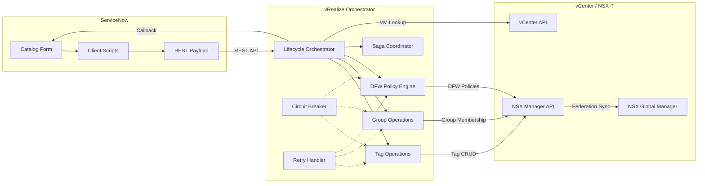

# NSX DFW Automation Pipeline


Automated lifecycle management for VMware NSX Distributed Firewall (DFW) via tag-driven security policies. This pipeline integrates ServiceNow, VMware vRealize Orchestrator (vRO), vCenter, and NSX-T Manager to deliver zero-touch micro-segmentation for virtual workloads across multi-site VMware Cloud Foundation (VCF) environments.

---

## Architecture Overview



## Quick Start

```bash
# Clone the repository
git clone https://github.com/enterprise/dfw-automation-pipeline.git
cd dfw-automation-pipeline

# Install dependencies
npm install

# Run all tests with coverage
npm test

# Run unit tests only
npm run test:unit

# Run integration tests
npm run test:integration

# Lint the codebase
npm run lint

# Validate JSON schemas
npm run validate-schemas

# Validate YAML policies
npm run validate-policies
```

## Directory Structure

```
dfw-automation-pipeline/
├── src/
│   ├── vro/
│   │   ├── actions/
│   │   │   ├── shared/          # Cross-cutting utilities
│   │   │   │   ├── CircuitBreaker.js       # Circuit breaker pattern for API protection
│   │   │   │   ├── ConfigLoader.js         # Centralized configuration with vault refs
│   │   │   │   ├── CorrelationContext.js    # Request correlation ID propagation
│   │   │   │   ├── ErrorFactory.js         # Structured DFW error code factory
│   │   │   │   ├── Logger.js               # Structured JSON logger (Splunk/ELK)
│   │   │   │   └── RetryHandler.js         # Exponential backoff retry with strategies
│   │   │   ├── tags/            # NSX tag management
│   │   │   │   ├── TagOperations.js        # Idempotent read-compare-write tag CRUD
│   │   │   │   └── TagCardinalityEnforcer.js # Cardinality rules and conflict detection
│   │   │   ├── groups/          # NSX security group management
│   │   │   ├── dfw/             # DFW policy and rule management
│   │   │   │   ├── DFWPolicyValidator.js   # Realized-state coverage validation
│   │   │   │   └── RuleConflictDetector.js # Shadow, contradiction, duplicate detection
│   │   │   └── lifecycle/       # Orchestration and saga coordination
│   │   │       └── SagaCoordinator.js      # Distributed transaction rollback
│   │   └── workflows/           # vRO workflow definitions
│   ├── servicenow/
│   │   └── catalog/
│   │       └── client-scripts/  # ServiceNow catalog form scripts
│   │           └── vmBuildRequest_onLoad.js # Form initialization and defaults
│   └── adapters/                # External system adapters
├── tests/
│   ├── unit/                    # Unit tests (Jest)
│   ├── integration/             # Integration tests (mock-based)
│   └── mocks/                   # Shared mock objects
├── schemas/                     # JSON Schema definitions for validation
├── policies/
│   ├── dfw-rules/               # YAML policy-as-code for DFW rules
│   │   ├── environment-zone-isolation.yaml
│   │   ├── infrastructure-shared-services.yaml
│   │   └── application-template.yaml
│   ├── security-groups/         # Security group definitions
│   └── tag-categories/          # Tag dictionary definitions
├── api/                         # REST API contracts
├── adr/                         # Architecture Decision Records
├── docs/
│   ├── SDD.md                   # Solution Design Document
│   ├── HLD.md                   # High Level Design
│   ├── LLD.md                   # Low Level Design
│   ├── FRD.md                   # Functional Requirements Design
│   ├── NFR-MAPPING.md           # Non-Functional Requirements Mapping
│   ├── TEST-STRATEGY.md         # Test Strategy
│   ├── RUNBOOK.md               # Operations Runbook
│   └── diagrams/                # Mermaid architecture diagrams
├── .github/workflows/ci.yml     # GitHub Actions CI pipeline
├── jest.config.js               # Jest test configuration
├── .eslintrc.json               # ESLint rules
├── package.json                 # Node.js project manifest
└── LICENSE                      # MIT License
```

## Design Patterns

This pipeline implements several design patterns to ensure reliability, maintainability, and resilience in a distributed VMware environment:

| Pattern | Where Used | Purpose |
|---------|-----------|---------|
| **Factory** | `ErrorFactory` | Creates structured error objects with DFW error codes and contextual metadata for consistent error handling |
| **Strategy** | `RetryHandler` | Pluggable retry strategies (interval-based, exponential backoff, custom) without modifying the handler |
| **Adapter** | `src/adapters/` | Abstracts vCenter, NSX, and ServiceNow REST APIs behind a uniform interface for testability |
| **Template Method** | Lifecycle workflows | Defines Day0/Day2/DayN lifecycle skeleton; subclasses override steps (tag, group, DFW) |
| **Saga** | `SagaCoordinator` | Manages distributed transactions with compensating actions for multi-step rollback on failure |
| **Circuit Breaker** | `CircuitBreaker` | Protects downstream APIs (NSX, vCenter) from cascading failures with CLOSED/OPEN/HALF_OPEN states |
| **Idempotent Read-Compare-Write** | `TagOperations` | Reads current state, computes delta, writes only changes to prevent race conditions and unnecessary writes |
| **Repository** | Policy YAML files | Stores DFW rules, security groups, and tag dictionaries as version-controlled code (policy-as-code) |

## Running Tests

```bash
# Full test suite with coverage report
npm test

# Unit tests only
npm run test:unit

# Integration tests (mock-based, no live APIs)
npm run test:integration

# Coverage targets:
#   Lines:      80%
#   Branches:   70%
#   Functions:  80%
#   Statements: 80%
```

Test results and coverage reports are written to the `coverage/` directory in `text`, `lcov`, and `clover` formats.

## Importing into vRO 8.x

The JavaScript action files in `src/vro/actions/` are designed for import into VMware Aria Automation Orchestrator (vRO) 8.x:

1. **Create a vRO Project** in the Orchestrator client or via `vro-cli`.
2. **Map action modules** to vRO package paths (e.g., `com.enterprise.dfw.shared` for `src/vro/actions/shared/`).
3. **Import each `.js` file** as a vRO Scriptable Task or Action. Each file exports a single class.
4. **Configure vRO Configuration Elements** with the endpoint URLs and credentials following the structure in `ConfigLoader.js` (vault references for secrets).
5. **Wire workflows** using the Workflow Designer, connecting the actions in Day0/Day2/DayN sequences as documented in `docs/LLD.md`.

See [`src/vro/workflows/README.md`](src/vro/workflows/README.md) for detailed import instructions.

## Contributing

1. **Fork** this repository and create a feature branch from `main`.
2. Follow the existing code style enforced by `.eslintrc.json`.
3. Write tests for all new functionality. Maintain the coverage thresholds defined in `jest.config.js`.
4. Validate schemas and policies before submitting:
   ```bash
   npm run validate-schemas
   npm run validate-policies
   ```
5. Create a pull request with a clear description of the change, referencing any relevant FR or NFR IDs.
6. All PRs require passing CI checks (lint, test, schema validation, docs check).

### Commit Convention

Use conventional commit messages:
```
feat(tags): add multi-value tag merge for Compliance category
fix(circuit-breaker): reset failure timestamps on HALF_OPEN success
docs(sdd): add saga compensation sequence diagram
test(dfw): add rule conflict detection edge cases
```

## License

This project is licensed under the MIT License. See [LICENSE](LICENSE) for details.

Copyright (c) 2026 Enterprise Infrastructure & Cloud Security.
