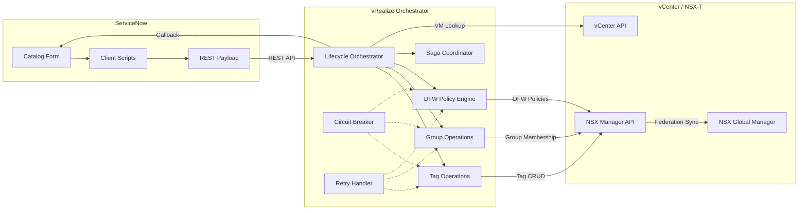

# NSX DFW Automation Pipeline


Automated lifecycle management for VMware NSX Distributed Firewall (DFW) via tag-driven security policies. This pipeline integrates ServiceNow, VMware vRealize Orchestrator (vRO), vCenter, and NSX-T Manager to deliver zero-touch micro-segmentation for virtual workloads across multi-site VMware Cloud Foundation (VCF) environments.

---

## Architecture Overview



## 5-Tag Security Taxonomy

The pipeline enforces a mandatory 5-tag security taxonomy aligned with the client security architecture:

| Tag | NSX Scope | Description |
|-----|-----------|-------------|
| **Region** | Region | Geographic site identifier (NDCNG, TULNG) |
| **SecurityZone** | SecurityZone | Network security zone (DMZ, Internal, Restricted, Management) |
| **Environment** | Environment | Deployment lifecycle stage (Production, Pre-Production, Development, etc.) |
| **AppCI** | AppCI | CMDB application CI reference |
| **SystemRole** | SystemRole | Workload function (WebServer, AppServer, Database, etc.) |

Optional tags: **Compliance** (PCI, HIPAA, SOX), **DataClassification** (Public, Internal, Confidential, Restricted), **CostCenter** (financial chargeback).

## Key Features

- **Tag-Driven Micro-Segmentation** — Day 0 / Day 2 / Day N lifecycle management via NSX tags with 5-tag mandatory taxonomy
- **CMDB Data Quality Validation** — Scheduled CMDB scans validating 5-tag completeness with gap reports and remediation tasks
- **DFW Rule Lifecycle Management** — Full state machine (REQUESTED through CERTIFIED) with audit trail and periodic review
- **Rule Registry and Tracking** — Custom `x_dfw_rule_registry` table with unique DFW-R-XXXX identifiers
- **Migration Bulk Tagging** — Manifest-based wave processing for Greenzone VM migration events
- **Periodic Rule Review** — Scheduled scans, owner notifications, escalation, and auto-expiry for rule certification
- **CMDB-Driven Event Sync** — Business rule on `cmdb_ci_vm_instance` triggers Day-2 tag synchronization
- **Emergency Quarantine** — Break-glass VM isolation with auto-expiry for security incidents
- **Bulk Tag Operations** — Batch tag remediation with configurable concurrency and dry-run mode
- **Drift Detection** — Scheduled tag drift scanning with automatic remediation
- **Legacy VM Onboarding** — CSV-based bulk onboarding of VMs deployed outside the standard pipeline
- **Migration Verification** — Post-vMotion tag and group membership verification
- **Untagged VM Discovery** — vCenter scanning to identify VMs without required NSX tags
- **Impact Analysis** — Pre-approval read-only assessment of tag change effects on groups and DFW policies
- **Rate Limiting** — Token bucket rate limiter protecting downstream APIs from burst traffic
- **Saga-Based Rollback** — Distributed transaction coordination with compensating actions
- **Circuit Breaker & Retry** — Resilience patterns protecting NSX, vCenter, and ServiceNow integrations
- **Policy-as-Code** — DFW rules, security groups, and tag dictionaries stored as version-controlled YAML
- **VRA Package Deployment** — Structured vRO package at `package/` for Aria Automation import

## Quick Start

```bash
# Clone the repository
git clone https://github.com/srikanth-nalam/dfw-automation-pipeline.git
cd dfw-automation-pipeline

# Install dependencies
npm install

# Run all tests with coverage
npm test

# Run unit tests only
npm run test:unit

# Run integration tests
npm run test:integration

# Lint the codebase
npm run lint

```

## Directory Structure

```
dfw-automation-pipeline/
├── src/
│   ├── vro/
│   │   ├── actions/
│   │   │   ├── shared/          # Cross-cutting utilities
│   │   │   │   ├── CircuitBreaker.js       # Circuit breaker pattern for API protection
│   │   │   │   ├── ConfigLoader.js         # Centralized configuration with vault refs
│   │   │   │   ├── CorrelationContext.js    # Request correlation ID propagation
│   │   │   │   ├── ErrorFactory.js         # Structured DFW error code factory
│   │   │   │   ├── Logger.js               # Structured JSON logger (Splunk/ELK)
│   │   │   │   ├── RateLimiter.js          # Token bucket rate limiter for NSX API
│   │   │   │   └── RetryHandler.js         # Exponential backoff retry with strategies
│   │   │   ├── tags/            # NSX tag management
│   │   │   │   ├── TagOperations.js        # Idempotent read-compare-write tag CRUD
│   │   │   │   ├── TagCardinalityEnforcer.js # Cardinality rules and conflict detection
│   │   │   │   └── UntaggedVMScanner.js    # vCenter inventory scan for untagged VMs
│   │   │   ├── groups/          # NSX security group management
│   │   │   ├── dfw/             # DFW policy and rule management
│   │   │   │   ├── DFWPolicyValidator.js   # Realized-state coverage validation
│   │   │   │   └── RuleConflictDetector.js # Shadow, contradiction, duplicate detection
│   │   │   ├── cmdb/            # CMDB validation
│   │   │   │   └── CMDBValidator.js        # CMDB 5-tag validation and gap reports
│   │   │   └── lifecycle/       # Orchestration and saga coordination
│   │   │       ├── SagaCoordinator.js      # Distributed transaction rollback
│   │   │       ├── BulkTagOrchestrator.js  # Bulk tag ops with batching and concurrency
│   │   │       ├── DriftDetectionWorkflow.js # Scheduled drift scan and remediation
│   │   │       ├── ImpactAnalysisAction.js # Pre-approval read-only impact analysis
│   │   │       ├── LegacyOnboardingOrchestrator.js # CSV-based legacy VM onboarding
│   │   │       ├── MigrationVerifier.js    # Post-vMotion tag preservation check
│   │   │       ├── MigrationBulkTagger.js  # Manifest-based migration wave tagging
│   │   │       ├── QuarantineOrchestrator.js # Emergency VM quarantine with auto-expiry
│   │   │       ├── RuleLifecycleManager.js # DFW rule lifecycle state machine
│   │   │       ├── RuleRegistry.js         # Rule tracking with DFW-R-XXXX IDs
│   │   │       ├── RuleRequestPipeline.js  # Unified rule intake from 4 channels
│   │   │       └── RuleReviewScheduler.js  # Periodic rule certification and expiry
│   │   └── workflows/           # vRO workflow definitions
│   ├── servicenow/
│   │   └── catalog/
│   │       ├── client-scripts/  # ServiceNow catalog form scripts
│   │       │   ├── vmBuildRequest_onLoad.js      # VM build form initialization
│   │       │   ├── tagUpdateRequest_onLoad.js    # Tag update form initialization
│   │       │   ├── quarantineRequest_onLoad.js   # Emergency quarantine form
│   │       │   ├── bulkTagRequest_onLoad.js      # Bulk tag remediation form
│   │       │   └── ruleRequest_onLoad.js         # DFW rule request form
│   │       └── business-rules/  # ServiceNow business rules
│   │           └── cmdbTagSyncRule.js            # CMDB change-driven tag sync
│   └── adapters/                # External system adapters
├── tests/
│   ├── unit/                    # Unit tests (Jest)
│   ├── integration/             # Integration tests (mock-based)
│   └── mocks/                   # Shared mock objects
├── schemas/                     # JSON Schema definitions for validation
├── policies/
│   ├── dfw-rules/               # YAML policy-as-code for DFW rules
│   │   ├── environment-zone-isolation.yaml
│   │   ├── infrastructure-shared-services.yaml
│   │   └── application-template.yaml
│   ├── security-groups/         # Security group definitions
│   └── tag-categories/          # Tag dictionary definitions
├── api/                         # REST API contracts
├── adr/                         # Architecture Decision Records
├── docs/
│   ├── SDD.md                   # Solution Design Document
│   ├── HLD.md                   # High Level Design
│   ├── LLD.md                   # Low Level Design
│   ├── FRD.md                   # Functional Requirements Design
│   ├── NFR-MAPPING.md           # Non-Functional Requirements Mapping
│   ├── TEST-STRATEGY.md         # Test Strategy
│   ├── RUNBOOK.md               # Operations Runbook
│   └── diagrams/                # Mermaid architecture diagrams
├── package/
│   ├── com.dfw.automation/      # VRA package for Aria Automation import
│   │   ├── actions/             # All vRO actions by module
│   │   ├── workflows/           # Workflow XML definitions
│   │   └── config-elements/     # Configuration element templates
│   ├── scripts/                 # Package import/export scripts
│   └── servicenow/              # ServiceNow update sets
├── .github/workflows/ci.yml     # GitHub Actions CI pipeline
├── jest.config.js               # Jest test configuration
├── .eslintrc.json               # ESLint rules
├── package.json                 # Node.js project manifest
└── LICENSE                      # MIT License
```

## Prerequisites and Deployment

For detailed deployment instructions, prerequisites, test data setup, and demo walkthroughs, see the **[Developer Deployment Guide](docs/DEVELOPER-GUIDE.md)**.

**Key prerequisites at a glance:**

- VMware vCenter Server 7.0U3+ and NSX-T Manager 3.2+
- VMware Aria Automation Orchestrator (vRO) 8.10+
- ServiceNow instance (Zurich Patch 6+) with Admin access and REST API enabled
- Service accounts for vRO→vCenter, vRO→NSX, vRO→ServiceNow, and ServiceNow→vRO integrations
- Network connectivity (HTTPS/443) between all integration endpoints
- Node.js 18+ and npm 9+ for local development and testing

The Developer Guide covers:
- Complete prerequisites checklist with exact versions and permissions
- Step-by-step deployment for all 30 vRO actions, 3 workflows, and 12 ServiceNow components
- NSX tag category, security group, and DFW policy configuration
- Test data setup with 26 tag dictionary entries and bulk-load scripts
- Eight end-to-end demo scenarios (Day 0, Day 2, Day N, Emergency Quarantine, Drift Detection, Bulk Onboarding, Migration Verification, Untagged VM Discovery)
- Troubleshooting guide for common setup issues

## Design Patterns

This pipeline implements several design patterns to ensure reliability, maintainability, and resilience in a distributed VMware environment:

| Pattern | Where Used | Purpose |
|---------|-----------|---------|
| **Factory** | `ErrorFactory` | Creates structured error objects with DFW error codes and contextual metadata for consistent error handling |
| **Strategy** | `RetryHandler` | Pluggable retry strategies (interval-based, exponential backoff, custom) without modifying the handler |
| **Adapter** | `src/adapters/` | Abstracts vCenter, NSX, and ServiceNow REST APIs behind a uniform interface for testability |
| **Template Method** | Lifecycle workflows | Defines Day0/Day2/DayN lifecycle skeleton; subclasses override steps (tag, group, DFW) |
| **Saga** | `SagaCoordinator` | Manages distributed transactions with compensating actions for multi-step rollback on failure |
| **Circuit Breaker** | `CircuitBreaker` | Protects downstream APIs (NSX, vCenter) from cascading failures with CLOSED/OPEN/HALF_OPEN states |
| **Idempotent Read-Compare-Write** | `TagOperations` | Reads current state, computes delta, writes only changes to prevent race conditions and unnecessary writes |
| **Token Bucket** | `RateLimiter` | Protects NSX API from overload during bulk operations with configurable burst and refill rates |
| **Semaphore** | `BulkTagOrchestrator` | Controls concurrency during parallel bulk tag operations to prevent resource exhaustion |
| **Repository** | Policy YAML files | Stores DFW rules, security groups, and tag dictionaries as version-controlled code (policy-as-code) |

## Running Tests

```bash
# Full test suite with coverage report
npm test

# Unit tests only
npm run test:unit

# Integration tests (mock-based, no live APIs)
npm run test:integration

# Coverage targets:
#   Lines:      95%+
#   Branches:   95%+
#   Functions:  95%+
#   Statements: 95%+
#
# Test suites: 54 | Tests: 1161+
```

Test results and coverage reports are written to the `coverage/` directory in `text`, `lcov`, and `clover` formats.

## VRA Package Deployment

The `package/` directory contains a complete VRA deployment package for VMware Aria Automation Orchestrator. This provides a streamlined deployment path for all pipeline components:

```bash
# Import via CLI
cd package/
./scripts/import-package.sh --host https://vro-host:443 --user admin

# Or import via Orchestrator UI:
# Administration > Packages > Import Package > select package/com.dfw.automation/
```

The package includes:
- All vRO actions (shared utilities, tag operations, group operations, DFW policy, lifecycle orchestrators, CMDB validation)
- 7 workflow definitions (Day0, Day2, DayN, CMDBValidation, RuleLifecycle, RuleReview, MigrationBulkTag)
- Configuration element templates with vault references
- ServiceNow update sets for tables, business rules, catalog items, and scheduled jobs

See the **[Developer Deployment Guide](docs/DEVELOPER-GUIDE.md)** for detailed import instructions and post-import configuration.

## Importing into vRO 8.x

The JavaScript action files in `src/vro/actions/` are designed for import into VMware Aria Automation Orchestrator (vRO) 8.x:

1. **Create a vRO Project** in the Orchestrator client or via `vro-cli`.
2. **Map action modules** to vRO package paths (e.g., `com.enterprise.dfw.shared` for `src/vro/actions/shared/`).
3. **Import each `.js` file** as a vRO Scriptable Task or Action. Each file exports a single class.
4. **Configure vRO Configuration Elements** with the endpoint URLs and credentials following the structure in `ConfigLoader.js` (vault references for secrets).
5. **Wire workflows** using the Workflow Designer, connecting the actions in Day0/Day2/DayN sequences as documented in `docs/LLD.md`.

See [`src/vro/workflows/README.md`](src/vro/workflows/README.md) for detailed import instructions.

## Contributing

1. **Fork** this repository and create a feature branch from `main`.
2. Follow the existing code style enforced by `.eslintrc.json`.
3. Write tests for all new functionality. Maintain the coverage thresholds defined in `jest.config.js`.
4. Create a pull request with a clear description of the change, referencing any relevant FR or NFR IDs.
5. All PRs require passing CI checks (lint, test, docs check).

### Commit Convention

Use conventional commit messages:
```
feat(tags): add multi-value tag merge for Compliance category
fix(circuit-breaker): reset failure timestamps on HALF_OPEN success
docs(sdd): add saga compensation sequence diagram
test(dfw): add rule conflict detection edge cases
```

## License

This project is licensed under the MIT License. See [LICENSE](LICENSE) for details.

Copyright (c) 2026 Enterprise Infrastructure & Cloud Security.
