# High Level Design (HLD)

## NSX DFW Automation Pipeline

**Version:** 1.0
**Date:** 2026-03-21
**Author:** Enterprise Infrastructure & Cloud Security
**Status:** Approved

---

## Table of Contents

1. [Architecture Overview](#1-architecture-overview)
2. [Component Inventory](#2-component-inventory)
3. [Interface Definitions](#3-interface-definitions)
4. [Data Flow](#4-data-flow)
5. [Brownfield / Existing VM Flows](#brownfield--existing-vm-flows)
6. [Deployment Topology](#5-deployment-topology)
7. [DR/HA Considerations](#6-drha-considerations)
8. [Monitoring and Observability](#7-monitoring-and-observability)

---

## 1. Architecture Overview

The NSX DFW Automation Pipeline is a production-grade, multi-tier integration solution that automates the full lifecycle management of VMware NSX Distributed Firewall (DFW) policies through a tag-driven security model. The pipeline orchestrates four primary platforms -- ServiceNow for IT Service Management request intake, VMware vRealize Orchestrator (vRO) for workflow orchestration, VMware vCenter for compute inventory management, and VMware NSX-T Manager for network security policy enforcement -- into a unified, zero-touch micro-segmentation workflow.

The architecture follows a hub-and-spoke integration pattern with vRO positioned as the central orchestration hub. ServiceNow serves as the northbound ingress point for business requests originating from infrastructure consumers. vCenter provides the southbound compute inventory context required for VM discovery and identity resolution. NSX-T Manager serves as the southbound target platform where security tags, group memberships, and DFW policies are realized and enforced on the data plane. The solution is designed for multi-site operation across two production VMware Cloud Foundation (VCF) environments -- NDCNG (primary data center) and TULNG (secondary data center) -- with NSX-T Federation providing cross-site policy consistency and replication through a Global Manager instance.

The pipeline supports three lifecycle operations that together cover the complete lifespan of a virtual workload:

- **Day 0 Provisioning**: Initial tag assignment, security group membership establishment, and DFW policy verification for newly built VMs. This operation is triggered when a new VM is requested through the ServiceNow catalog.
- **Day 2 Modification**: Tag updates, group reconciliation, impact analysis, drift detection, and policy re-verification for configuration changes to existing VMs. This operation supports environment promotions, compliance framework changes, and application tier reassignments.
- **Day N Decommissioning**: Tag removal, group departure verification, orphaned rule detection, dependency checking, VM deprovisioning, and CMDB cleanup for retired workloads. This operation ensures no security policy gaps are introduced when a VM is removed.

Each operation is orchestrated as a distributed saga -- a series of compensable steps that can be rolled back in reverse order if any step fails -- ensuring that partial failures never leave the environment in an inconsistent state. The saga pattern is complemented by circuit breaker protection on all downstream API calls, exponential backoff retry logic for transient failures, and a dead letter queue (DLQ) for operations that exhaust all retry attempts.

### 1.1 System Architecture Diagram

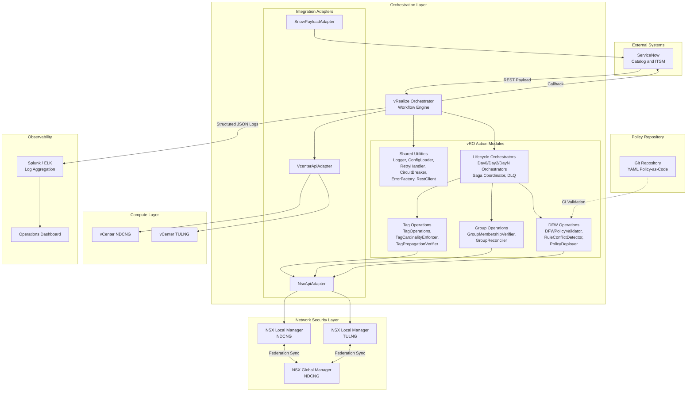

### 1.2 Layered Architecture

The solution is organized into six logical layers, each with clearly defined responsibilities and interfaces:

1. **Request Layer** (ServiceNow): Captures business requirements through catalog forms with client-side validation, enforces mandatory tag fields through UI policies, performs tag dictionary lookups for dropdown population, generates structured JSON payloads containing RITM numbers, tag assignments, VM identifiers, site codes, and callback URLs.

2. **Orchestration Layer** (vRO Lifecycle Orchestrators): Coordinates multi-step workflows using the Template Method pattern to define invariant workflow skeletons (validate, resolve endpoints, prepare, execute, verify, callback) while delegating lifecycle-specific logic to Day0, Day2, and DayN subclasses. Manages distributed transaction state via the SagaCoordinator, handles retry orchestration through the RetryHandler, and protects downstream systems through per-endpoint CircuitBreaker instances.

3. **Business Logic Layer** (vRO Action Modules): Implements the core domain logic including tag governance (cardinality enforcement, conflict detection, idempotent read-compare-write operations), group membership management (verification, reconciliation, impact analysis), DFW policy validation (realized-state coverage checks, rule conflict detection for shadows, contradictions, and duplicates), and drift detection (comparing actual NSX state against CMDB-expected state).

4. **Integration Layer** (Adapters): Abstracts REST API communication with vCenter, NSX Manager, and ServiceNow behind uniform adapter interfaces. Each adapter encapsulates endpoint URL construction, request/response serialization, authentication header injection, and error response normalization. This abstraction enables comprehensive unit testing with mock adapters and isolates API version changes to a single module.

5. **Infrastructure Layer** (vCenter + NSX): Provides the target compute and network security platforms where changes are realized. vCenter supplies VM inventory, identity resolution (MoRef to NSX external ID mapping), and lifecycle operations (provisioning, power management, deletion). NSX Manager provides the tag management, group membership, and DFW policy enforcement APIs.

6. **Governance Layer** (Policy-as-Code + Git): Stores DFW rule definitions, security group specifications, and tag category dictionaries as declarative YAML files in a version-controlled Git repository. The CI pipeline validates these definitions against JSON schemas on every commit. Runtime drift detection compares the Git-declared policy state against the actual NSX Manager state.

### 1.3 Design Philosophy

The architecture is guided by several foundational principles:

- **Tag-Driven Security**: VMs are never referenced directly in firewall rules. Instead, security policy assignment is determined entirely by tag values applied to VMs. NSX security groups use tag-based dynamic membership criteria, and DFW rules reference these groups. This decouples policy definition from infrastructure topology, enabling automatic security posture adjustment when VM attributes change.

- **Idempotent Operations**: All mutating operations (tag apply, tag remove, tag update) follow a read-compare-write pattern that computes a minimal delta before writing. Calling the same operation twice with the same desired state produces no additional side effects.

- **Eventual Consistency with Verification**: The pipeline accepts that NSX tag propagation to the data plane is asynchronous. After every mutating operation, the pipeline polls the NSX realized-state API until convergence is confirmed or a timeout is reached.

- **Fail-Safe Compensation**: The saga pattern ensures that partial failures trigger compensating actions in reverse order. The dead letter queue captures operations that cannot be automatically recovered, providing operators with full context for manual intervention.

- **Policy-as-Code**: All DFW rules, security group definitions, and tag dictionaries are stored as declarative YAML in Git, enabling peer review, diff-based auditing, automated validation, and rollback via git revert.

---

## 2. Component Inventory

### 2.1 ServiceNow Components

| Component | Type | Purpose | Key Interactions |
|-----------|------|---------|------------------|
| VM Build Request | Catalog Item | Entry point for Day 0 provisioning requests | Triggers vRO REST call |
| VM Tag Update | Catalog Item | Entry point for Day 2 tag modification requests | Triggers vRO REST call |
| VM Decommission | Catalog Item | Entry point for Day N decommission requests | Triggers vRO REST call |
| `vmBuildRequest_onLoad.js` | Client Script | Auto-populates form defaults, sets mandatory fields, initializes tag dropdowns | Reads Tag Dictionary |
| `vmBuildRequest_onChange.js` | Client Script | Dynamic field behavior on value changes, cascading dropdown updates | Validates tag combinations |
| `tagUpdateRequest_onLoad.js` | Client Script | Initializes Day 2 tag update form with current VM tags from CMDB | Reads CMDB CI record |
| `catalogItemValidation.js` | Server Script | Server-side validation before payload submission, enforces business rules | Validates against Tag Dictionary |
| `tagDictionaryLookup.js` | Server Script | Looks up authorized tag values from the centralized Tag Dictionary reference table | Returns permitted values |
| `conditionalFieldPolicies.js` | UI Policy | Controls field visibility and mandatory status based on request type and selected values | Enforces form logic |
| `correlationIdGenerator.js` | Integration Script | Generates unique correlation IDs (format: `SNOW-REQ-YYYY-NNNNNNN`) for end-to-end request tracking | Used by `vroTrigger.js` |
| `vroTrigger.js` | Integration Script | Assembles JSON payload and sends REST call to vRO workflow trigger endpoint | Sends to vRO REST API |
| Tag Dictionary | Reference Table | Centralized repository of authorized tag categories, permitted values, cardinality rules, and conflict definitions | Read by catalog forms and server scripts |
| RITM Callback Handler | Business Rule | Processes vRO callback to update RITM status, work notes, and closure code | Receives from vRO callback |

### 2.2 vRO Components -- Shared Utilities

| Component | Module Path | Purpose | Design Pattern |
|-----------|------------|---------|----------------|
| `ConfigLoader` | `src/vro/actions/shared/` | Centralized configuration management with site-aware endpoint resolution and vault reference patterns (`{{vault:secret/...}}`) for secrets | Configuration |
| `Logger` | `src/vro/actions/shared/` | Structured JSON logging with correlation ID propagation, configurable log levels, and single-line output for Splunk/ELK ingestion | Structured Logging |
| `CorrelationContext` | `src/vro/actions/shared/` | Thread-local correlation ID propagation across all modules and HTTP headers (`X-Correlation-ID`) | Context Propagation |
| `RetryHandler` | `src/vro/actions/shared/` | Configurable retry with pluggable strategies (interval-based, exponential backoff with jitter, custom), `shouldRetry` predicate for non-retryable errors | Strategy |
| `CircuitBreaker` | `src/vro/actions/shared/` | Per-endpoint circuit breaker with sliding window failure tracking, three-state machine (CLOSED/OPEN/HALF_OPEN), configurable thresholds (default: 5 failures in 5 minutes, 60s reset timeout) | Circuit Breaker |
| `RestClient` | `src/vro/actions/shared/` | HTTP client wrapper with circuit breaker integration, retry handler integration, correlation ID header injection, and response normalization | Facade |
| `PayloadValidator` | `src/vro/actions/shared/` | JSON Schema-based payload validation using AJV, validates incoming ServiceNow payloads against `snow-vro-payload.schema.json` | Validation |
| `ErrorFactory` | `src/vro/actions/shared/` | Creates structured `DfwError` instances with DFW error codes (DFW-4xxx through DFW-9xxx), error taxonomy mapping, retryability classification, and SNOW callback payload generation | Factory |

### 2.3 vRO Components -- Domain Modules

| Component | Module Path | Purpose | Design Pattern |
|-----------|------------|---------|----------------|
| `TagOperations` | `src/vro/actions/tags/` | Idempotent tag CRUD via read-compare-write pattern against NSX-T fabric API | Idempotent Write |
| `TagCardinalityEnforcer` | `src/vro/actions/tags/` | Enforces single/multi-value cardinality rules, validates tag combinations against conflict rules, computes minimal deltas | Domain Rules |
| `TagPropagationVerifier` | `src/vro/actions/tags/` | Polls NSX realized-state API to confirm tag propagation to security groups and data plane | Polling Verifier |
| `GroupMembershipVerifier` | `src/vro/actions/groups/` | Verifies VM membership in expected NSX security groups, predicts group changes from tag modifications | Verification |
| `GroupReconciler` | `src/vro/actions/groups/` | Reconciles actual group membership with expected state, adds/removes VMs from groups as needed | Reconciliation |
| `DFWPolicyValidator` | `src/vro/actions/dfw/` | Validates realized-state DFW coverage for VMs by querying the NSX enforcement point API | Validation |
| `RuleConflictDetector` | `src/vro/actions/dfw/` | Detects shadow rules (more specific rule masks a broader one), contradicting rules (allow/deny for same traffic), and duplicate rules | Analysis |
| `PolicyDeployer` | `src/vro/actions/dfw/` | Deploys DFW policies from YAML templates to NSX Manager via the Policy API | Deployment |
| `ImpactAnalysisAction` | `src/vro/actions/dfw/` | Evaluates downstream effects of proposed tag or group changes on DFW rule coverage, identifying VMs that would gain or lose policy protection before changes are committed | Pre-flight Analysis |
| `DriftDetectionWorkflow` | `src/vro/actions/tags/` | Scheduled comparison of CMDB-declared tag state against actual NSX tag state, producing a delta report and optionally auto-remediating discovered drift or opening a ServiceNow incident | Reconciliation |
| `UntaggedVMScanner` | `src/vro/actions/tags/` | Discovers VMs in the NSX fabric inventory that have no tags or are missing mandatory tag categories, generating compliance reports and optionally queueing remediation requests | Discovery |
| `RateLimiter` | `src/vro/actions/shared/` | Enforces per-endpoint request rate limits using a sliding-window token bucket algorithm, preventing NSX API throttling during bulk operations by queuing excess requests | Rate Limiting |

### 2.4 vRO Components -- Lifecycle Orchestrators

| Component | Module Path | Purpose | Design Pattern |
|-----------|------------|---------|----------------|
| `LifecycleOrchestrator` | `src/vro/actions/lifecycle/` | Abstract base class defining the invariant workflow skeleton (validate, resolveEndpoints, prepare, execute, verify, callback) with timing instrumentation | Template Method |
| `Day0Orchestrator` | `src/vro/actions/lifecycle/` | Day 0 provisioning: VM creation, VMware Tools wait, tag application, propagation wait, group verification, DFW validation | Concrete Template |
| `Day2Orchestrator` | `src/vro/actions/lifecycle/` | Day 2 modification: current tag retrieval, drift detection, impact analysis, delta application, propagation wait, re-verification | Concrete Template |
| `DayNOrchestrator` | `src/vro/actions/lifecycle/` | Day N decommission: dependency check, orphaned rule detection, tag removal, group removal verification, VM deprovisioning, CMDB update | Concrete Template |
| `SagaCoordinator` | `src/vro/actions/lifecycle/` | Distributed transaction management: records completed steps with compensating actions, executes LIFO rollback on failure | Saga |
| `DeadLetterQueue` | `src/vro/actions/lifecycle/` | Persistent storage for failed operations with full context (correlation ID, payload, error, partial steps, compensation results) | Dead Letter Queue |
| `QuarantineOrchestrator` | `src/vro/actions/lifecycle/` | Emergency quarantine workflow that applies a Quarantine=ACTIVE tag to a VM, forces membership in the SG-Quarantine security group, verifies that the DFW quarantine deny-all policy is active, and schedules auto-expiry for time-limited quarantines | Concrete Template |
| `BulkTagOrchestrator` | `src/vro/actions/lifecycle/` | Processes batched tag operations from CSV uploads, validating each row against the Tag Dictionary, applying changes in configurable batch sizes with progress callbacks to ServiceNow, and producing a completion report summarizing successes and failures | Batch Orchestrator |
| `LegacyOnboardingOrchestrator` | `src/vro/actions/lifecycle/` | Onboards existing brownfield VMs into the tag-driven security model by discovering current firewall rules, mapping them to equivalent tag-based policies, applying tags, and verifying that the effective security posture is unchanged after migration | Migration Orchestrator |
| `MigrationVerifier` | `src/vro/actions/lifecycle/` | Post-vMotion verification workflow that checks whether NSX tags survived a VM migration to a new host or cluster, re-applies any missing tags at the destination, and confirms security group membership and DFW policy coverage are intact | Verification |

### 2.5 Integration Adapters

| Component | Module Path | Purpose |
|-----------|------------|---------|
| `NsxApiAdapter` | `src/adapters/` | Abstracts NSX-T Manager REST API (tag CRUD, group membership, realized-state queries, policy operations) behind a uniform interface |
| `VcenterApiAdapter` | `src/adapters/` | Abstracts vCenter REST API (VM lookup, provisioning, power management, deletion, VMware Tools status) behind a uniform interface |
| `SnowPayloadAdapter` | `src/adapters/` | Transforms ServiceNow catalog form data into normalized pipeline payloads and formats callback responses for SNOW consumption |

### 2.6 VMware Infrastructure Components

| Component | Site | Role | Endpoint Pattern |
|-----------|------|------|-----------------|
| vCenter NDCNG | NDCNG | VM inventory, provisioning, and metadata for primary site | `vcenter-ndcng.company.internal` |
| vCenter TULNG | TULNG | VM inventory, provisioning, and metadata for secondary site | `vcenter-tulng.company.internal` |
| NSX Local Manager NDCNG | NDCNG | Local policy management, tag operations, group management for primary site | `nsx-manager-ndcng.company.internal` |
| NSX Local Manager TULNG | TULNG | Local policy management, tag operations, group management for secondary site | `nsx-manager-tulng.company.internal` |
| NSX Global Manager | NDCNG | Federation policy management, cross-site group replication, global security policies | `nsx-global-ndcng.company.internal` |

---

## 3. Interface Definitions

### 3.1 ServiceNow to vRO (SNOW-to-vRO REST Trigger)

**Protocol**: HTTPS REST
**Authentication**: Basic Authentication (vRO service account)
**Endpoint**: `POST /vco/api/workflows/{workflowId}/executions`
**Content-Type**: `application/json`
**Correlation ID**: Generated by `correlationIdGenerator.js` in format `SNOW-REQ-YYYY-NNNNNNN`

**Request Payload** (schema: `schemas/snow-vro-payload.schema.json`):

The payload includes `correlationId`, `requestType` (DAY0_PROVISION, DAY2_RETAG, or DAY2_DECOMMISSION), `vmName`, `site` (NDCNG/TULNG), `tags` object with required fields (application, tier, environment, compliance, dataClassification) and optional costCenter, `callbackUrl`, and for Day 0 requests: `vmTemplate`, `cluster`, `datastore`, `network`, `cpuCount`, `memoryGB`, `diskGB`.

**Response**: HTTP 202 Accepted with `executionId` for async tracking.

### 3.2 vRO to ServiceNow (vRO-to-SNOW Callback)

**Protocol**: HTTPS REST
**Authentication**: Bearer token (short-lived, scoped to correlation ID)
**Endpoint**: `POST /api/now/v1/dfw/callback`
**Content-Type**: `application/json`

**Success Callback Payload** (schema: `schemas/vro-snow-callback.schema.json`): Includes `correlationId`, `requestType`, `status: "SUCCESS"`, `timestamp`, `executionDurationSeconds`, `vm` details, `appliedTags`, `groupMemberships`, `activeDFWPolicies`, and `workflowStepDurations`.

**Failure Callback Payload**: Includes `correlationId`, `requestType`, `status: "FAILURE"`, `timestamp`, `errorCode`, `errorCategory`, `errorMessage`, `failedStep`, `retryCount`, `compensatingActionTaken`, `compensatingActionResult`, `recommendedAction`, and optional `deadLetterQueueEntry`.

### 3.3 vRO to NSX Manager (NSX REST API)

**Protocol**: HTTPS REST
**Authentication**: Basic Authentication (NSX service account with `NsxTagOperator` and `NsxSecurityEngineer` roles)
**Base URL**: Resolved per-site by `ConfigLoader.getEndpointsForSite(site)`

**Tag Operations**:
- `GET /api/v1/fabric/virtual-machines/{vmId}/tags` -- Read current tags for a VM
- `PATCH /api/v1/fabric/virtual-machines/{vmId}/tags` -- Write tags (full replacement of tag array)

**Group Membership**:
- `GET /policy/api/v1/infra/domains/default/groups/{groupId}/members/virtual-machines` -- List VM members of a group
- `PATCH /policy/api/v1/infra/domains/default/groups/{groupId}` -- Update group membership criteria

**DFW Realized State**:
- `GET /policy/api/v1/infra/realized-state/enforcement-points/default/virtual-machines/{vmId}/rules` -- Get effective DFW rules for a VM

**DFW Policy Management**:
- `GET /policy/api/v1/infra/domains/default/security-policies` -- List all security policies
- `PATCH /policy/api/v1/infra/domains/default/security-policies/{policyId}` -- Update a security policy

**Common HTTP Headers**:
```
Content-Type: application/json
X-Correlation-ID: SNOW-REQ-2026-0001234
Authorization: Basic <base64-encoded-credentials>
```

All NSX API calls are wrapped in `CircuitBreaker` (per-endpoint) and `RetryHandler` (exponential backoff with configurable intervals).

### 3.4 vRO to vCenter (vCenter REST API)

**Protocol**: HTTPS REST (vSphere Automation API)
**Authentication**: Session-based (vRO vCenter plug-in manages session lifecycle)

**VM Operations**:
- `GET /api/vcenter/vm/{vmId}` -- VM details (cluster, resource pool, folder, power state)
- `GET /api/vcenter/vm?filter.names={vmName}` -- VM lookup by name
- `POST /api/vcenter/vm` -- VM provisioning (clone from template)
- `POST /api/vcenter/vm/{vmId}/power` -- Power operations (start, stop, suspend)
- `DELETE /api/vcenter/vm/{vmId}` -- VM deletion
- `GET /api/vcenter/vm/{vmId}/tools` -- VMware Tools status

---

## 4. Data Flow

### 4.1 End-to-End Data Flow

The complete data flow from business request to realized security policy traverses all system layers:

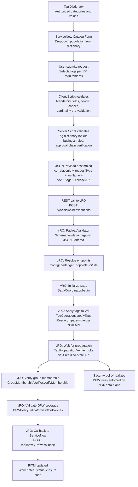

### 4.2 Tag Dictionary Flow

The Tag Dictionary is the authoritative source for all permitted tag values. It feeds both the ServiceNow form experience and the vRO validation logic:

1. **Dictionary Population**: Infrastructure administrators maintain the Tag Dictionary reference table in ServiceNow, defining permitted values for each category (Application, Tier, Environment, DataClassification, Compliance, CostCenter).
2. **Form Population**: When a user opens a catalog form, client scripts query the Tag Dictionary via `tagDictionaryLookup.js` to populate dropdown fields with authorized values.
3. **Client Validation**: Client scripts enforce cardinality (single-select vs. multi-select) and conflict rules (e.g., PCI not allowed in Sandbox) before form submission.
4. **Server Validation**: Server scripts perform a second-pass validation against the Tag Dictionary to prevent bypassing client-side checks.
5. **vRO Validation**: The `TagCardinalityEnforcer` in vRO performs a third validation pass, ensuring that the tag combination is valid even if the dictionary has been updated between submission and execution.

### 4.3 Day 0 Provisioning Sequence

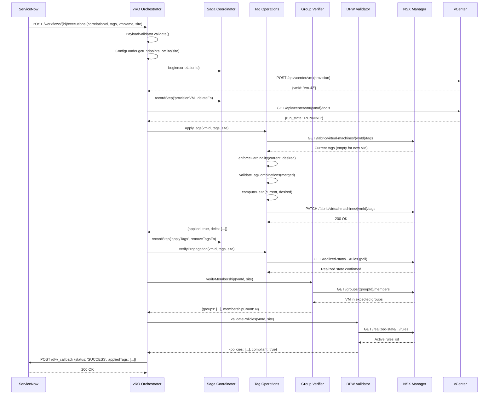

### 4.4 Day 2 Tag Update Sequence

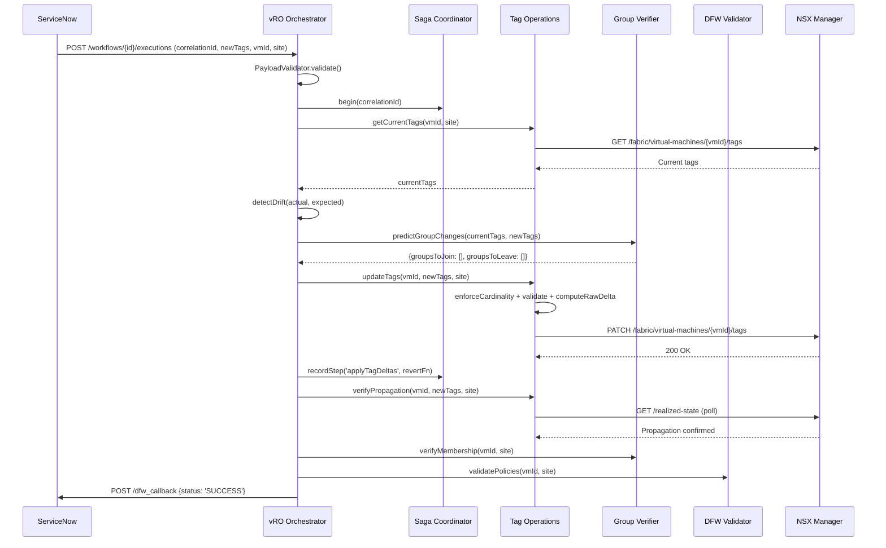

### 4.5 Day N Decommission Sequence

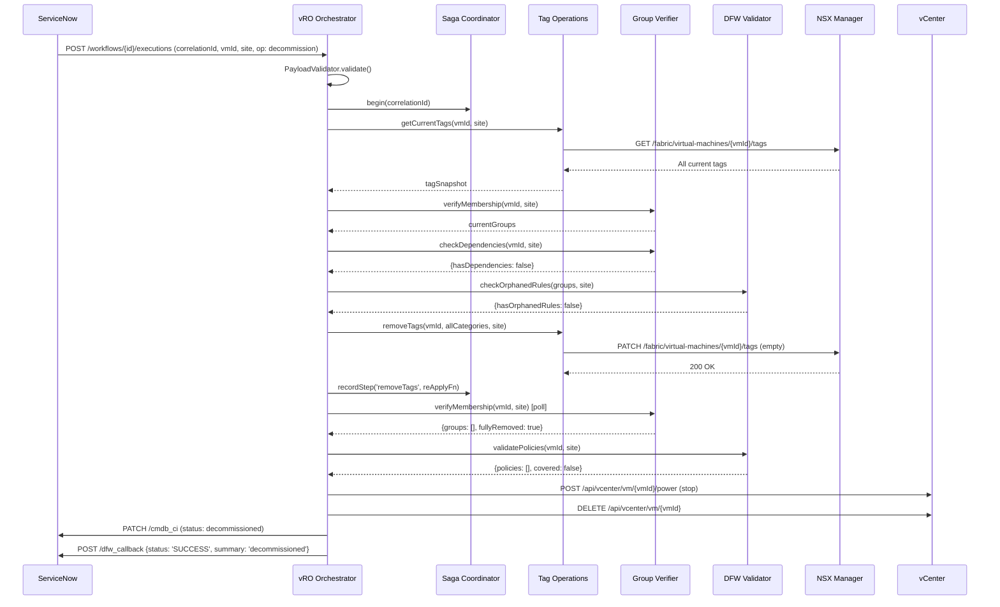

---

## Brownfield / Existing VM Flows

In addition to the greenfield Day 0/2/N lifecycle operations, the pipeline supports several workflows for managing existing (brownfield) VMs that were provisioned outside the automated pipeline or that require operational interventions beyond standard lifecycle management.

### Emergency Quarantine Flow

The Emergency Quarantine Flow provides rapid network isolation for compromised or suspicious VMs. When a security incident is raised in ServiceNow, the `QuarantineOrchestrator` applies a `Quarantine=ACTIVE` tag to the target VM, which triggers dynamic membership in the `SG-Quarantine` security group. The DFW quarantine policy -- a pre-provisioned deny-all rule scoped to `SG-Quarantine` -- immediately blocks all inbound and outbound traffic for the VM. The orchestrator verifies that the quarantine policy is actively enforced on the data plane before sending a callback to ServiceNow. Time-limited quarantines include an auto-expiry mechanism that removes the quarantine tag after a configurable duration, restoring the VM to its previous security posture.

**Flow**: VM quarantine request received -> Quarantine tag applied (`Quarantine=ACTIVE`) -> Dynamic membership in `SG-Quarantine` group -> DFW deny-all quarantine policy blocks traffic -> Auto-expiry removes quarantine tag after configured duration

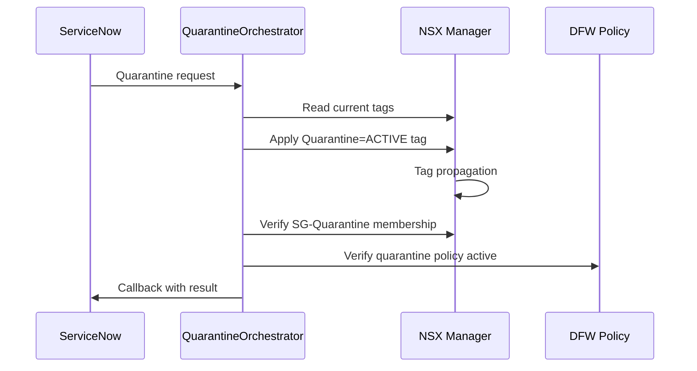

### Bulk Tag Remediation Flow

The Bulk Tag Remediation Flow enables operators to apply tag changes to large numbers of VMs in a single operation. A CSV file containing VM identifiers and desired tag assignments is uploaded through ServiceNow or an administrative interface. The `BulkTagOrchestrator` validates each row against the Tag Dictionary, groups valid entries into configurable batches, and processes each batch sequentially through the standard tag application pipeline. The `RateLimiter` throttles NSX API calls to prevent platform overload during large-scale operations. Progress callbacks are sent to ServiceNow at configurable intervals, and a completion report summarizing successes, failures, and skipped entries is generated at the end.

**Flow**: CSV upload with VM-to-tag mappings -> Row-level validation against Tag Dictionary -> Batched processing with configurable batch size -> Rate-limited NSX API calls -> Progress callbacks to ServiceNow -> Completion report with per-VM status

### Drift Detection Flow

The Drift Detection Flow runs on a scheduled cadence (configurable, default every 4 hours) to identify discrepancies between the CMDB-declared tag state and the actual NSX tag state. The `DriftDetectionWorkflow` queries the CMDB for the expected tag assignments for each managed VM and compares them against the tags currently applied in NSX Manager. Discovered drift is classified by severity: missing tags (high), extra tags (medium), and value mismatches (high). Based on the drift policy configuration, the workflow either auto-remediates by re-applying the expected tags, or creates a ServiceNow incident for manual review. All drift events are logged with full before/after state for audit purposes.

**Flow**: Scheduled scan triggered by cron -> Query CMDB for expected tag state -> Query NSX Manager for actual tag state -> Compare and compute drift delta -> Auto-remediate (re-apply expected tags) or create ServiceNow incident -> Log drift event with before/after state

### Migration Verification Flow

The Migration Verification Flow ensures that VM security posture is preserved after vMotion events. When a VM is migrated to a new host or cluster (either manually or by DRS), NSX tags may not propagate correctly to the destination. The `MigrationVerifier` detects post-vMotion events, reads the expected tag state from the CMDB, compares it against the tags present on the VM at the destination, and re-applies any missing tags. After tag restoration, the verifier confirms that the VM has rejoined its expected security groups and that DFW policies are actively enforced on the data plane at the new location.

**Flow**: Post-vMotion event detected -> Read expected tags from CMDB -> Check tags at destination host -> Re-apply missing tags if needed -> Verify security group membership restored -> Verify DFW policy enforcement at new location

### Monitor-Mode Deployment Flow

The Monitor-Mode Deployment Flow implements a two-phase policy rollout strategy that reduces the risk of production impact from new or modified DFW policies. Rather than deploying rules in enforcement mode immediately, policies are first deployed in monitor (observation) mode where all traffic is allowed but logged, enabling operators to validate correctness before enforcement.

**Flow**: Policy definition submitted -> PolicyDeployer.deployMonitorMode() deploys rules with ALLOW+logging -> Operators observe traffic logs during review period (48-72 hours) -> False positives identified and policy adjusted -> PolicyDeployer.promoteToEnforce() restores original rule actions -> DFW enforces intended ALLOW/DROP/REJECT actions

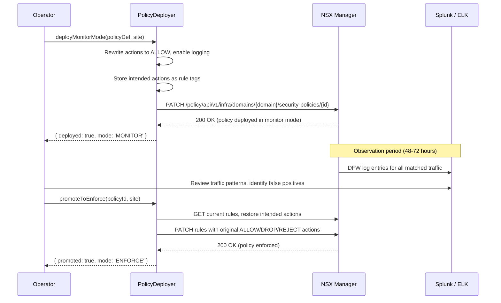

### Drift Trend Analysis Flow

The Drift Trend Analysis Flow extends the standard drift detection scan with historical tracking and trend computation. After each scan, results are persisted to both local storage and ServiceNow, enabling operators to identify recurring drift patterns, chronic offenders, and systemic issues that cause tag inconsistency.

**Flow**: Scheduled drift scan triggered -> DriftDetectionWorkflow.executeScan() compares CMDB vs NSX tags -> DriftDetectionWorkflow.storeScanHistory() persists results locally and to ServiceNow -> DriftDetectionWorkflow.analyzeDriftTrend() computes per-VM and per-category drift frequency over lookback window -> DriftDetectionWorkflow.generateDriftSummary() produces trend report with recommendations

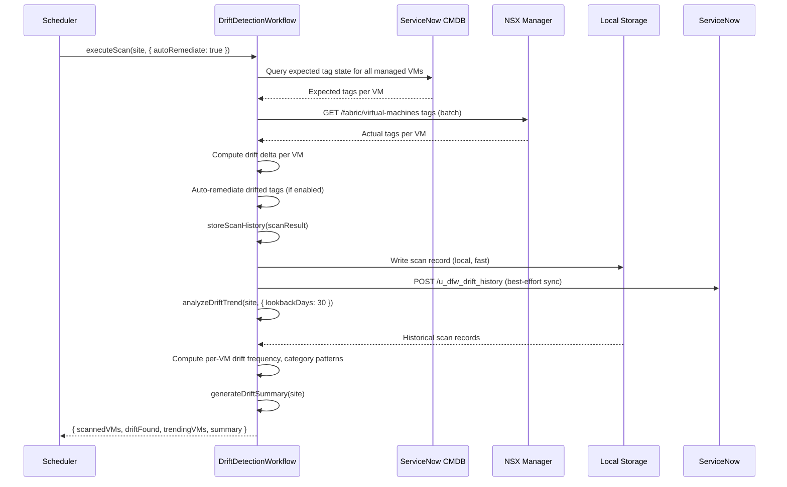

### NSX Hygiene Sweep Flow

The NSX Hygiene Sweep Flow provides a coordinated cleanup operation that detects and remediates orphaned groups, stale rules, phantom VMs, stale tags, and unregistered workloads in a single orchestrated pass. The `NSXHygieneOrchestrator` sequences all cleanup tasks to avoid resource contention on the NSX Manager API and respects dependency ordering between tasks. Each task supports dryRun mode, and items requiring manual intervention are escalated to ServiceNow as incidents.

**Flow**: ServiceNow triggers hygiene sweep -> NSXHygieneOrchestrator coordinates task sequence -> PhantomVMDetector identifies phantom VMs -> OrphanGroupCleaner removes empty groups -> StaleRuleReaper disables stale rules -> PolicyDeployer cleans empty sections -> StaleTagRemediator re-applies correct tags -> UnregisteredVMOnboarder creates CMDB CIs -> NSXHygieneOrchestrator sends callback to ServiceNow with summary

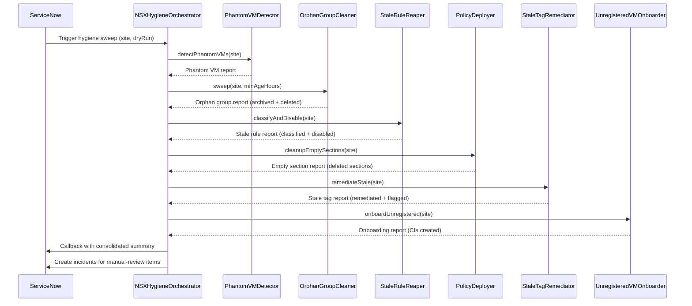

### Phantom VM Detection Flow

The Phantom VM Detection Flow identifies VMs that exist in one inventory source (NSX or vCenter) but not the other. Phantom VMs indicate failed decommissions, partial migrations, or manual interventions that have left the environment in an inconsistent state. The `PhantomVMDetector` queries both NSX fabric API and vCenter API independently, then computes the set difference to identify discrepancies.

**Flow**: PhantomVMDetector queries NSX for fabric VMs -> PhantomVMDetector queries vCenter for compute VMs -> Compute set difference (NSX-only and vCenter-only) -> Classify phantoms by source -> Generate report with recommended actions

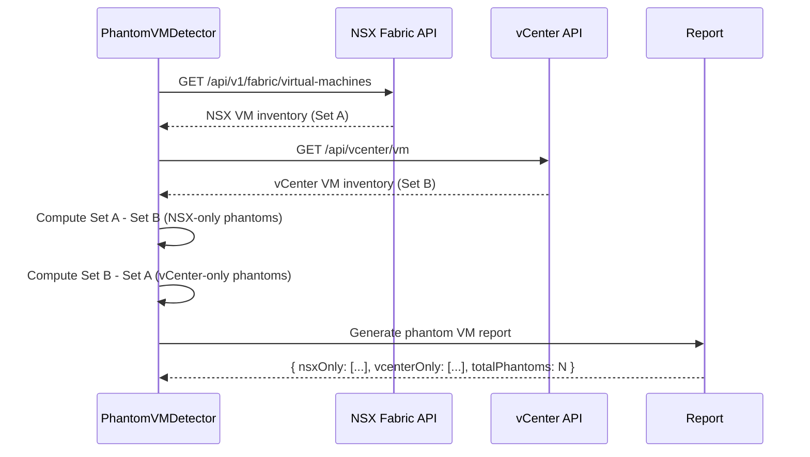

### Orphan Group and Stale Rule Cleanup Flow

The Orphan Group and Stale Rule Cleanup Flow removes empty NSX security groups and disables stale DFW rules that no longer serve an active security purpose. The `OrphanGroupCleaner` identifies groups with zero members that have exceeded the minimum age threshold, archives their full JSON definition, and deletes them. The `StaleRuleReaper` classifies all DFW rules into categories (stale, expired, unmanaged, active), archives stale rule definitions, and disables them via PATCH without deleting them.

**Flow (Orphan Groups)**: OrphanGroupCleaner queries NSX groups -> Check member count per group -> Check referencing rules -> Filter by minimum age -> Archive group JSON -> Delete empty groups

**Flow (Stale Rules)**: StaleRuleReaper queries NSX policies -> Classify each rule by age, state, and ownership -> Archive stale rule JSON -> Disable stale rules via PATCH

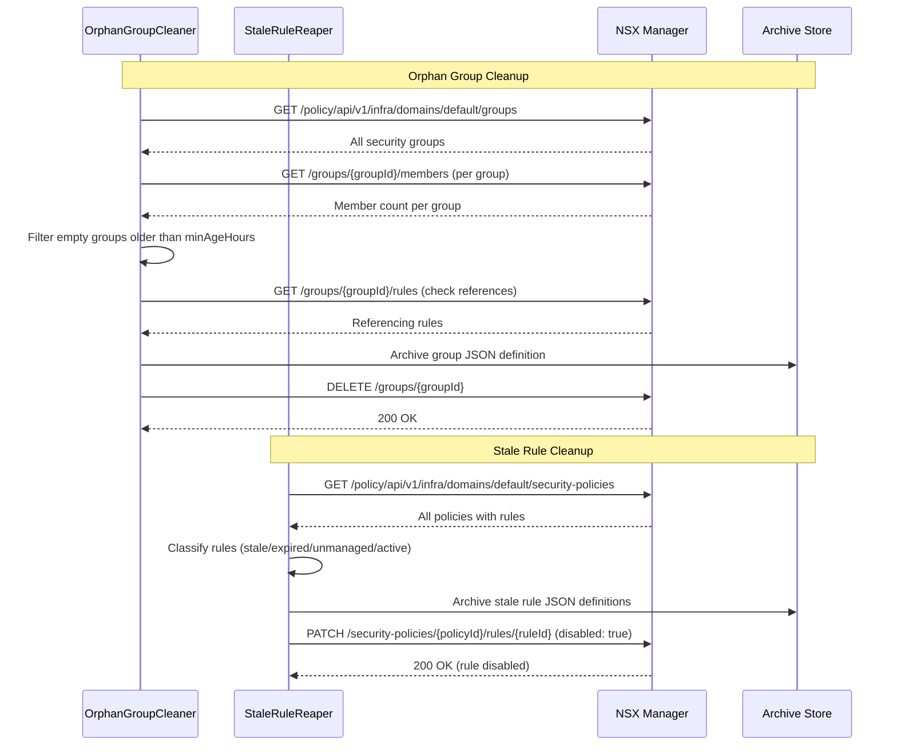

---

## 5. Deployment Topology

### 5.1 Multi-Site Architecture

The pipeline operates across two VMware Cloud Foundation sites with independent vCenter and NSX Manager instances, connected through NSX-T Federation for cross-site policy consistency.

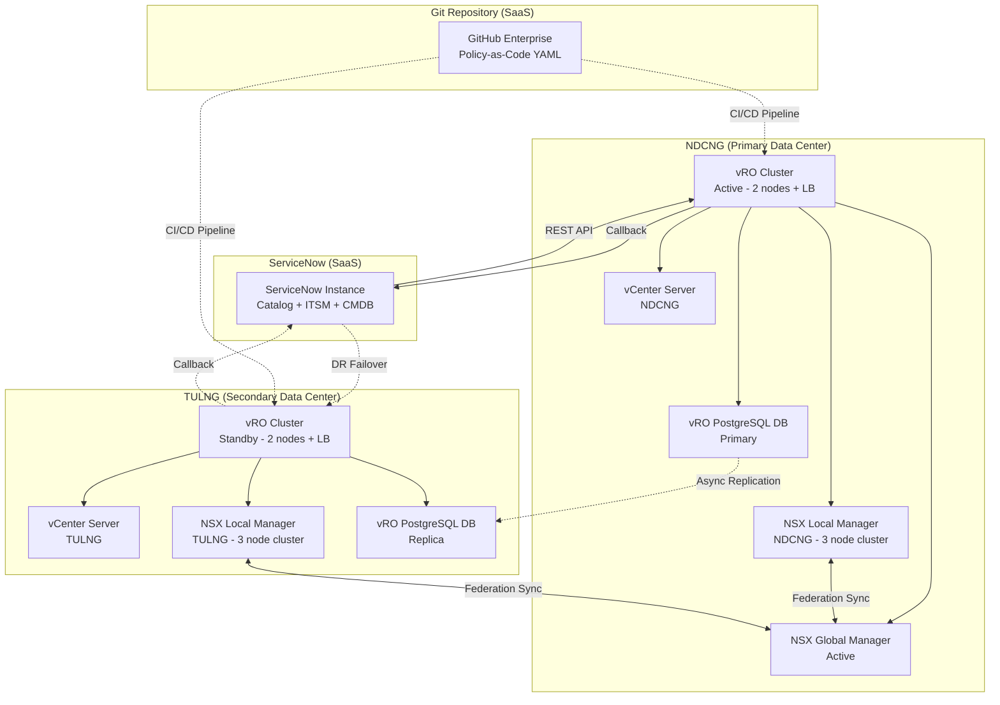

### 5.2 vRO Cluster Topology

The vRO deployment uses an active-standby cluster configuration across sites:

- **NDCNG (Active)**: Primary 2-node vRO cluster behind an F5 load balancer. All ServiceNow-initiated workflows are routed here. The cluster shares a PostgreSQL database for workflow state persistence. Both nodes are identically configured with the same workflow packages, action modules, REST host definitions, and configuration elements.

- **TULNG (Standby)**: Secondary 2-node vRO cluster, identically configured through automated package export/import. The PostgreSQL database at TULNG receives asynchronous replication from NDCNG. The standby cluster is activated during DR failover by switching the ServiceNow REST endpoint target.

### 5.3 NSX Federation Topology

NSX-T Federation operates in Active-Standby mode for the Global Manager:

- **Global Manager (NDCNG)**: Manages cross-site objects including global security groups, global security policies, and cross-site segment definitions. Replicates configuration to both Local Managers.
- **Local Manager (NDCNG)**: Manages site-local objects including local tags, local groups, and local-scope policies. Enforces both global (replicated) and local policies on the data plane.
- **Local Manager (TULNG)**: Same as NDCNG Local Manager but for the secondary site. Receives global policy replicas from the Global Manager.

The pipeline writes site-local operations (tag CRUD, local group membership updates) to the appropriate Local Manager. Cross-site operations (global group definitions, federated security policies) are written to the Global Manager. Circuit breakers track each endpoint independently, so a failure at one site does not affect operations at the other.

### 5.4 Network Connectivity Requirements

| Source | Destination | Port | Protocol | Purpose |
|--------|------------|------|----------|---------|
| ServiceNow | vRO LB (NDCNG) | 443 | HTTPS | REST workflow trigger |
| ServiceNow | vRO LB (TULNG) | 443 | HTTPS | DR failover REST trigger |
| vRO (NDCNG) | ServiceNow | 443 | HTTPS | Callback REST API |
| vRO (NDCNG) | vCenter (NDCNG) | 443 | HTTPS | vSphere Automation API |
| vRO (NDCNG) | NSX LM (NDCNG) | 443 | HTTPS | NSX Policy API |
| vRO (NDCNG) | NSX GM | 443 | HTTPS | NSX Federation API |
| vRO (NDCNG) | vCenter (TULNG) | 443 | HTTPS | Cross-site VM operations |
| vRO (NDCNG) | NSX LM (TULNG) | 443 | HTTPS | Cross-site NSX operations |
| NSX LM (NDCNG) | NSX GM | 443 | HTTPS | Federation sync |
| NSX LM (TULNG) | NSX GM | 443 | HTTPS | Federation sync |

---

## 6. DR/HA Considerations

### 6.1 vRO High Availability (Intra-Site)

The primary vRO cluster at NDCNG provides intra-site high availability through a 2-node active-active cluster behind an F5 load balancer. Both nodes share a PostgreSQL database for workflow state persistence. If one node fails, the surviving node continues processing workflows. In-progress workflow executions are persisted to the database and resume on the surviving node.

The load balancer performs health checks against the vRO REST API endpoint (`GET /vco/api/about`) every 10 seconds. A node is removed from the pool after 3 consecutive failed health checks and restored after 2 consecutive successful checks.

### 6.2 Cross-Site Disaster Recovery

If the NDCNG site becomes completely unavailable, the following DR procedure is executed:

1. **Detection**: Monitoring detects NDCNG site failure (vRO health check failures, NSX Global Manager unreachable).
2. **DNS Failover**: ServiceNow REST endpoint is switched to the TULNG vRO cluster via DNS CNAME update or manual REST message configuration change.
3. **vRO Activation**: The TULNG vRO cluster is activated as the primary processing cluster.
4. **NSX GM Promotion**: If the Global Manager at NDCNG is down, the TULNG Local Manager can be promoted to Global Manager role (manual procedure, ~15 minutes).
5. **Processing Resumes**: New requests from ServiceNow are routed to TULNG vRO and processed against TULNG vCenter and NSX Local Manager.

**Recovery Time Objective (RTO)**: 30 minutes (time to activate standby vRO, switch DNS, and optionally promote NSX GM).
**Recovery Point Objective (RPO)**: Zero data loss for committed (completed) workflows. In-flight workflows at the moment of failure may need resubmission from ServiceNow.

### 6.3 NSX Federation Resilience

NSX-T Federation provides inherent policy resilience:

- **Global Manager Down**: Local Managers continue enforcing their last-known policy configuration. Tag operations on local VMs continue to work. Only new cross-site policy changes are blocked until the GM is restored.
- **Local Manager Down**: The affected site's data plane continues enforcing cached policies. No new tag or group operations can be performed at the affected site. The other site is unaffected.
- **Site Link Down**: Federation sync pauses. Each site operates independently with its last-synced policy set. When connectivity is restored, the GM automatically reconciles state.

### 6.4 ServiceNow Resilience

ServiceNow is a SaaS platform with its own multi-region HA/DR capabilities (99.9%+ SLA). The pipeline's dependency on ServiceNow is limited to two interaction points:

1. **Inbound REST calls** from ServiceNow to vRO: If ServiceNow is unavailable, no new requests are generated, but all in-flight pipeline operations continue unaffected.
2. **Outbound callback** from vRO to ServiceNow: If the callback fails, the RetryHandler retries with exponential backoff intervals (2s, 5s, 10s). If all retries fail, the callback payload is written to the Dead Letter Queue for later reprocessing when ServiceNow becomes available.

### 6.5 Graceful Degradation

The pipeline supports graceful degradation under partial failure conditions:

| Failure Scenario | Impact | Degradation Behavior |
|-----------------|--------|---------------------|
| NSX Manager unreachable | Cannot apply tags or verify groups | Circuit breaker opens; operations queued in DLQ for retry |
| vCenter unreachable | Cannot provision/delete VMs | Day 0/N blocked; Day 2 tag operations can proceed if vmId is known |
| NSX Global Manager down | Cannot modify cross-site policies | Site-local operations continue; cross-site changes deferred |
| ServiceNow callback fails | RITM not updated | Callbacks retried then DLQ'd; pipeline operations complete successfully |
| vRO database failure | Cannot persist workflow state | Active workflows fail; saga compensates; operations retry on recovery |

---

## 7. Monitoring and Observability

### 7.1 Observability Architecture

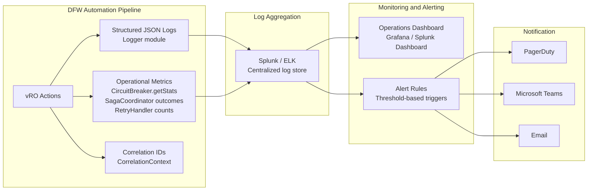

### 7.2 Structured Logging

Every pipeline operation produces structured JSON log entries via the `Logger` module. Each entry contains:

- **timestamp**: ISO 8601 timestamp for ordering and temporal correlation
- **level**: Severity level (DEBUG, INFO, WARN, ERROR) for filtering and routing
- **correlationId**: Links all log entries for a single pipeline run to the originating ServiceNow RITM
- **step**: Pipeline step identifier (validate, resolveEndpoints, prepare, execute, verify, callback) for segmented analysis
- **component**: Source module name (Day0Orchestrator, TagOperations, CircuitBreaker, etc.) for module-level filtering
- **message**: Human-readable description of the event
- **metadata**: Operation-specific key-value pairs (vmId, site, error details, durations, counts)

Log entries are emitted as single-line JSON to `stdout`, where the vRO log forwarder ships them to Splunk or ELK. The correlation ID enables end-to-end tracing across all systems involved in a single request. Example log entry:

```json
{"timestamp":"2026-03-21T14:30:05.123Z","level":"INFO","correlationId":"SNOW-REQ-2026-0001234","step":"applyTags","component":"TagOperations","message":"Tags applied successfully","metadata":{"vmId":"vm-42","site":"NDCNG","added":6,"removed":0}}
```

### 7.3 Key Metrics

| Metric | Source | Normal Range | Alert Threshold |
|--------|--------|-------------|----------------|
| Pipeline execution time | Workflow duration | 30-120 seconds | > 5 minutes |
| Tag apply latency | TagOperations timer | 2-10 seconds | > 30 seconds |
| Tag propagation latency | PropagationVerifier timer | 10-60 seconds | > 120 seconds |
| Circuit breaker state | CircuitBreaker.getStats() | All CLOSED | Any endpoint OPEN |
| Retry rate | RetryHandler attempt counter | < 5% of operations | > 10% of operations |
| Saga compensation rate | SagaCoordinator outcomes | 0-2% of operations | > 5% of operations |
| DLQ depth | DeadLetterQueue.getDepth() | 0 entries | > 0 entries |
| NSX API error rate | HTTP status code counters | < 1% 5xx responses | > 5% 5xx responses |
| Tag propagation timeout | DFW-7004 error count | 0 occurrences/day | Any occurrence |
| ServiceNow callback failures | Callback retry counter | 0 failures/hour | > 3 consecutive failures |
| Drift detection count | Day2Orchestrator drift log | < 5/day | > 20/day |

### 7.4 Dashboard Panels

The operations dashboard provides the following real-time views:

1. **Pipeline Health**: Status of all circuit breakers across both sites, color-coded green (CLOSED), yellow (HALF_OPEN), red (OPEN). Includes time-in-state and last failure timestamp.
2. **Throughput**: Operations per hour segmented by type (Day 0, Day 2, Day N) and site (NDCNG, TULNG). Trend line with 24-hour rolling window.
3. **Error Rate**: Percentage of operations resulting in errors, segmented by DFW error code range (4xxx validation, 5xxx auth, 6xxx connectivity, 7xxx infrastructure).
4. **Latency Distribution**: Histogram of end-to-end pipeline execution times with p50, p90, and p99 percentiles. Separate panels for each lifecycle type.
5. **DLQ Monitor**: Current DLQ depth with age of oldest entry. Table of pending DLQ entries with correlation IDs and error summaries.
6. **Saga Outcomes**: Pie chart of successful completions vs. compensations vs. partial failures over configurable time windows.
7. **Tag Governance**: Count of tag validation failures by conflict rule type. Useful for identifying misconfigured catalog forms or stale dictionary entries.
8. **Federation Status**: Cross-site replication lag, Global Manager availability, and Local Manager sync status.

### 7.5 Alerting Strategy

Alerts are categorized by severity with defined notification channels and response time SLAs:

| Severity | Condition | Notification Channel | Response Time SLA |
|----------|-----------|---------------------|-------------------|
| Critical (P1) | Circuit breaker OPEN on any production endpoint | PagerDuty page + Teams | 15 minutes |
| Critical (P1) | DLQ depth > 10 entries | PagerDuty page + Teams | 30 minutes |
| Critical (P1) | vRO cluster health check failure | PagerDuty page | 15 minutes |
| High (P2) | Pipeline execution failure rate > 10% (rolling 1h) | Teams channel + email | 1 hour |
| High (P2) | Saga compensation rate > 5% (rolling 1h) | Teams channel + email | 1 hour |
| Medium (P3) | Retry rate > 20% (rolling 1h) | Teams channel | 4 hours |
| Medium (P3) | Tag propagation timeout occurrences | Teams channel | 4 hours |
| Low (P4) | Tag validation failure rate > 5% (rolling 24h) | Email digest | Next business day |
| Low (P4) | Drift detection count > 20/day | Email digest | Next business day |

### 7.6 Audit and Compliance Reporting

The monitoring system generates compliance reports on scheduled cadences:

- **Daily**: Summary of all pipeline operations with pass/fail outcomes, grouped by site and operation type. Includes error breakdown by DFW error code.
- **Weekly**: DFW coverage audit -- list of VMs without DFW policy coverage (potential security gaps). Tag completeness audit -- VMs missing required tag categories.
- **Monthly**: Tag governance compliance -- percentage of VMs with complete, valid tag sets. Circuit breaker trip history. DLQ processing summary.
- **Quarterly**: Full audit report correlating every DFW policy change to its originating ServiceNow RITM, suitable for SOX, PCI DSS, and HIPAA auditor review. Includes immutable log evidence, approval chain verification, and policy change diffs.

All audit logs are retained for a minimum of 7 years to satisfy SOX, PCI DSS, and HIPAA retention requirements. The Logger module formats every entry as single-line JSON for efficient ingestion by log aggregation platforms, and log entries are forwarded to a write-once audit store for tamper-proof retention.

---

## 8. CMDB Validation and Rule Lifecycle Components

### 8.1 Extended Component Inventory

The following components extend the pipeline to support CMDB data quality validation, DFW rule lifecycle management, migration-event-driven bulk tagging, and periodic rule review.

#### 8.1.1 CMDBValidator

| Component | Module Path | Purpose | Design Pattern |
|-----------|------------|---------|----------------|
| `CMDBValidator` | `src/vro/actions/cmdb/` | Extracts VM inventory from ServiceNow CMDB, validates 5-tag completeness per VM, and generates gap reports with remediation tasks. Operates as a scheduled validation engine that ensures all managed VMs maintain complete tag coverage against the 5-tag mandatory taxonomy (Region, SecurityZone, Environment, AppCI, SystemRole). | Scheduled Validation, Read-Only Query |

#### 8.1.2 RuleLifecycleManager

| Component | Module Path | Purpose | Design Pattern |
|-----------|------------|---------|----------------|
| `RuleLifecycleManager` | `src/vro/actions/lifecycle/` | Manages the full DFW rule lifecycle through a formal state machine with states: REQUESTED, IMPACT_ANALYZED, APPROVED, MONITOR_MODE, VALIDATED, ENFORCED, CERTIFIED, REVIEW_DUE, EXPIRED, and ROLLED_BACK. Enforces legal transition paths and maintains an immutable audit trail for every state change. | State Machine, Audit Trail |

#### 8.1.3 RuleRegistry

| Component | Module Path | Purpose | Design Pattern |
|-----------|------------|---------|----------------|
| `RuleRegistry` | `src/vro/actions/lifecycle/` | Provides CRUD operations against the `x_dfw_rule_registry` custom ServiceNow table. Each rule receives a unique identifier (DFW-R-XXXX format) and carries metadata including owner, creation date, last review date, expiry date, and state transition history. | Repository, Registry |

#### 8.1.4 RuleReviewScheduler

| Component | Module Path | Purpose | Design Pattern |
|-----------|------------|---------|----------------|
| `RuleReviewScheduler` | `src/vro/actions/lifecycle/` | Runs scheduled scans against the rule registry to identify rules approaching their review deadline. Sends owner notifications, escalates overdue reviews through ServiceNow incident management, and auto-expires rules that are not re-certified within the configured grace period. | Scheduled Scan, Notification |

#### 8.1.5 RuleRequestPipeline

| Component | Module Path | Purpose | Design Pattern |
|-----------|------------|---------|----------------|
| `RuleRequestPipeline` | `src/vro/actions/lifecycle/` | Provides a unified intake pipeline for DFW rule requests from four source channels: ServiceNow Catalog, Onboarding workflows, Emergency requests, and Audit-driven requests. Normalizes requests from all sources into a common format and feeds them into the RuleLifecycleManager. | Pipeline, Adapter |

#### 8.1.6 MigrationBulkTagger

| Component | Module Path | Purpose | Design Pattern |
|-----------|------------|---------|----------------|
| `MigrationBulkTagger` | `src/vro/actions/lifecycle/` | Processes Greenzone VM migration manifests in waves, applying tags based on manifest definitions. Supports pre-validation, wave-based execution with progress tracking, and post-migration tag persistence verification. | Batch Orchestrator, Manifest-Driven |

### 8.2 Updated Data Flow -- Rule Lifecycle

The rule lifecycle data flow spans ServiceNow (request intake and approval), vRO (impact analysis, deployment, and monitoring), and NSX Manager (rule enforcement and realized-state verification):

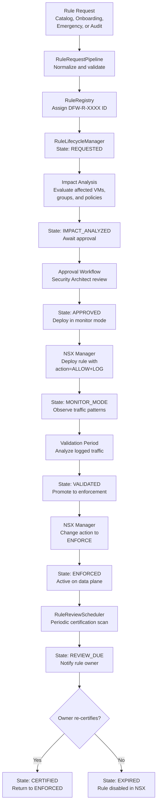

### 8.3 CMDB Validation Flow

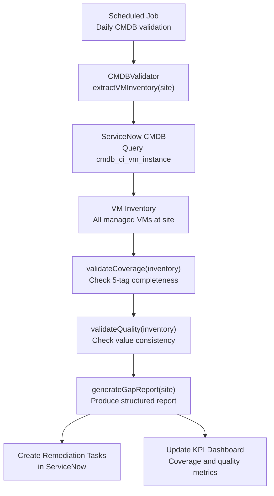

---

*End of High Level Design*
