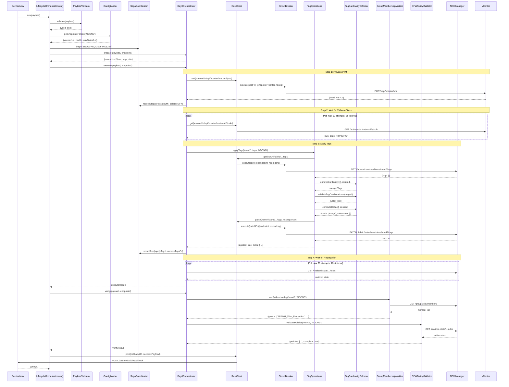
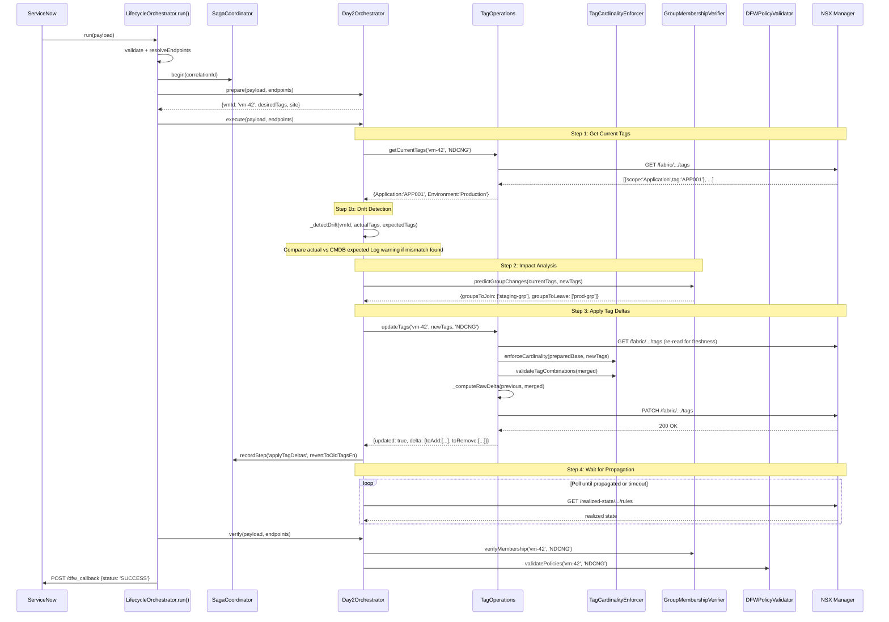
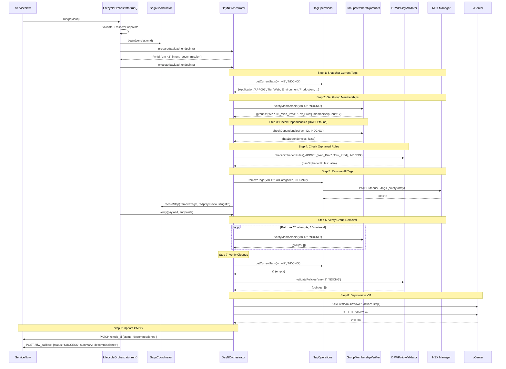
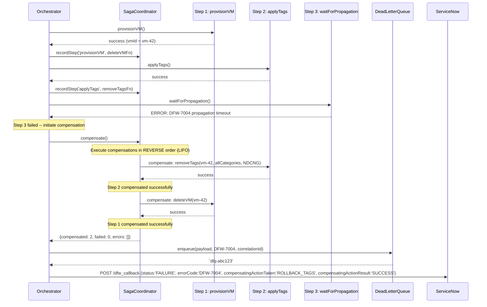
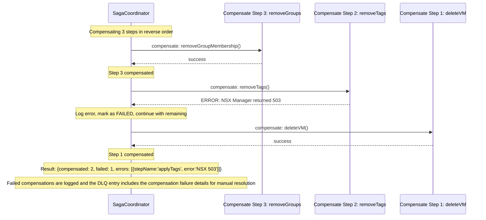
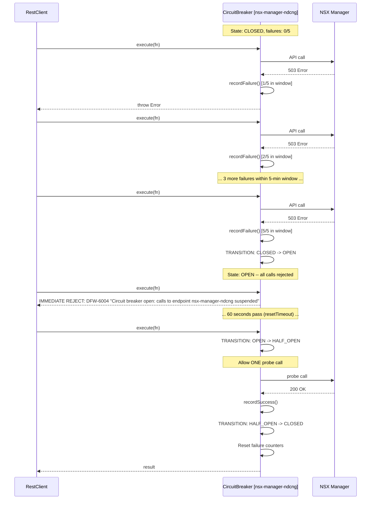
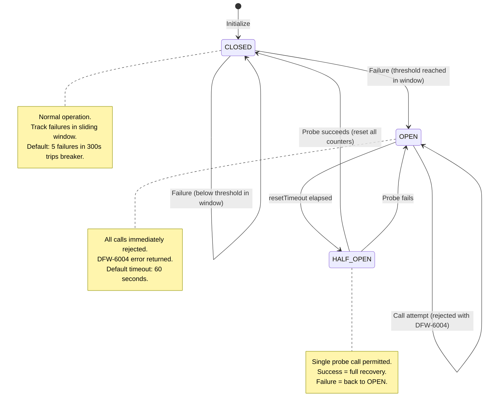
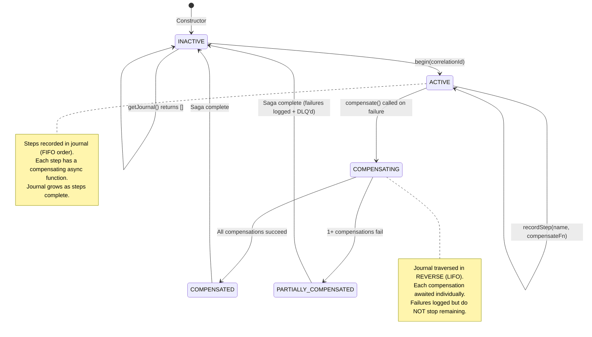
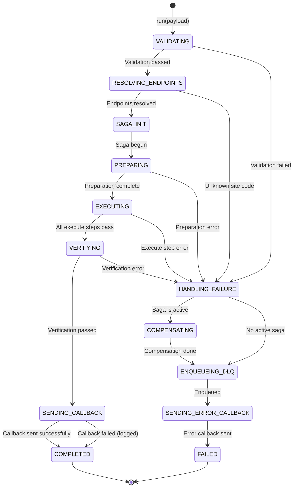

# Low Level Design (LLD)

## NSX DFW Automation Pipeline

**Version:** 1.0
**Date:** 2026-03-21
**Author:** Enterprise Infrastructure & Cloud Security
**Status:** Approved

---

## Table of Contents

1. [Module-Level Design](#1-module-level-design)
2. [Class Diagram](#2-class-diagram)
3. [Sequence Diagrams](#3-sequence-diagrams)
4. [Error Handling Flows](#4-error-handling-flows)
5. [Configuration Schema](#5-configuration-schema)
6. [REST API Contracts Summary](#6-rest-api-contracts-summary)
7. [State Machine Diagrams](#7-state-machine-diagrams)

---

## 1. Module-Level Design

### 1.1 Shared Utilities Module (`src/vro/actions/shared/`)

The shared utilities module provides cross-cutting infrastructure services used by all domain modules. Each class is designed as an independently testable unit with explicit dependencies injected through constructors.

#### 1.1.1 ConfigLoader

**Responsibility**: Centralized configuration management with site-aware endpoint resolution and vault reference resolution for secrets.

**Key Methods**:
- `getEndpointsForSite(site: string): { vcenterUrl, nsxUrl, nsxGlobalUrl }` -- Resolves the vCenter, NSX Local Manager, and NSX Global Manager URLs for a given site code (NDCNG or TULNG). Throws `DFW-4004` if site code is unrecognized.
- `getConfig(key: string): any` -- Retrieves a configuration value by key, supporting nested dot-notation paths.
- `resolveVaultReference(ref: string): string` -- Resolves vault reference patterns (`{{vault:secret/path}}`) to actual credential values at runtime. In development, returns the reference string unchanged; in production, integrates with HashiCorp Vault or the vRO credential store.

**Configuration Structure**:
```javascript
{
  sites: {
    NDCNG: {
      vcenterUrl: 'https://vcenter-ndcng.company.internal',
      nsxUrl: 'https://nsx-manager-ndcng.company.internal',
      nsxGlobalUrl: 'https://nsx-global-ndcng.company.internal'
    },
    TULNG: {
      vcenterUrl: 'https://vcenter-tulng.company.internal',
      nsxUrl: 'https://nsx-manager-tulng.company.internal'
    }
  },
  credentials: {
    nsxUsername: 'svc-dfw-pipeline',
    nsxPassword: '{{vault:secret/vro/nsx/password}}',
    vcenterUsername: 'svc-dfw-pipeline@vsphere.local',
    vcenterPassword: '{{vault:secret/vro/vcenter/password}}'
  },
  retry: { intervals: [5000, 15000, 45000] },
  circuitBreaker: { failureThreshold: 5, resetTimeout: 60000, windowSize: 300000 },
  propagation: { timeout: 120000, pollInterval: 10000 }
}
```

**Design Decisions**:
- Vault references use a double-curly-brace pattern (`{{vault:...}}`) that is visually distinct and easily detectable by static analysis tools. The pattern is never resolved during unit tests, preventing accidental credential exposure in CI/CD logs.
- Site configuration is keyed by site code (string), not by index, to prevent off-by-one routing errors. The `getEndpointsForSite` method performs strict validation and throws a typed DFW-4004 error for unrecognized sites.

#### 1.1.2 Logger

**Responsibility**: Structured JSON logging with correlation ID propagation, configurable log levels, and single-line output for Splunk/ELK ingestion.

**Key Methods**:
- `info(message: string, metadata?: object): void` -- Logs at INFO level.
- `warn(message: string, metadata?: object): void` -- Logs at WARN level.
- `error(message: string, metadata?: object): void` -- Logs at ERROR level.
- `debug(message: string, metadata?: object): void` -- Logs at DEBUG level.
- `setCorrelationId(id: string): void` -- Sets the correlation ID for subsequent log entries.

**Log Entry Format**:
```json
{
  "timestamp": "2026-03-21T14:30:05.123Z",
  "level": "INFO",
  "correlationId": "SNOW-REQ-2026-0001234",
  "step": "applyTags",
  "component": "TagOperations",
  "message": "Tags applied successfully",
  "metadata": { "vmId": "vm-42", "site": "NDCNG", "added": 6, "removed": 0 }
}
```

**Constructor Parameters**:
- `step: string` -- Default step identifier for log entries.
- `minLevel: string` -- Minimum log level to emit (DEBUG, INFO, WARN, ERROR). Defaults to 'DEBUG' in development, 'INFO' in production.
- `correlationId?: string` -- Initial correlation ID (can be set later via `setCorrelationId`).

**Design Decisions**:
- Single-line JSON format was chosen over multi-line formats because Splunk and ELK parse single-line JSON natively without custom parsing rules. Each log entry is one complete JSON object per line.
- The `metadata` field is an unstructured object that accepts arbitrary key-value pairs. This provides flexibility for domain modules to include operation-specific context without requiring Logger changes.
- Log levels use a severity hierarchy: DEBUG (0) < INFO (1) < WARN (2) < ERROR (3). The `minLevel` filter is evaluated at emit time, not at call time, so the overhead of constructing log metadata exists even when the entry is filtered out. This is acceptable because the pipeline prioritizes debuggability over micro-optimization.

#### 1.1.3 CorrelationContext

**Responsibility**: Thread-local (execution-scoped in vRO) correlation ID propagation across all modules and HTTP headers.

**Key Methods**:
- `generate(ritmNumber: string): string` -- Generates a new correlation ID in format `RITM-{number}-{epochTimestamp}`. The epoch timestamp provides uniqueness for retries of the same RITM.
- `set(correlationId: string): void` -- Sets the correlation ID for the current execution context.
- `get(): string` -- Retrieves the current correlation ID.
- `getHeaders(): object` -- Returns HTTP headers object with `X-Correlation-ID` set for injection into outbound REST calls.

**Implementation Note**: In vRO 8.x, each workflow execution runs in an isolated JavaScript context. The correlation ID is stored as a module-level variable, which is effectively thread-local because vRO does not share module state between concurrent executions.

#### 1.1.4 RetryHandler

**Responsibility**: Configurable retry logic with pluggable strategies for different failure modes. The handler wraps an async function call and retries it according to a configurable schedule when failures occur.

**Key Methods**:
- `execute(fn: AsyncFunction, options?: object): Promise<any>` -- Executes the given async function with retry logic. On failure, evaluates `shouldRetry(error, attempt)` and waits for the configured delay before the next attempt. Returns the result of the first successful attempt.

**Constructor Parameters**:
- `retryIntervals: number[]` -- Array of delay durations in milliseconds between retry attempts (default: `[5000, 15000, 45000]`). The array length determines the maximum number of retries after the initial attempt.
- `shouldRetry?: (error, attempt) => boolean` -- Predicate function determining if a failed operation should be retried. Default implementation retries on HTTP 5xx, 429 (rate limiting), and network errors; rejects on 4xx (except 429) and non-retryable error codes.
- `retryStrategy?: { getDelay(attempt: number): number }` -- Pluggable strategy object for computing custom delay values (e.g., exponential backoff with jitter). When provided, overrides `retryIntervals`.
- `onRetry?: (error, attempt) => void` -- Optional callback invoked before each retry attempt, useful for logging.
- `logger?: Logger` -- Logger instance for retry event logging.

**Retry Strategy Interface**:
```javascript
// Strategy pattern interface
interface RetryStrategy {
  getDelay(attempt: number): number;  // Returns delay in ms for the given attempt
}

// Built-in strategies:
class ExponentialBackoff implements RetryStrategy {
  constructor(baseMs = 1000, maxMs = 60000, jitterMs = 500);
  getDelay(attempt) {
    const exponential = Math.min(this.baseMs * Math.pow(2, attempt), this.maxMs);
    const jitter = Math.random() * this.jitterMs;
    return exponential + jitter;
  }
}

class FixedInterval implements RetryStrategy {
  constructor(intervalMs = 5000);
  getDelay(_attempt) { return this.intervalMs; }
}
```

**Retry Decision Logic**:
1. Execute the function.
2. If the function succeeds, return the result.
3. If the function throws, evaluate `shouldRetry(error, attempt)`.
4. If `shouldRetry` returns `false`, re-throw the error immediately.
5. If `shouldRetry` returns `true` and retries remain, wait for the computed delay and go to step 1.
6. If no retries remain, re-throw the last error.

#### 1.1.5 CircuitBreaker

**Responsibility**: Per-endpoint circuit breaker protecting downstream APIs (NSX Manager, vCenter) from cascading failures by tracking failure rates within a sliding time window and temporarily suspending calls when a failure threshold is breached.

**State Machine**: CLOSED -> OPEN -> HALF_OPEN -> CLOSED (see Section 7.1 for the full state machine diagram)

**Key Methods**:
- `execute(fn: AsyncFunction): Promise<any>` -- Executes the function through the circuit breaker. In CLOSED state, calls the function and tracks failures in a sliding window. In OPEN state, immediately rejects with a DFW-6004 error without calling the function. In HALF_OPEN state, allows exactly one probe call: success returns to CLOSED, failure returns to OPEN.
- `getState(): string` -- Returns the current state ('CLOSED', 'OPEN', or 'HALF_OPEN'). Also performs automatic OPEN-to-HALF_OPEN transition check.
- `getStats(): object` -- Returns operational statistics including name, state, totalSuccesses, totalFailures, consecutiveFailures, failureThreshold, recentFailures, lastFailureTime, and lastSuccessTime.
- `reset(): void` -- Manually resets the breaker to CLOSED state, clearing all failure counters and timestamps. Used by operators to recover from false-positive trips.

**Constructor Parameters**:
- `name: string` -- Logical endpoint identifier (e.g., `'nsx-manager-ndcng'`). State is tracked per-name in an in-memory Map, so different endpoints have independent breakers.
- `failureThreshold: number` -- Number of failures within the sliding window that trips the breaker (default: 5).
- `resetTimeout: number` -- Milliseconds to wait in OPEN state before transitioning to HALF_OPEN (default: 60000ms = 1 minute).
- `windowSize: number` -- Sliding window size in milliseconds for counting failures (default: 300000ms = 5 minutes).

**Internal State Structure** (per-endpoint, stored in module-level `Map<string, Object>`):
```javascript
{
  status: 'CLOSED' | 'OPEN' | 'HALF_OPEN',
  failureTimestamps: number[],     // Epoch ms timestamps of failures within window
  consecutiveFailures: number,     // Sequential failures without success
  totalFailures: number,           // Lifetime failure count
  totalSuccesses: number,          // Lifetime success count
  lastFailureTime: number | null,  // Epoch ms of most recent failure
  lastSuccessTime: number | null   // Epoch ms of most recent success
}
```

**Failure Recording Logic**:
1. Record the failure timestamp.
2. Increment `totalFailures` and `consecutiveFailures`.
3. Prune failure timestamps outside the sliding window (`now - windowSize`).
4. If the count of remaining timestamps >= `failureThreshold`, transition to OPEN.

**Success Recording Logic**:
1. Increment `totalSuccesses`.
2. Reset `consecutiveFailures` to 0.
3. Update `lastSuccessTime`.

#### 1.1.6 RestClient

**Responsibility**: HTTP client wrapper that integrates CircuitBreaker, RetryHandler, and CorrelationContext for all outbound REST API calls. Acts as a facade that hides the complexity of resilience patterns from domain modules.

**Key Methods**:
- `get(url: string, options?: object): Promise<object>` -- HTTP GET with circuit breaker and retry.
- `post(url: string, body: object, options?: object): Promise<object>` -- HTTP POST with circuit breaker and retry.
- `patch(url: string, body: object, options?: object): Promise<object>` -- HTTP PATCH with circuit breaker and retry.
- `delete(url: string, options?: object): Promise<object>` -- HTTP DELETE with circuit breaker and retry.

**Request Processing Pipeline**:
1. Extract hostname from URL for circuit breaker endpoint selection.
2. Inject `X-Correlation-ID` header from CorrelationContext.
3. Wrap the HTTP call in `CircuitBreaker.execute()` for the target endpoint.
4. Wrap the circuit-breaker-protected call in `RetryHandler.execute()` for transient failure recovery.
5. Return the response body, or throw a structured error.

#### 1.1.7 PayloadValidator

**Responsibility**: JSON Schema-based validation of incoming ServiceNow payloads using AJV (Another JSON Validator).

**Key Methods**:
- `validate(payload: object): { valid: boolean, errors?: string[] }` -- Validates the payload against `schemas/snow-vro-payload.schema.json`. Returns validation result with human-readable error messages extracted from AJV's error objects.
- `validateCallback(payload: object): { valid: boolean, errors?: string[] }` -- Validates outbound callback payloads against `schemas/vro-snow-callback.schema.json`.

**Schema Features Used**:
- Conditional validation (`if`/`then`) for DAY0_PROVISION-specific required fields (vmTemplate, cluster, datastore, network, cpuCount, memoryGB, diskGB).
- Pattern validation for correlationId, vmName, and application code formats.
- Enum validation for requestType, site, tier, environment, compliance, and dataClassification.
- `$defs` references for reusable tag assignment schema.

#### 1.1.8 ErrorFactory

**Responsibility**: Creates structured `DfwError` instances conforming to the pipeline's BRD error taxonomy. Provides error classification, retryability determination, and ServiceNow callback payload generation from any error type.

**Error Taxonomy Mapping**:

| Code Range | Category | HTTP Status | Retryable | Examples |
|-----------|----------|-------------|-----------|---------|
| DFW-4001 | INPUT_VALIDATION | 400 | No | Missing required field in request payload |
| DFW-4002 | INPUT_VALIDATION | 400 | No | Invalid tag value not in Enterprise Tag Dictionary |
| DFW-4003 | INPUT_VALIDATION | 400 | No | Conflicting tag combination (PCI + Sandbox) |
| DFW-4004 | INPUT_VALIDATION | 400 | No | Invalid site value (must be NDCNG or TULNG) |
| DFW-4005 | INPUT_VALIDATION | 400 | No | VM name format does not match naming convention |
| DFW-4006 | INPUT_VALIDATION | 400 | No | Duplicate single-value tag categories |
| DFW-5001 | AUTHENTICATION | 401 | No | vRO service account auth failed for vCenter |
| DFW-5002 | AUTHENTICATION | 401 | No | vRO service account auth failed for NSX |
| DFW-5003 | AUTHENTICATION | 403 | No | Insufficient permissions for vCenter VAPI tag op |
| DFW-5004 | AUTHENTICATION | 403 | No | Insufficient permissions for NSX tag op |
| DFW-6001 | CONNECTIVITY | 503 | Yes | vCenter API endpoint unreachable |
| DFW-6002 | CONNECTIVITY | 503 | Yes | NSX Manager API endpoint unreachable |
| DFW-6003 | CONNECTIVITY | 503 | Yes | NSX Manager 503 after all retries |
| DFW-6004 | CONNECTIVITY | 503 | No | Circuit breaker open (calls suspended) |
| DFW-6005 | CONNECTIVITY | 504 | Yes | Gateway timeout on NSX Federation GM API |
| DFW-7001 | INFRASTRUCTURE | 500 | Yes | VM provisioning failed in vCenter |
| DFW-7002 | INFRASTRUCTURE | 500 | Yes | VMware Tools did not become ready within timeout |
| DFW-7003 | INFRASTRUCTURE | 500 | Yes | Tag application failed in vCenter (VAPI error) |
| DFW-7004 | INFRASTRUCTURE | 500 | Yes | NSX tag propagation verification timeout |
| DFW-7005 | INFRASTRUCTURE | 500 | Yes | Dynamic Security Group membership not confirmed |
| DFW-7006 | INFRASTRUCTURE | 500 | Yes | DFW rule validation failed |
| DFW-7007 | INFRASTRUCTURE | 500 | Yes | Orphaned DFW rule detected during decommission |
| DFW-8001 | PARTIAL_SUCCESS | 207 | Varies | Tag applied but propagation to NSX not confirmed |
| DFW-8002 | PARTIAL_SUCCESS | 207 | Varies | Some but not all VMs in bulk operation completed |
| DFW-8003 | PARTIAL_SUCCESS | 207 | Varies | VM decommissioned but orphaned rule cleanup incomplete |
| DFW-9001 | UNKNOWN | 500 | No | Unclassified error (fallback) |

**Key Static Methods**:
- `createError(code, message?, failedStep?, retryCount?, details?): DfwError` -- Creates a structured error from the taxonomy. If `code` is not in the taxonomy, falls back to DFW-9001.
- `createCallbackPayload(correlationId, error, compensatingAction?): object` -- Builds a ServiceNow callback payload from any error type (DfwError, plain Error, or structured object).
- `isRetryable(code): boolean` -- Returns `true` for CONNECTIVITY and INFRASTRUCTURE categories.
- `getTaxonomy(code): { category, httpStatus, defaultMessage } | null` -- Returns the taxonomy entry for a code, or null.
- `getAllCodes(): string[]` -- Returns all registered error code strings.
- `getCodesByCategory(category): string[]` -- Returns codes filtered by category.

**DfwError Class**:
```javascript
class DfwError extends Error {
  code: string;           // DFW-4001 through DFW-9001
  category: string;       // INPUT_VALIDATION, AUTHENTICATION, CONNECTIVITY, etc.
  httpStatus: number;     // 400, 401, 403, 500, 503, 504, 207
  failedStep: string;     // Pipeline step where error occurred
  retryCount: number;     // Retry attempts made before this error
  details: any;           // Additional structured context
  timestamp: string;      // ISO 8601 timestamp of error creation
  toJSON(): object;       // Serialization for logging and callbacks
}
```

### 1.2 Tag Operations Module (`src/vro/actions/tags/`)

#### 1.2.1 TagOperations

**Responsibility**: Idempotent tag CRUD operations against the NSX-T Manager REST API using the read-compare-write pattern.

**Dependencies**: `RestClient` (for HTTP calls), `Logger` (for structured logging), `TagCardinalityEnforcer` (for cardinality rules and conflict validation).

**Key Methods**:

- `applyTags(vmId, tags, site): Promise<{ applied, delta, currentTags, finalTags }>` -- The primary tag write operation for Day 0 provisioning. Follows the idempotent read-compare-write pattern:
  1. Read current tags from NSX Manager via GET.
  2. Merge desired tags with current using `TagCardinalityEnforcer.enforceCardinality()`.
  3. Validate the merged set with `TagCardinalityEnforcer.validateTagCombinations()`.
  4. Compute delta with `TagCardinalityEnforcer.computeDelta()`.
  5. If delta is empty, return `{ applied: false }` (already in desired state).
  6. Build NSX tag array and PATCH to NSX Manager.
  7. Return `{ applied: true, delta, currentTags, finalTags }`.

- `updateTags(vmId, newTags, site): Promise<{ updated, delta, previousTags, currentTags }>` -- Tag replacement for Day 2 modifications. Differs from `applyTags` in that it explicitly removes old values for single-value categories before merging, ensuring clean replacement rather than conflict:
  1. Read current (previous) tags from NSX Manager.
  2. For each category in `newTags` that is single-value, delete from the prepared base.
  3. Merge using `TagCardinalityEnforcer.enforceCardinality()`.
  4. Validate with `validateTagCombinations()`.
  5. Compute raw delta from original previousTags to final merged state.
  6. PATCH if delta is non-empty.

- `removeTags(vmId, tagCategories, site): Promise<{ removed, removedCategories, currentTags, finalTags }>` -- Tag removal for Day N decommission. Reads current tags, deletes specified categories from the map, and PATCHes the filtered tag set.

- `getCurrentTags(vmId, site): Promise<object>` -- Reads and normalizes current tags. Handles multiple NSX API response formats (direct array, nested `body.tags`, nested `body.results`). Normalizes to category-keyed object where single-value categories are strings and multi-value categories are arrays.

**NSX Tag Array Format**: NSX Manager stores tags as flat arrays of `{tag: string, scope: string}` objects where `scope` is the category name and `tag` is the value. The `_buildNsxTagArray` and `_normalizeNsxTags` methods handle conversion between this format and the category-keyed object format used internally.

#### 1.2.2 TagCardinalityEnforcer

**Responsibility**: Enforces cardinality constraints and validates tag combinations against business rules.

**Category Configuration** (immutable):

| Category | Cardinality | Enforcement |
|----------|------------|-------------|
| Application | single | New value replaces old value |
| Tier | single | New value replaces old value |
| Environment | single | New value replaces old value |
| DataClassification | single | New value replaces old value |
| CostCenter | single | New value replaces old value |
| Compliance | multi | Values are unioned; "None" is mutually exclusive |

**Compliance Multi-Value Rules**:
- If desired contains "None", result is `['None']` regardless of current values.
- If desired contains any non-"None" value and current contains "None", "None" is removed before merging.
- Otherwise, current and desired sets are unioned with duplicate removal.

**Conflict Rules** (evaluated by `validateTagCombinations`):
1. `PCI compliance is not permitted in a Sandbox environment` -- Checks if Compliance includes "PCI" AND Environment equals "Sandbox".
2. `HIPAA compliance is not permitted in a Sandbox environment` -- Checks if Compliance includes "HIPAA" AND Environment equals "Sandbox".
3. `Confidential data classification requires a compliance tag other than None` -- Checks if DataClassification equals "Confidential" AND (Compliance is empty OR Compliance equals ["None"]).

**Key Methods**:
- `enforceCardinality(currentTags, desiredTags): object` -- Merges desired into current. For single-value categories, replaces unconditionally. For multi-value categories, applies union with "None"-exclusivity logic.
- `computeDelta(current, desired): { toAdd: Array<{tag, scope}>, toRemove: Array<{tag, scope}> }` -- First enforces cardinality, then computes the minimal set of tag additions and removals by comparing the merged result against the current state.
- `validateTagCombinations(tags): { valid: boolean, errors: string[] }` -- Evaluates all conflict rules against the tag set. Returns `{ valid: true, errors: [] }` if no conflicts, or `{ valid: false, errors: [...descriptions...] }` if conflicts found.
- `getCategoryType(category): string` -- Returns 'single', 'multi', or 'unknown' for a given category name.

#### 1.2.3 TagPropagationVerifier

**Responsibility**: Polls NSX realized-state API to confirm that tag changes have propagated to the data plane and that security group memberships have been updated accordingly.

**Key Methods**:
- `verifyPropagation(vmId, tags, site): Promise<{ propagated: boolean, pendingGroups?: string[] }>` -- Queries the NSX realized-state API for the VM's effective rules. If the expected groups (derived from the applied tags) appear in the realized state, propagation is confirmed.

**Polling Configuration** (configurable per-site):
- `maxAttempts`: 30 (default)
- `intervalMs`: 10000 (10 seconds between polls)
- `timeoutMs`: 300000 (5-minute hard timeout)

### 1.3 Group Operations Module (`src/vro/actions/groups/`)

#### 1.3.1 GroupMembershipVerifier

**Responsibility**: Verifies VM membership in NSX security groups, predicts group changes from tag modifications, and checks decommission dependencies.

**Key Methods**:
- `verifyMembership(vmId, site): Promise<{ groups: string[], membershipCount: number }>` -- Queries NSX group membership APIs to determine which groups the VM currently belongs to.
- `predictGroupChanges(currentTags, newTags): Promise<{ groupsToJoin: string[], groupsToLeave: string[], unchangedGroups: string[] }>` -- Analyzes the tag changes to predict which groups the VM will join or leave. Used by Day2Orchestrator for impact analysis before applying changes.
- `checkDependencies(vmId, site): Promise<{ hasDependencies: boolean, dependencies: Array<{ group, dependentVMs }> }>` -- Safety check for Day N decommission. Determines if removing this VM would leave any group empty when that group is referenced by active DFW rules, which could disrupt other VMs' security posture.

#### 1.3.2 GroupReconciler

**Responsibility**: Reconciles actual group membership state with the expected state derived from applied tags.

**Key Methods**:
- `reconcile(vmId, expectedGroups, site): Promise<{ added: string[], removed: string[], unchanged: string[] }>` -- Compares the VM's actual group memberships against the expected set and makes adjustments. Adds the VM to missing groups and removes it from unexpected groups.

### 1.4 DFW Operations Module (`src/vro/actions/dfw/`)

#### 1.4.1 DFWPolicyValidator

**Responsibility**: Validates that DFW policies are correctly realized and enforced for a given VM by querying the NSX enforcement point realized-state API.

**Key Methods**:
- `validatePolicies(vmId, site): Promise<{ policies: Array<object>, policyCount: number, compliant: boolean }>` -- Queries the realized-state API to retrieve all active DFW rules affecting the VM. Validates that expected policies (derived from tag-based group memberships) are present and enforced.
- `checkOrphanedRules(groups, site): Promise<{ hasOrphanedRules: boolean, orphanedRules: Array<object> }>` -- Analyzes whether any DFW rules reference groups that would become empty after a VM's tags are removed. Returns details of potentially orphaned rules for operator awareness.

#### 1.4.2 RuleConflictDetector

**Responsibility**: Detects problematic rule relationships within DFW policy sets that could indicate configuration errors or security risks.

**Key Methods**:
- `detectConflicts(rules: Array<object>): { shadows: Array, contradictions: Array, duplicates: Array }` -- Analyzes an array of DFW rules for three types of conflicts:
  - **Shadow rules**: A more specific rule (lower sequence number) matches a subset of traffic also matched by a broader rule (higher sequence number) with the same action, making the broader rule partially unreachable.
  - **Contradicting rules**: Two rules match overlapping traffic patterns but have opposing actions (ALLOW vs. DROP), creating ambiguous enforcement behavior.
  - **Duplicate rules**: Two or more rules have functionally identical source, destination, service, and action definitions, wasting rule table capacity.

#### 1.4.3 PolicyDeployer

**Responsibility**: Deploys DFW policies from YAML template definitions to NSX Manager via the Policy API.

**Key Methods**:
- `deploy(policyDefinition: object, site: string): Promise<{ deployed: boolean, policyId: string, ruleCount: number }>` -- Translates a parsed YAML policy definition (from `policies/dfw-rules/`) into NSX Policy API JSON format and deploys via PATCH to the target NSX Manager.
- `validate(policyDefinition: object): { valid: boolean, errors: string[] }` -- Validates a YAML policy definition against the DFW policy template schema before deployment.

### 1.5 Lifecycle Orchestrators Module (`src/vro/actions/lifecycle/`)

#### 1.5.1 LifecycleOrchestrator (Abstract Base Class)

**Responsibility**: Defines the invariant workflow skeleton using the Template Method pattern. Subclasses implement the variant steps (prepare, execute, verify).

**Dependencies** (injected via constructor):
- `configLoader: ConfigLoader` -- Site endpoint resolution.
- `restClient: RestClient` -- HTTP client with resilience patterns.
- `logger: Logger` -- Structured JSON logger.
- `payloadValidator: PayloadValidator` -- JSON Schema validation.
- `sagaCoordinator: SagaCoordinator` -- Distributed transaction management.
- `deadLetterQueue: DeadLetterQueue` -- Failed operation storage.
- `tagOperations: TagOperations` -- Tag CRUD operations.
- `groupVerifier: GroupMembershipVerifier` -- Group membership verification.
- `dfwValidator: DFWPolicyValidator` -- DFW policy validation.
- `snowAdapter: SnowPayloadAdapter` -- ServiceNow integration.

**Template Method: `run(payload)`**:
```
1. validate(payload)           -- Schema validation (concrete, shared)
2. resolveEndpoints(site)      -- Site endpoint resolution (concrete, shared)
3. sagaCoordinator.begin(id)   -- Saga initialization (concrete, shared)
4. prepare(payload, endpoints) -- ABSTRACT: Subclass preparation logic
5. execute(payload, endpoints) -- ABSTRACT: Subclass execution logic
6. verify(payload, endpoints)  -- ABSTRACT: Subclass verification logic
7. callback(payload, result)   -- ServiceNow callback (concrete, shared)
```

**Error Handling: `_handleFailure(payload, correlationId, error)`**:
```
1. Log the failure with error details.
2. If saga is active, call sagaCoordinator.compensate().
3. Enqueue the payload + error to the Dead Letter Queue.
4. Build error result object.
5. Send error callback to ServiceNow.
6. Return error result (does not re-throw).
```

**Timing Instrumentation: `_timedStep(stepName, stepFn)`**:
All steps are wrapped in `_timedStep` which records the start time, awaits the step function, records the duration in `stepDurations`, and logs the step completion or failure with timing data.

**Factory Method: `LifecycleOrchestrator.create(requestType, dependencies)`**:
Returns the appropriate subclass instance based on the request type string:
- `'Day0'` -> `Day0Orchestrator`
- `'Day2'` -> `Day2Orchestrator`
- `'DayN'` -> `DayNOrchestrator`
- Other -> throws DFW-6105

#### 1.5.2 Day0Orchestrator

**Extends**: `LifecycleOrchestrator`

**prepare()**: Extracts and normalizes VM specification (cpu defaults to 2, memory to 8GB, disk to 50GB, network to 'dvs-default'). Verifies vCenter connectivity.

**execute()**: 4 timed steps with saga registration:
1. **provisionVM**: POST to vCenter `/api/vcenter/vm` with hardware specification. Saga compensation: DELETE the provisioned VM.
2. **waitForVMTools**: Poll vCenter `/api/vcenter/vm/{vmId}/tools` until `run_state: 'RUNNING'`. Config: maxAttempts=60, intervalMs=5000, timeoutMs=300000. Throws DFW-6201 on timeout.
3. **applyTags**: `TagOperations.applyTags(vmId, tags, site)`. Saga compensation: remove all applied tag categories.
4. **waitForPropagation**: `TagPropagationVerifier.verifyPropagation(vmId, tags, site)`. Config: maxAttempts=30, intervalMs=10000, timeoutMs=300000. Throws DFW-6202 on timeout.

**verify()**: 2 timed steps:
5. **verifyGroupMembership**: `GroupMembershipVerifier.verifyMembership(vmId, site)`.
6. **validateDFW**: `DFWPolicyValidator.validatePolicies(vmId, site)`.

#### 1.5.3 Day2Orchestrator

**Extends**: `LifecycleOrchestrator`

**prepare()**: Resolves target VM identity from `vmId` or `vmName`. Throws DFW-6300 if neither is provided.

**execute()**: 4 timed steps with saga registration:
1. **getCurrentTags**: `TagOperations.getTags(vmId, site)`. Also performs drift detection if `payload.expectedCurrentTags` is provided.
2. **runImpactAnalysis**: `GroupMembershipVerifier.predictGroupChanges(currentTags, newTags)`. Predicts which groups the VM will join or leave.
3. **applyTagDeltas**: `TagOperations.updateTags(vmId, newTags, site)`. Saga compensation: revert to previous (pre-update) tags using `TagOperations.updateTags(vmId, currentTags, site)`.
4. **waitForPropagation**: Same as Day0, config: maxAttempts=30, intervalMs=10000, timeoutMs=300000.

**verify()**: 2 timed steps:
5. **verifyGroups**: `GroupMembershipVerifier.verifyMembership(vmId, site)`.
6. **validateDFW**: `DFWPolicyValidator.validatePolicies(vmId, site)`.

**Drift Detection** (`_detectDrift`): Compares the actual tags on the VM (read from NSX) against the expected tags from the CMDB (provided in the payload). For each category, compares serialized values. Logs warnings for drifted categories (including both value mismatches and unexpected/missing categories) but continues execution using actual tags as the baseline.

#### 1.5.4 DayNOrchestrator

**Extends**: `LifecycleOrchestrator`

**prepare()**: Resolves target VM identity. Throws DFW-6400 if no VM identifier provided.

**execute()**: 5 timed steps:
1. **getCurrentTags**: Snapshot of current tags for potential saga rollback.
2. **getGroupMemberships**: Current group membership inventory.
3. **checkDependencies**: HARD HALT with DFW-6401 if dependencies found (other VMs depend on this VM's group memberships for their security policy).
4. **checkOrphanedRules**: Warns about DFW rules that reference groups which will become empty after this VM's removal. Does NOT halt -- logged as cleanup opportunity.
5. **removeTags**: `TagOperations.removeTags(vmId, allCategories, site)`. Saga compensation: reapply all previous tags using `TagOperations.applyTags(vmId, currentTags, site)`.

**verify()**: 4 timed steps:
6. **verifyGroupRemoval**: Poll until VM is no longer in any NSX groups. Config: maxAttempts=20, intervalMs=10000, timeoutMs=200000. If VM remains in groups after timeout, logs warning but continues (does not throw).
7. **verifyCleanup**: Confirms no tags remain and no DFW policies reference the VM.
8. **deprovisionVM**: Power off (POST `{action: 'stop'}`) then DELETE via vCenter API.
9. **updateCMDB**: PATCH ServiceNow CMDB CI to `status: 'decommissioned'`. Does NOT throw on failure -- logs error and returns `{ updated: false }` because the VM has already been deleted.

#### 1.5.5 SagaCoordinator

**Responsibility**: Distributed transaction management with compensating actions executed in LIFO (reverse) order on failure.

**State Lifecycle**: INACTIVE -> begin() -> ACTIVE -> compensate() -> INACTIVE

**Key Methods**:
- `begin(correlationId: string): void` -- Starts a new saga. Clears any previous journal. Throws DFW-6001 if a saga is already active.
- `recordStep(stepName: string, compensatingAction: AsyncFunction): Promise<void>` -- Records a completed step. The `compensatingAction` is an async function that takes no arguments and undoes the step's side effects. Throws DFW-6002 if no saga is active. Throws DFW-6003 if `compensatingAction` is not a function.
- `compensate(): Promise<{ compensated: number, failed: number, errors: Array<{stepName, error}> }>` -- Executes all compensating actions in REVERSE order. For each compensation: logs start, awaits the function, logs success/failure. If a compensation throws, the error is recorded and logged but execution continues with remaining compensations. After all attempts, marks the saga as inactive.
- `getJournal(): Array` -- Returns a shallow copy of the step journal.
- `isActive(): boolean` -- Returns whether a saga is currently in progress.

#### 1.5.6 DeadLetterQueue

**Responsibility**: Persistent storage for failed operations. Each DLQ entry contains the full operation context needed for manual investigation and reprocessing.

**DLQ Entry Structure**:
```javascript
{
  id: 'dlq-{uuid}',
  correlationId: 'SNOW-REQ-2026-0001234',
  enqueuedAt: '2026-03-21T14:45:01.000Z',
  payload: { /* original request payload */ },
  error: {
    code: 'DFW-6002',
    category: 'CONNECTIVITY',
    message: 'NSX Manager API endpoint unreachable',
    failedStep: 'applyTags',
    retryCount: 3
  },
  compensationResult: {
    compensated: 1,
    failed: 0,
    errors: []
  },
  reprocessed: false,
  reprocessedAt: null
}
```

### 1.6 Adapters Module (`src/adapters/`)

#### 1.6.1 NsxApiAdapter

**Responsibility**: Abstracts the NSX-T Manager REST API (Policy API and Management Plane API) behind a uniform interface. Handles endpoint URL construction, request formatting, and response normalization.

**Key Methods**:
- `getTags(vmId, site): Promise<Array<{tag, scope}>>` -- GET `/api/v1/fabric/virtual-machines/{vmId}/tags`
- `setTags(vmId, tags, site): Promise<void>` -- PATCH `/api/v1/fabric/virtual-machines/{vmId}/tags`
- `getGroupMembers(groupId, site): Promise<Array<string>>` -- GET `/policy/api/v1/infra/domains/default/groups/{groupId}/members/virtual-machines`
- `getRealizedRules(vmId, site): Promise<Array<object>>` -- GET `/policy/api/v1/infra/realized-state/enforcement-points/default/virtual-machines/{vmId}/rules`
- `patchSecurityPolicy(policyId, policy, site): Promise<void>` -- PATCH `/policy/api/v1/infra/domains/default/security-policies/{policyId}`

#### 1.6.2 VcenterApiAdapter

**Responsibility**: Abstracts the vCenter vSphere Automation REST API behind a uniform interface.

**Key Methods**:
- `getVM(vmId, site): Promise<object>` -- GET `/api/vcenter/vm/{vmId}`
- `findVMByName(vmName, site): Promise<object>` -- GET `/api/vcenter/vm?filter.names={vmName}`
- `createVM(vmSpec, site): Promise<{ vmId: string }>` -- POST `/api/vcenter/vm`
- `deleteVM(vmId, site): Promise<void>` -- DELETE `/api/vcenter/vm/{vmId}`
- `getToolsStatus(vmId, site): Promise<{ runState: string }>` -- GET `/api/vcenter/vm/{vmId}/tools`
- `powerAction(vmId, action, site): Promise<void>` -- POST `/api/vcenter/vm/{vmId}/power`

#### 1.6.3 SnowPayloadAdapter

**Responsibility**: Transforms between ServiceNow catalog form data format and the pipeline's internal payload format.

**Key Methods**:
- `normalizeInbound(snowPayload): object` -- Converts ServiceNow vRO parameter format (nested `{type, value}` structures) into flat key-value pipeline payload.
- `formatCallback(result): object` -- Formats pipeline success results into ServiceNow callback payload per `vro-snow-callback.schema.json`.
- `formatErrorCallback(error, correlationId): object` -- Formats pipeline errors into ServiceNow failure callback payload.

---

## 2. Class Diagram

```mermaid
classDiagram
    class LifecycleOrchestrator {
        <<abstract>>
        #configLoader: ConfigLoader
        #restClient: RestClient
        #logger: Logger
        #payloadValidator: PayloadValidator
        #sagaCoordinator: SagaCoordinator
        #deadLetterQueue: DeadLetterQueue
        #tagOperations: TagOperations
        #groupVerifier: GroupMembershipVerifier
        #dfwValidator: DFWPolicyValidator
        #snowAdapter: SnowPayloadAdapter
        #stepDurations: Object
        +run(payload) Promise~Object~
        +validate(payload) Promise~Object~
        +resolveEndpoints(site) Promise~Object~
        +callback(payload, result) Promise~void~
        +prepare(payload, endpoints)* Promise~Object~
        +execute(payload, endpoints)* Promise~Object~
        +verify(payload, endpoints)* Promise~Object~
        -_timedStep(name, fn) Promise~any~
        -_handleFailure(payload, id, err) Promise~Object~
        +create(type, deps)$ LifecycleOrchestrator
    }

    class Day0Orchestrator {
        +prepare(payload, endpoints) Promise~Object~
        +execute(payload, endpoints) Promise~Object~
        +verify(payload, endpoints) Promise~Object~
        +provisionVM(payload, endpoints) Promise~Object~
        +waitForVMTools(vmId, endpoints) Promise~Object~
        +applyTags(vmId, tags, site) Promise~Object~
        +waitForPropagation(vmId, tags, site) Promise~Object~
        +verifyGroupMembership(vmId, site) Promise~Object~
        +validateDFW(vmId, site) Promise~Object~
        -_sleep(ms)$ Promise~void~
    }

    class Day2Orchestrator {
        +prepare(payload, endpoints) Promise~Object~
        +execute(payload, endpoints) Promise~Object~
        +verify(payload, endpoints) Promise~Object~
        +getCurrentTags(vmId, site) Promise~Object~
        +runImpactAnalysis(current, desired) Promise~Object~
        +applyTagDeltas(vmId, tags, site) Promise~Object~
        +waitForPropagation(vmId, tags, site) Promise~Object~
        +verifyGroups(vmId, site) Promise~Object~
        +validateDFW(vmId, site) Promise~Object~
        -_detectDrift(vmId, actual, expected, id) void
        -_sleep(ms)$ Promise~void~
    }

    class DayNOrchestrator {
        +prepare(payload, endpoints) Promise~Object~
        +execute(payload, endpoints) Promise~Object~
        +verify(payload, endpoints) Promise~Object~
        +getCurrentTags(vmId, site) Promise~Object~
        +getGroupMemberships(vmId, site) Promise~Object~
        +checkDependencies(vmId, site) Promise~Object~
        +checkOrphanedRules(groups, site) Promise~Object~
        +removeTags(vmId, cats, site) Promise~Object~
        +verifyGroupRemoval(vmId, site) Promise~Object~
        +verifyCleanup(vmId, site) Promise~Object~
        +deprovisionVM(vmId, endpoints) Promise~Object~
        +updateCMDB(payload) Promise~Object~
        -_sleep(ms)$ Promise~void~
    }

    class SagaCoordinator {
        -_logger: Logger
        -_correlationId: string
        -_journal: Array
        -_active: boolean
        +begin(correlationId) void
        +recordStep(name, compensateFn) Promise~void~
        +compensate() Promise~Object~
        +getJournal() Array
        +isActive() boolean
    }

    class DeadLetterQueue {
        -_store: Map
        +enqueue(payload, error, id) Promise~string~
        +dequeue(entryId) Promise~Object~
        +list() Promise~Array~
        +inspect(entryId) Promise~Object~
        +purge(entryId) Promise~void~
        +getDepth() Promise~number~
    }

    class TagOperations {
        +restClient: Object
        +logger: Logger
        +cardinalityEnforcer: TagCardinalityEnforcer
        +applyTags(vmId, tags, site) Promise~Object~
        +updateTags(vmId, tags, site) Promise~Object~
        +removeTags(vmId, categories, site) Promise~Object~
        +getCurrentTags(vmId, site) Promise~Object~
        -_getNsxUrl(site) string
        -_extractTagsFromResponse(resp) Array
        -_normalizeNsxTags(tags) Object
        -_buildNsxTagArray(tagMap) Array
        -_patchTags(vmId, site, tags) Promise
        -_computeRawDelta(from, to) Object
        -_toArray(value) Array
    }

    class TagCardinalityEnforcer {
        +categoryConfig: Object
        +conflictRules: Array
        +enforceCardinality(current, desired) Object
        +computeDelta(current, desired) Object
        +validateTagCombinations(tags) Object
        +getCategoryType(category) string
        -_mergeMultiValue(current, desired) Array
        -_normalizeToArray(value) Array
    }

    class TagPropagationVerifier {
        +verifyPropagation(vmId, tags, site) Promise~Object~
    }

    class GroupMembershipVerifier {
        +verifyMembership(vmId, site) Promise~Object~
        +predictGroupChanges(current, desired) Promise~Object~
        +checkDependencies(vmId, site) Promise~Object~
    }

    class GroupReconciler {
        +reconcile(vmId, expected, site) Promise~Object~
    }

    class DFWPolicyValidator {
        +validatePolicies(vmId, site) Promise~Object~
        +checkOrphanedRules(groups, site) Promise~Object~
    }

    class RuleConflictDetector {
        +detectConflicts(rules) Object
    }

    class PolicyDeployer {
        +deploy(policyDef, site) Promise~Object~
        +validate(policyDef) Object
    }

    class CircuitBreaker {
        -_name: string
        -_failureThreshold: number
        -_resetTimeout: number
        -_windowSize: number
        -_logger: Logger
        +execute(fn) Promise~any~
        +getState() string
        +getStats() Object
        +reset() void
        +resetAll()$ void
        +getTrackedEndpointCount()$ number
        -_initState() void
        -_getState() Object
        -_transition(newStatus) void
        -_executeNormal(fn) Promise~any~
        -_executeProbe(fn) Promise~any~
        -_recordSuccess() void
        -_recordFailure() void
        -_countRecentFailures() number
    }

    class RetryHandler {
        -_retryIntervals: Array
        -_shouldRetry: Function
        -_retryStrategy: Object
        -_logger: Logger
        +execute(fn, options) Promise~any~
    }

    class ConfigLoader {
        +getEndpointsForSite(site) Object
        +getConfig(key) any
        +resolveVaultReference(ref) string
    }

    class Logger {
        -_step: string
        -_minLevel: string
        -_correlationId: string
        +info(msg, meta) void
        +warn(msg, meta) void
        +error(msg, meta) void
        +debug(msg, meta) void
        +setCorrelationId(id) void
    }

    class CorrelationContext {
        +generate(ritmNumber) string
        +set(correlationId) void
        +get() string
        +getHeaders() Object
    }

    class ErrorFactory {
        +createError(code, msg, step, retry, details)$ DfwError
        +createCallbackPayload(id, error, action)$ Object
        +isRetryable(code)$ boolean
        +getTaxonomy(code)$ Object
        +getAllCodes()$ Array
        +getCodesByCategory(cat)$ Array
    }

    class DfwError {
        +code: string
        +category: string
        +httpStatus: number
        +failedStep: string
        +retryCount: number
        +details: any
        +timestamp: string
        +toJSON() Object
    }

    class PayloadValidator {
        +validate(payload) Object
        +validateCallback(payload) Object
    }

    class RestClient {
        +get(url, options) Promise
        +post(url, body, options) Promise
        +patch(url, body, options) Promise
        +delete(url, options) Promise
    }

    class NsxApiAdapter {
        +getTags(vmId, site) Promise
        +setTags(vmId, tags, site) Promise
        +getGroupMembers(groupId, site) Promise
        +getRealizedRules(vmId, site) Promise
        +patchSecurityPolicy(policyId, policy, site) Promise
    }

    class VcenterApiAdapter {
        +getVM(vmId, site) Promise
        +findVMByName(vmName, site) Promise
        +createVM(spec, site) Promise
        +deleteVM(vmId, site) Promise
        +getToolsStatus(vmId, site) Promise
        +powerAction(vmId, action, site) Promise
    }

    class SnowPayloadAdapter {
        +normalizeInbound(payload) Object
        +formatCallback(result) Object
        +formatErrorCallback(error, id) Object
    }

    LifecycleOrchestrator <|-- Day0Orchestrator
    LifecycleOrchestrator <|-- Day2Orchestrator
    LifecycleOrchestrator <|-- DayNOrchestrator

    LifecycleOrchestrator --> SagaCoordinator
    LifecycleOrchestrator --> DeadLetterQueue
    LifecycleOrchestrator --> TagOperations
    LifecycleOrchestrator --> GroupMembershipVerifier
    LifecycleOrchestrator --> DFWPolicyValidator
    LifecycleOrchestrator --> ConfigLoader
    LifecycleOrchestrator --> Logger
    LifecycleOrchestrator --> PayloadValidator
    LifecycleOrchestrator --> RestClient
    LifecycleOrchestrator --> SnowPayloadAdapter

    TagOperations --> TagCardinalityEnforcer
    TagOperations *-- RestClient

    RestClient --> CircuitBreaker
    RestClient --> RetryHandler
    RestClient --> CorrelationContext

    ErrorFactory --> DfwError
    DFWPolicyValidator --> RuleConflictDetector

    NsxApiAdapter --> RestClient
    VcenterApiAdapter --> RestClient
    SnowPayloadAdapter --> RestClient
```



---

## 3. Sequence Diagrams

### 3.1 Day 0 Provisioning (Full Detail)



### 3.2 Day 2 Tag Update (Full Detail)



### 3.3 Day N Decommission (Full Detail)



---

## 4. Error Handling Flows

### 4.1 Saga Compensation on Failure



### 4.2 Compensation Partial Failure



### 4.3 Circuit Breaker Error Flow



---

## 5. Configuration Schema

### 5.1 Pipeline Configuration

```yaml
pipeline:
  name: dfw-automation-pipeline
  version: 1.0.0
  environment: production  # production | staging | development

sites:
  NDCNG:
    vcenterUrl: https://vcenter-ndcng.company.internal
    nsxUrl: https://nsx-manager-ndcng.company.internal
    nsxGlobalUrl: https://nsx-global-ndcng.company.internal
    isPrimary: true
  TULNG:
    vcenterUrl: https://vcenter-tulng.company.internal
    nsxUrl: https://nsx-manager-tulng.company.internal
    nsxGlobalUrl: null  # Uses NDCNG Global Manager
    isPrimary: false

credentials:
  nsx:
    username: svc-dfw-pipeline
    password: "{{vault:secret/vro/nsx/password}}"
  vcenter:
    username: svc-dfw-pipeline@vsphere.local
    password: "{{vault:secret/vro/vcenter/password}}"
  servicenow:
    clientId: "{{vault:secret/vro/snow/clientId}}"
    clientSecret: "{{vault:secret/vro/snow/clientSecret}}"

retry:
  intervals: [5000, 15000, 45000]   # Delay between retries in ms
  maxAttempts: 4                     # Initial attempt + 3 retries
  shouldRetryOn: [500, 502, 503, 504, 429]

circuitBreaker:
  failureThreshold: 5    # Failures within window to trip
  resetTimeout: 60000    # ms in OPEN before HALF_OPEN
  windowSize: 300000     # Sliding window size in ms (5 min)

propagation:
  timeout: 120000        # Max wait for tag propagation (2 min)
  pollInterval: 10000    # Poll every 10 seconds
  maxAttempts: 12        # Max polling attempts

vmTools:
  timeout: 300000        # Max wait for VMware Tools (5 min)
  pollInterval: 5000     # Poll every 5 seconds
  maxAttempts: 60        # Max polling attempts

groupRemoval:
  timeout: 200000        # Max wait for group removal
  pollInterval: 10000    # Poll every 10 seconds
  maxAttempts: 20        # Max polling attempts

dlq:
  maxEntries: 1000       # Maximum DLQ entries before alerting
  retentionDays: 30      # Days to retain DLQ entries
  autoRetryEnabled: false # Manual reprocessing only

logging:
  minLevel: INFO         # DEBUG | INFO | WARN | ERROR
  format: json           # json | text
  outputTarget: stdout   # stdout | file
```

### 5.2 JSON Schema Inventory

| Schema File | Purpose | Validates |
|------------|---------|-----------|
| `schemas/snow-vro-payload.schema.json` | Inbound ServiceNow trigger payloads | correlationId, requestType, vmName, site, tags, callbackUrl |
| `schemas/vro-snow-callback.schema.json` | Outbound callback payloads (success + failure) | correlationId, status, appliedTags, groupMemberships, errorCode |
| `schemas/tag-dictionary-entry.schema.json` | Tag dictionary entries | category, cardinality, permitted values |
| `schemas/dfw-policy-template.schema.json` | YAML DFW policy templates | policy_name, nsx_category, rules, scope |

---

## 6. REST API Contracts Summary

### 6.1 Inbound: ServiceNow to vRO

| Method | Endpoint | Auth | Schema | Description |
|--------|---------|------|--------|-------------|
| POST | `/vco/api/workflows/{workflowId}/executions` | Basic Auth | `snow-vro-payload.schema.json` | Trigger lifecycle workflow |

### 6.2 Outbound: vRO to ServiceNow

| Method | Endpoint | Auth | Schema | Description |
|--------|---------|------|--------|-------------|
| POST | `/api/now/v1/dfw/callback` | Bearer Token | `vro-snow-callback.schema.json` | Report workflow result (success/failure) |
| PATCH | `/api/now/table/cmdb_ci/{sys_id}` | OAuth 2.0 | N/A | Update CMDB CI status on decommission |

### 6.3 NSX Manager API (per-site)

| Method | Endpoint | Auth | Description |
|--------|---------|------|-------------|
| GET | `/api/v1/fabric/virtual-machines/{vmId}/tags` | Basic Auth | Read VM tags |
| PATCH | `/api/v1/fabric/virtual-machines/{vmId}/tags` | Basic Auth | Write VM tags (full tag array) |
| GET | `/policy/api/v1/infra/domains/default/groups/{groupId}/members/virtual-machines` | Basic Auth | List group VM members |
| PATCH | `/policy/api/v1/infra/domains/default/groups/{groupId}` | Basic Auth | Update group criteria |
| GET | `/policy/api/v1/infra/realized-state/enforcement-points/default/virtual-machines/{vmId}/rules` | Basic Auth | Get realized DFW rules |
| GET | `/policy/api/v1/infra/domains/default/security-policies` | Basic Auth | List security policies |
| PATCH | `/policy/api/v1/infra/domains/default/security-policies/{policyId}` | Basic Auth | Update security policy |

### 6.4 vCenter API (per-site)

| Method | Endpoint | Auth | Description |
|--------|---------|------|-------------|
| GET | `/api/vcenter/vm/{vmId}` | Session | Get VM details |
| GET | `/api/vcenter/vm?filter.names={vmName}` | Session | Find VM by name |
| POST | `/api/vcenter/vm` | Session | Provision new VM |
| DELETE | `/api/vcenter/vm/{vmId}` | Session | Delete VM |
| POST | `/api/vcenter/vm/{vmId}/power` | Session | Power on/off/suspend |
| GET | `/api/vcenter/vm/{vmId}/tools` | Session | Get VMware Tools status |

---

## 7. State Machine Diagrams

### 7.1 CircuitBreaker State Machine



**Transition Table**:

| Current | Event | Condition | Next | Action |
|---------|-------|-----------|------|--------|
| CLOSED | Success | -- | CLOSED | `totalSuccesses++`, `consecutiveFailures = 0` |
| CLOSED | Failure | `recentFailures < failureThreshold` | CLOSED | `totalFailures++`, `consecutiveFailures++`, add timestamp |
| CLOSED | Failure | `recentFailures >= failureThreshold` | OPEN | Log transition, set `lastFailureTime` |
| OPEN | Call | `now - lastFailureTime < resetTimeout` | OPEN | Reject with DFW-6004 (no API call) |
| OPEN | Call | `now - lastFailureTime >= resetTimeout` | HALF_OPEN | Allow one probe call |
| HALF_OPEN | Probe success | -- | CLOSED | Reset `consecutiveFailures`, clear `failureTimestamps` |
| HALF_OPEN | Probe failure | -- | OPEN | Record failure, restart timeout |

### 7.2 Saga State Machine



### 7.3 Lifecycle Workflow State Machine



---

*End of Low Level Design*
