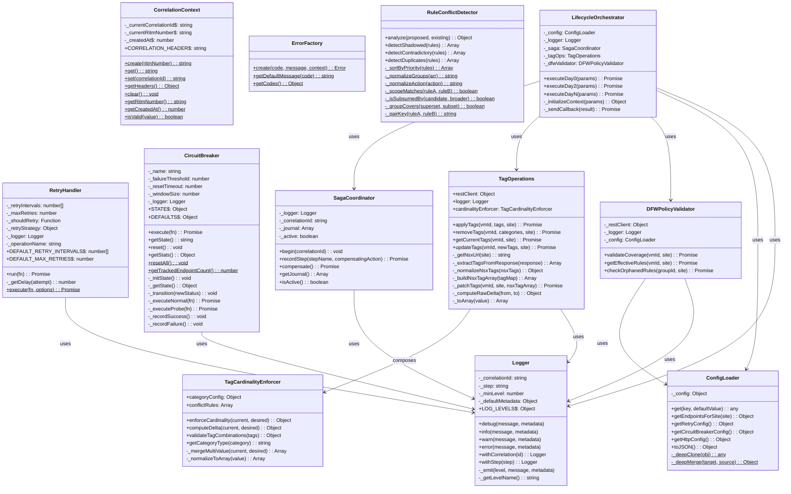
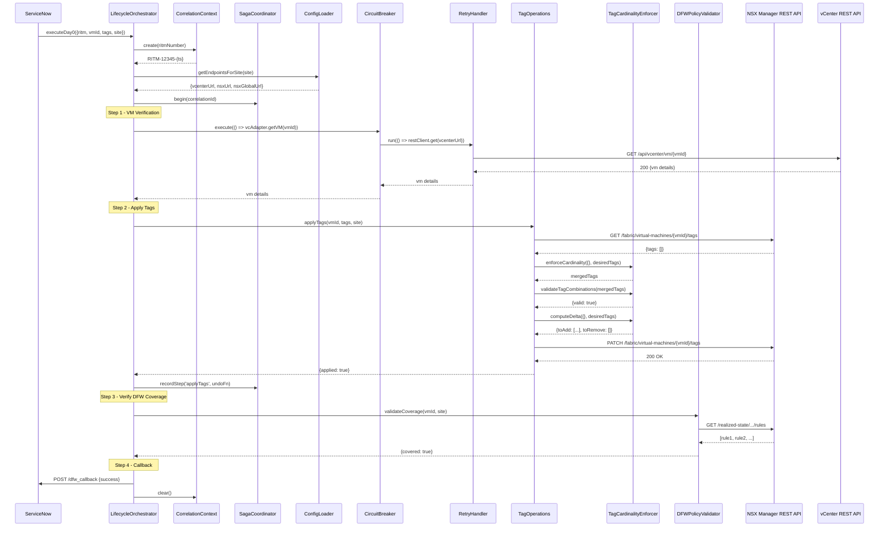
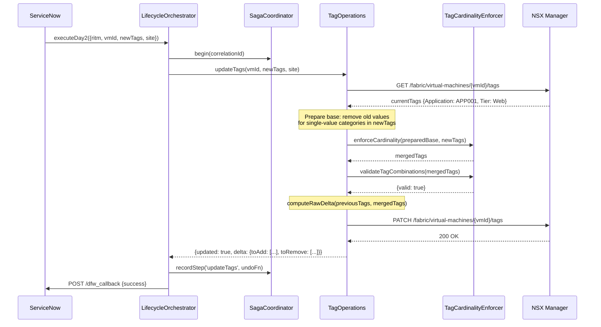
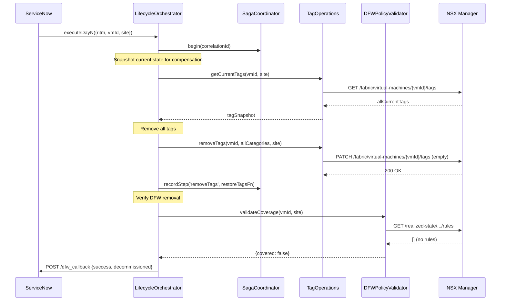
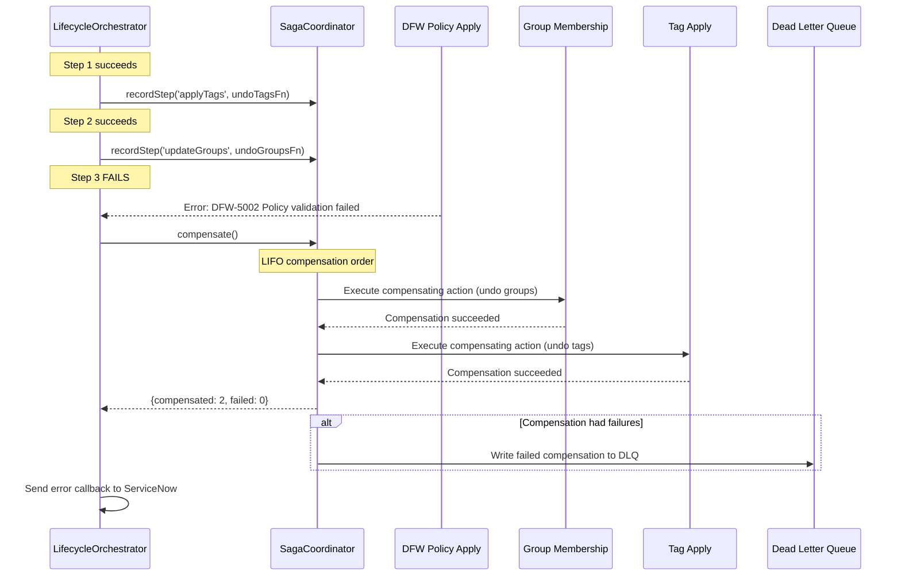
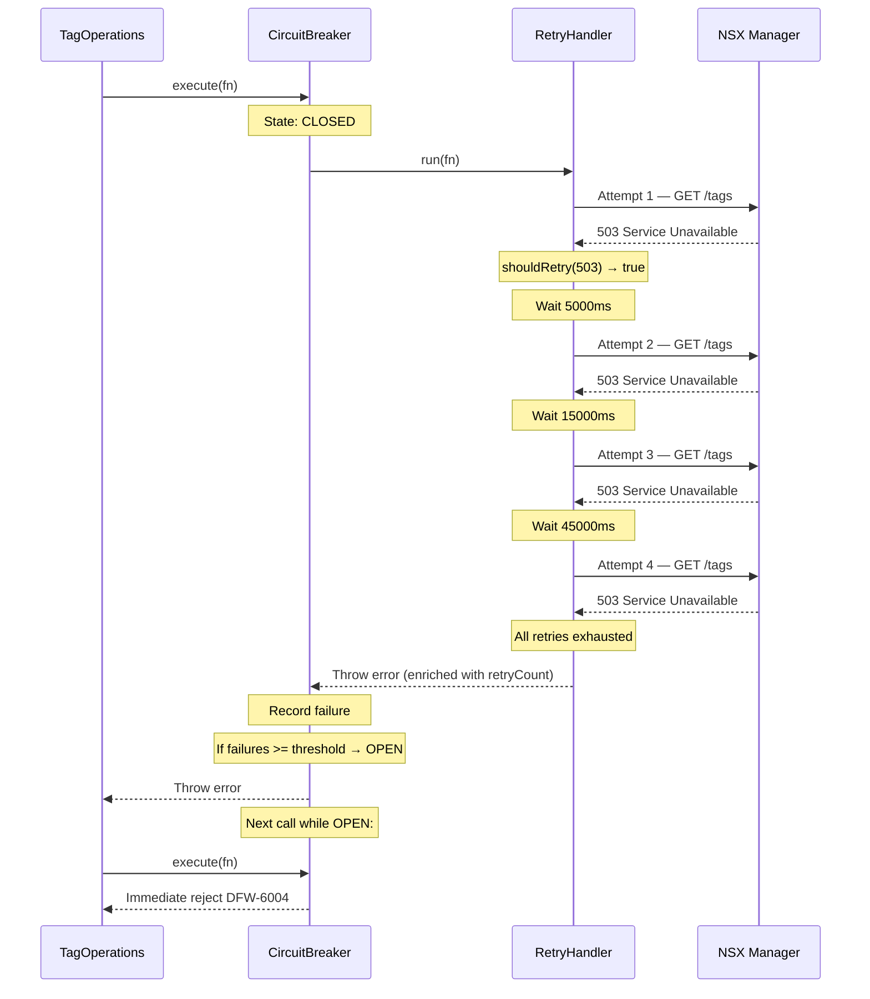
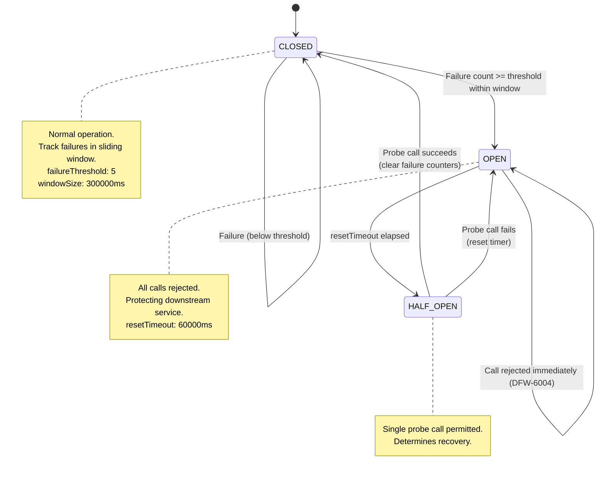
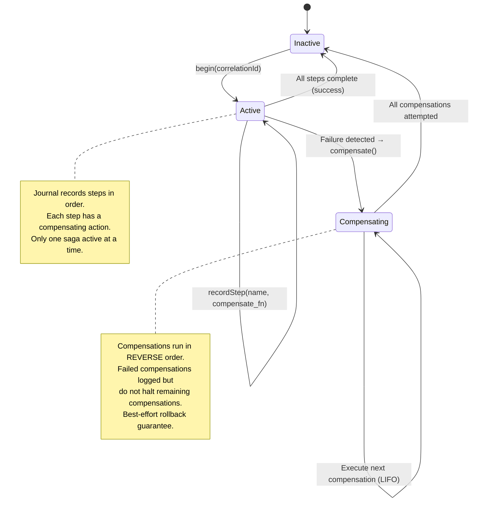
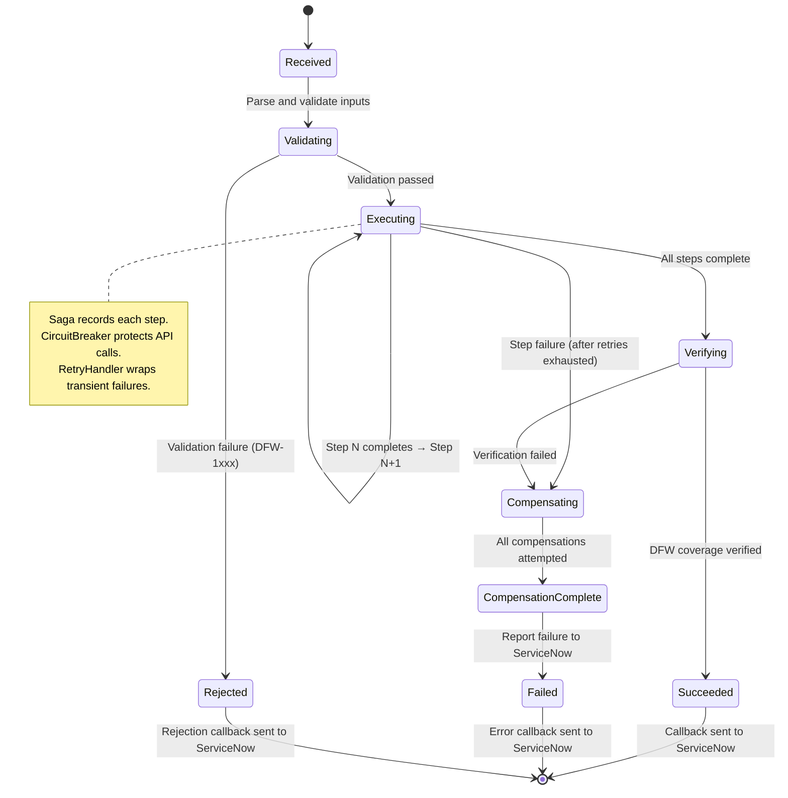

# Low Level Design (LLD)

## NSX DFW Automation Pipeline

**Version:** 1.0
**Date:** 2026-03-21
**Author:** Enterprise Infrastructure & Cloud Security
**Status:** Approved

---

## Table of Contents

1. [Module-Level Design](#1-module-level-design)
2. [Class Diagram](#2-class-diagram)
3. [Sequence Diagrams](#3-sequence-diagrams)
4. [Error Handling Flows](#4-error-handling-flows)
5. [Configuration Schema](#5-configuration-schema)
6. [REST API Contracts Summary](#6-rest-api-contracts-summary)
7. [State Machine Diagrams](#7-state-machine-diagrams)

---

## 1. Module-Level Design

### 1.1 Shared Utilities Module (`src/vro/actions/shared/`)

The shared utilities module provides cross-cutting infrastructure services consumed by all domain modules. It contains no business logic; every class in this module is a reusable, domain-agnostic utility.

**Logger** (`Logger.js`): A structured JSON logger that emits single-line JSON objects to the console. Each log entry includes a timestamp, severity level, correlation ID, pipeline step label, message, and arbitrary metadata. The Logger supports four severity levels (DEBUG, INFO, WARN, ERROR) with configurable minimum-level thresholding. Context propagation is achieved through factory methods: `withCorrelation(id)` returns a new Logger bound to a correlation ID, and `withStep(step)` returns a new Logger bound to a pipeline step. This immutable-style API ensures that a Logger instance can be safely shared across async operations without state leakage.

The Logger also handles error enrichment: when an Error object is passed as metadata to the `error()` method, its `message`, `stack`, and `code` properties are automatically extracted into a structured metadata object, avoiding the common problem of Error objects being serialized as `{}` by `JSON.stringify()`.

**ConfigLoader** (`ConfigLoader.js`): Provides centralized, read-only access to pipeline configuration. Configuration is resolved by deep-merging a default configuration template with optional overrides supplied at construction time. In production, the overrides are sourced from a vRO Configuration Element; in tests, they are supplied directly by the test harness. The ConfigLoader supports dot-notation key access (e.g., `get('sites.NDCNG.vcenterUrl')`) with fallback default values.

Key design decisions: (a) The config is deep-cloned at construction time to prevent mutation by callers. (b) Secrets are represented as vault reference patterns (`{{vault:secret/...}}`) that are resolved by an external vault integration at runtime. The ConfigLoader itself never handles actual credentials. (c) Per-site endpoint resolution is provided by `getEndpointsForSite(site)`, which validates the site code and returns the three endpoint URLs (vCenter, NSX Local, NSX Global).

**CorrelationContext** (`CorrelationContext.js`): Manages a module-level (process-global) correlation ID that uniquely identifies a pipeline execution. The correlation ID format is `RITM-{number}-{epochTimestamp}`, linking every log entry, HTTP header, and callback payload to the originating ServiceNow RITM. Because vRO JavaScript actions execute in a single-threaded Rhino runtime, a module-level variable provides thread-local-like semantics without the complexity of `AsyncLocalStorage`.

The CorrelationContext provides `create(ritmNumber)` for generation, `set(correlationId)` for adoption (when the ID arrives via an incoming HTTP header), `get()` for retrieval, `getHeaders()` for propagation as an HTTP header (`X-Correlation-ID`), and `clear()` for cleanup at the end of each pipeline execution. The `isValid(value)` method validates format compliance.

**ErrorFactory** (`ErrorFactory.js`): A factory for creating structured Error instances with DFW error codes. Each error code follows the format `DFW-XXXX` where the first digit indicates the category (1=input, 2=NSX API, 3=tags, 4=groups, 5=DFW policy, 6=ServiceNow, 7=timeout, 8=config, 9=internal). The factory attaches the `code` property and an arbitrary `context` object to each Error, enabling downstream consumers to route errors programmatically. The `getCodes()` method returns the full error code registry for documentation and dashboard configuration.

**RetryHandler** (`RetryHandler.js`): Implements configurable retry logic with two modes: interval-based (array of wait times) and strategy-based (an object with a `getDelay(attempt)` method). The Strategy pattern allows callers to plug in custom backoff algorithms (exponential, jittered, constant) without modifying the handler. The `shouldRetry` predicate function gives callers control over which errors trigger retries; by default, HTTP 5xx and 429 errors are retried while 4xx client errors are not.

The handler enriches the final error (after all retries are exhausted) with `retryCount` and `operationName` properties, enabling monitoring systems to track retry exhaustion rates. The static convenience method `RetryHandler.execute(fn, options)` creates a handler and runs the function in a single call for simple use cases.

**CircuitBreaker** (`CircuitBreaker.js`): Implements the circuit breaker pattern with per-endpoint state tracking. State is maintained in a module-level `Map` keyed by endpoint name, enabling multiple CircuitBreaker instances for the same endpoint to share state. The three states (CLOSED, OPEN, HALF_OPEN) are managed through a sliding-window failure counter, a configurable failure threshold, and a reset timeout.

Key implementation details: (a) Failure timestamps are stored in an array and pruned on each failure event to remove timestamps outside the sliding window. (b) The OPEN-to-HALF_OPEN transition is checked lazily on each `execute()` call rather than using a timer, avoiding the need for background threads. (c) On a successful HALF_OPEN probe, failure counters and timestamps are cleared, providing a clean start. (d) The `getStats()` method returns operational statistics suitable for dashboard display. (e) The static `resetAll()` method clears all endpoint states, primarily used in test setup.

### 1.2 Tag Operations Module (`src/vro/actions/tags/`)

**TagCardinalityEnforcer** (`TagCardinalityEnforcer.js`): Enforces cardinality constraints on NSX tag operations. The category configuration defines six tag categories: five single-value (Application, Tier, Environment, DataClassification, CostCenter) and one multi-value (Compliance). The enforcer provides three core operations:

1. `enforceCardinality(current, desired)`: Merges desired tags into the current tag set. Single-value categories are replaced unconditionally. The multi-value Compliance category follows "None"-exclusivity rules: setting "None" clears all other values; adding a real compliance value removes "None".

2. `computeDelta(current, desired)`: Computes the minimal set of tag additions and removals required to transition from the current to the desired state, after applying cardinality rules. Returns arrays in NSX format (`{tag, scope}`).

3. `validateTagCombinations(tags)`: Checks the merged tag set against conflict rules. Currently enforces three rules: PCI/Sandbox conflict, HIPAA/Sandbox conflict, and Confidential-without-Compliance conflict. Returns a `{valid, errors}` result object.

**TagOperations** (`TagOperations.js`): Provides CRUD methods for NSX tags using the idempotent read-compare-write pattern. Each mutating method (`applyTags`, `updateTags`, `removeTags`) follows the same flow: read current tags from NSX, compute the required changes, validate the result, and apply only the delta via PATCH. The `getCurrentTags` method handles NSX API response normalization, converting the raw `[{tag, scope}]` array into a category-keyed object where single-value categories produce strings and multi-value categories produce arrays.

The class depends on a `restClient` (HTTP client) and a `logger` (structured logger) injected via the constructor, following the Dependency Injection pattern. The `TagCardinalityEnforcer` is instantiated internally as a composition relationship.

### 1.3 Group Operations Module (`src/vro/actions/groups/`)

The group operations module manages NSX security group membership based on tag criteria. Security groups in NSX use tag-based membership expressions (e.g., "all VMs with Environment=Production AND Tier=Web"). When a VM's tags change, its group membership is automatically recalculated by NSX. However, the pipeline explicitly verifies group membership after tag operations to ensure consistency.

Key responsibilities: creating security groups with tag-based criteria, verifying VM membership in expected groups after tag application, reconciling group membership during tag updates (ensuring VMs are removed from old groups and added to new groups), and cleaning up group membership during decommissioning.

### 1.4 DFW Operations Module (`src/vro/actions/dfw/`)

**DFWPolicyValidator** (`DFWPolicyValidator.js`): Validates that VMs are properly covered by DFW policies by querying the NSX realized-state API. The `validateCoverage(vmId, site)` method retrieves effective rules for a VM and checks that at least one active (non-disabled) rule applies. The `checkOrphanedRules(groupId, site)` method detects security groups that have DFW rule criteria but no VM members -- a potential security drift indicator.

The validator depends on ConfigLoader for endpoint resolution, ensuring that the correct NSX Manager URL is used for each site. Error handling uses inline error factory functions (DFW-7006 for validation failures, DFW-7007 for orphaned rules) to produce structured errors.

**RuleConflictDetector** (`RuleConflictDetector.js`): Performs static analysis on DFW rule sets to detect three types of issues:

1. **Shadowed rules**: Rules that are completely covered by a higher-priority rule and will never be evaluated. Detection uses scope subsumption analysis (is the higher-priority rule's source/destination/service scope a superset of the candidate's scope?).

2. **Contradictory rules**: Rules with identical scope but different actions (e.g., one ALLOW and one DROP for the same traffic tuple). These indicate a policy conflict that needs resolution.

3. **Duplicate rules**: Rules with identical scope and identical actions. These add no value and should be consolidated.

The `analyze(proposedRules, existingRules)` method combines both rule sets and runs all three detection algorithms, returning a unified summary with a `hasIssues` boolean.

### 1.5 Lifecycle Module (`src/vro/actions/lifecycle/`)

**SagaCoordinator** (`SagaCoordinator.js`): Manages distributed transactions across the pipeline's multi-step lifecycle operations. The coordinator maintains a journal of completed steps, each with a compensating action (an async function that undoes the step). On failure, `compensate()` executes compensating actions in LIFO order.

Key design decisions: (a) Only one saga can be active at a time per coordinator instance (enforced by the `_active` flag). (b) Compensating actions are executed sequentially, not in parallel, to avoid ordering conflicts. (c) If a compensation fails, the error is logged but the coordinator continues with remaining compensations -- this ensures best-effort rollback. (d) The `compensate()` method returns a summary object with counts of successful and failed compensations plus error details for each failure.

**Lifecycle Orchestrator**: The top-level orchestration class that coordinates Day 0, Day 2, and Day N operations. It initializes the correlation context, starts a saga, executes steps in order (calling Tag Operations, Group Operations, and DFW validation), records each step with the saga, handles errors with retry and compensation, and sends the callback to ServiceNow. This class implements the Template Method pattern, with a common execution skeleton and overridable step implementations for each lifecycle type.

### 1.6 Adapters Module (`src/adapters/`)

The adapters module provides uniform interfaces to external systems. Each adapter wraps a system-specific REST client and translates between the pipeline's internal data model and the external API's request/response format. Adapters handle authentication, request formatting, response parsing, and error mapping (converting HTTP errors to DFW error codes via ErrorFactory).

Three adapter types are planned: VCenterAdapter (VM lookup, metadata retrieval), NSXAdapter (tag CRUD, group management, policy operations), and ServiceNowAdapter (callback delivery, RITM updates).

---

## 2. Class Diagram



---

## 3. Sequence Diagrams

### 3.1 Day 0 Provisioning — Detailed Internal Flow



### 3.2 Day 2 Update — Detailed Internal Flow



### 3.3 Day N Decommission — Detailed Internal Flow



---

## 4. Error Handling Flows

### 4.1 Saga Compensation Flow



### 4.2 Retry with Circuit Breaker Flow



---

## 5. Configuration Schema

The ConfigLoader resolves the following configuration tree. In production, this is loaded from a vRO Configuration Element; in tests, it is supplied as a JavaScript object.

```json
{
  "sites": {
    "NDCNG": {
      "vcenterUrl": "https://vcenter-ndcng.company.internal",
      "nsxUrl": "https://nsx-manager-ndcng.company.internal",
      "nsxGlobalUrl": "https://nsx-global-ndcng.company.internal"
    },
    "TULNG": {
      "vcenterUrl": "https://vcenter-tulng.company.internal",
      "nsxUrl": "https://nsx-manager-tulng.company.internal",
      "nsxGlobalUrl": "https://nsx-global-tulng.company.internal"
    }
  },
  "auth": {
    "vcenterUsername": "{{vault:secret/vro/vcenter/username}}",
    "vcenterPassword": "{{vault:secret/vro/vcenter/password}}",
    "nsxUsername": "{{vault:secret/vro/nsx/username}}",
    "nsxPassword": "{{vault:secret/vro/nsx/password}}",
    "nsxGlobalUsername": "{{vault:secret/vro/nsx-global/username}}",
    "nsxGlobalPassword": "{{vault:secret/vro/nsx-global/password}}"
  },
  "retry": {
    "intervals": [5000, 15000, 45000],
    "maxRetries": 3
  },
  "circuitBreaker": {
    "failureThreshold": 5,
    "resetTimeout": 60000,
    "windowSize": 300000
  },
  "http": {
    "timeout": 30000,
    "followRedirects": true,
    "maxRedirects": 5
  },
  "callback": {
    "maxRetries": 3,
    "retryIntervals": [2000, 5000, 10000]
  },
  "logging": {
    "minLevel": "INFO"
  }
}
```

### 5.1 Configuration Key Reference

| Key Path | Type | Default | Description |
|----------|------|---------|-------------|
| `sites.{SITE}.vcenterUrl` | string | (per-site) | vCenter REST API base URL |
| `sites.{SITE}.nsxUrl` | string | (per-site) | NSX Local Manager REST API base URL |
| `sites.{SITE}.nsxGlobalUrl` | string | (per-site) | NSX Global Manager REST API base URL |
| `auth.vcenterUsername` | string | vault ref | vCenter service account username |
| `auth.vcenterPassword` | string | vault ref | vCenter service account password |
| `auth.nsxUsername` | string | vault ref | NSX Manager service account username |
| `auth.nsxPassword` | string | vault ref | NSX Manager service account password |
| `retry.intervals` | number[] | [5000,15000,45000] | Wait times (ms) between retry attempts |
| `retry.maxRetries` | number | 3 | Maximum retry attempts |
| `circuitBreaker.failureThreshold` | number | 5 | Failures to trip the breaker |
| `circuitBreaker.resetTimeout` | number | 60000 | Milliseconds before OPEN to HALF_OPEN |
| `circuitBreaker.windowSize` | number | 300000 | Sliding window for failure counting (ms) |
| `http.timeout` | number | 30000 | HTTP request timeout (ms) |
| `callback.maxRetries` | number | 3 | ServiceNow callback retry limit |
| `callback.retryIntervals` | number[] | [2000,5000,10000] | Callback retry wait times (ms) |
| `logging.minLevel` | string | "INFO" | Minimum log severity to emit |

---

## 6. REST API Contracts Summary

### 6.1 NSX Manager — Tag Operations

**Read Tags:**
```
GET {nsxUrl}/api/v1/fabric/virtual-machines/{vmId}/tags
Accept: application/json
X-Correlation-ID: RITM-12345-{ts}

Response 200:
{
  "results": [
    { "tag": "APP001", "scope": "Application" },
    { "tag": "Web", "scope": "Tier" },
    { "tag": "Production", "scope": "Environment" }
  ]
}
```

**Write Tags:**
```
PATCH {nsxUrl}/api/v1/fabric/virtual-machines/{vmId}/tags
Content-Type: application/json
X-Correlation-ID: RITM-12345-{ts}

Body:
{
  "tags": [
    { "tag": "APP001", "scope": "Application" },
    { "tag": "Web", "scope": "Tier" },
    { "tag": "Production", "scope": "Environment" },
    { "tag": "PCI", "scope": "Compliance" }
  ]
}

Response 200: (empty body)
```

### 6.2 NSX Manager — Realized State

**Get Effective Rules:**
```
GET {nsxUrl}/policy/api/v1/infra/realized-state/enforcement-points/default/virtual-machines/{vmId}/rules
Accept: application/json

Response 200:
{
  "results": [
    {
      "id": "rule-001",
      "display_name": "Allow-DNS-UDP",
      "action": "ALLOW",
      "disabled": false,
      "source_groups": ["ANY"],
      "destination_groups": ["/infra/domains/default/groups/DNS-Servers"],
      "services": ["UDP/53"]
    }
  ]
}
```

### 6.3 NSX Manager — Security Groups

**Get Group Members:**
```
GET {nsxUrl}/policy/api/v1/infra/domains/default/groups/{groupId}/members/virtual-machines
Accept: application/json

Response 200:
{
  "results": [
    { "external_id": "vm-42", "display_name": "srv-web-01" }
  ],
  "result_count": 1
}
```

### 6.4 ServiceNow — Callback

**Operation Callback:**
```
POST {snowUrl}/api/x_company/dfw_callback
Content-Type: application/json
Authorization: Bearer {oauth_token}
X-Correlation-ID: RITM-12345-{ts}

Body:
{
  "ritmNumber": "RITM0012345",
  "correlationId": "RITM-12345-1679000000000",
  "status": "success|failure",
  "operation": "day0-provision|day2-update|dayn-decommission",
  "summary": {
    "tagsApplied": 6,
    "groupsUpdated": 3,
    "dfwPoliciesVerified": 2
  },
  "errors": [],
  "compensationResult": null,
  "timestamp": "2026-03-21T12:00:00.000Z"
}
```

---

## 7. State Machine Diagrams

### 7.1 Circuit Breaker State Machine



### 7.2 Saga State Machine



### 7.3 Pipeline Operation State Machine



---

*End of Low Level Design*
