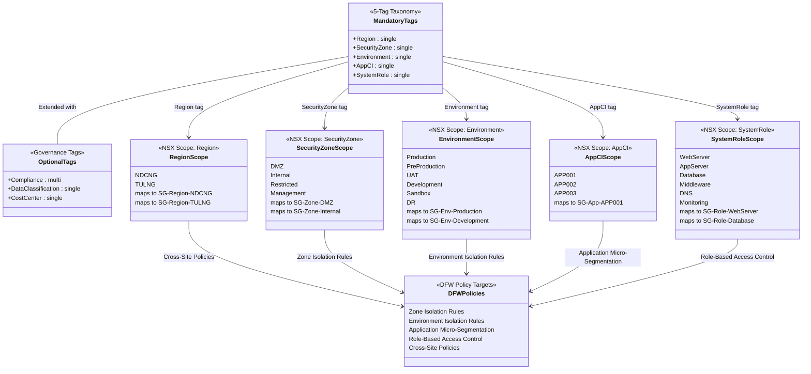
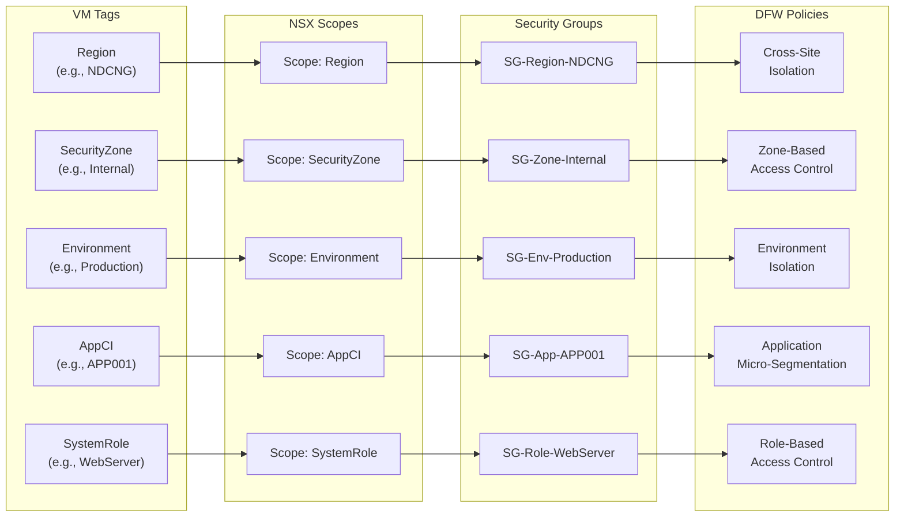

# 5-Tag Security Taxonomy Model

## Overview

This diagram shows the 5-tag mandatory security taxonomy, its mapping to NSX scopes and security group patterns, and the relationship between tags and DFW policy constructs.

## Tag-to-NSX Mapping

## Taxonomy Details

### Mandatory Tags (5)

| Tag | Cardinality | NSX Scope | Purpose | Example Values |
|-----|-------------|-----------|---------|----------------|
| Region | Single | Region | Geographic site identifier | NDCNG, TULNG |
| SecurityZone | Single | SecurityZone | Network security zone classification | DMZ, Internal, Restricted, Management |
| Environment | Single | Environment | Deployment lifecycle stage | Production, Pre-Production, UAT, Development, Sandbox, DR |
| AppCI | Single | AppCI | CMDB application CI reference | APP001, APP002, APP003 |
| SystemRole | Single | SystemRole | Workload function identifier | WebServer, AppServer, Database, Middleware, DNS, Monitoring |

### Optional Tags (3)

| Tag | Cardinality | NSX Scope | Purpose | Example Values |
|-----|-------------|-----------|---------|----------------|
| Compliance | Multi | Compliance | Regulatory framework applicability | PCI, HIPAA, SOX, None |
| DataClassification | Single | DataClassification | Data sensitivity level | Public, Internal, Confidential, Restricted |
| CostCenter | Single | CostCenter | Financial chargeback identifier | CC-IT-INFRA-001, CC-SEC-OPS-002 |
