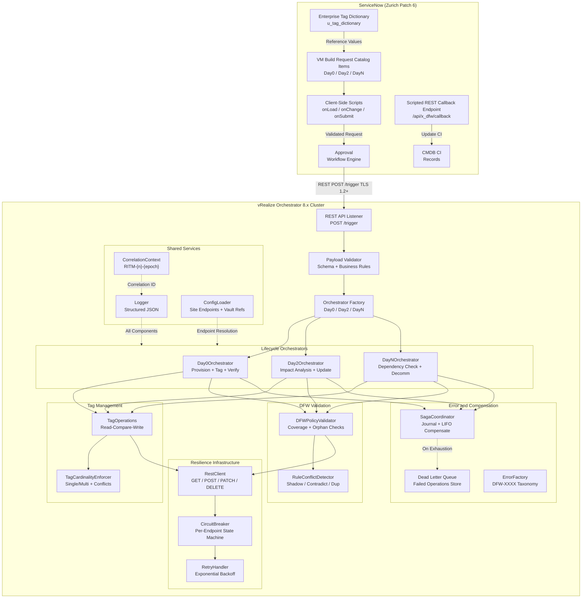
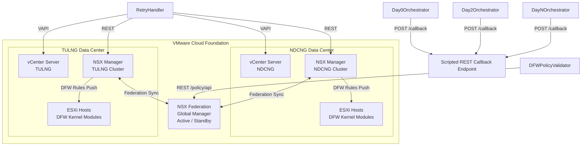

# Architecture Overview

This diagram shows the complete NSX DFW Automation Pipeline architecture, including the ServiceNow request layer, vRO orchestration engine with all internal components, and the VMware VCF infrastructure across both data center sites with NSX-T Federation.

The architecture is split into two sub-diagrams for readability.

### ServiceNow and vRO Orchestration

This diagram covers the ServiceNow request layer, the vRO orchestration engine with all internal subsystems, and the connections between them.

### VMware Infrastructure and Cross-System Connections

This diagram covers the VMware Cloud Foundation infrastructure (vCenter, NSX, ESXi) across both data center sites, the NSX Federation Global Manager, and the connections from vRO into the infrastructure and back to ServiceNow.

## Component Summary

| Layer | Components | Responsibility |
|-------|-----------|----------------|
| Request | ServiceNow Catalog, Tag Dictionary, Approval Engine | User-facing request intake, validation, approval |
| Orchestration | LifecycleOrchestrator (Day0/Day2/DayN), Factory | Workflow coordination, step sequencing |
| Tag Management | TagOperations, TagCardinalityEnforcer | Idempotent tag CRUD, cardinality/conflict enforcement |
| DFW Validation | DFWPolicyValidator, RuleConflictDetector | Coverage verification, conflict detection |
| Resilience | CircuitBreaker, RetryHandler, RestClient | Fault tolerance, exponential backoff, endpoint protection |
| Error Handling | SagaCoordinator, DLQ, ErrorFactory | Compensation, dead-letter storage, structured errors |
| Shared | Logger, ConfigLoader, CorrelationContext | Logging, configuration, request tracing |
| Infrastructure | vCenter, NSX Manager, NSX Global Manager, ESXi | VM management, tag storage, DFW enforcement |
