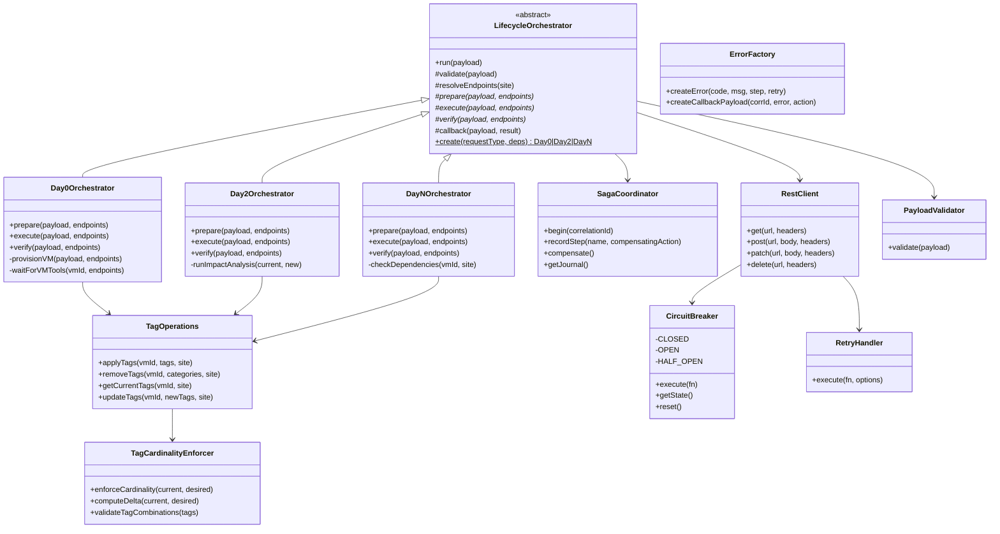

# Class Diagram

```mermaid
classDiagram
    class LifecycleOrchestrator {
        <<abstract>>
        +run(payload)
        #validate(payload)
        #resolveEndpoints(site)
        #prepare(payload, endpoints)*
        #execute(payload, endpoints)*
        #verify(payload, endpoints)*
        #callback(payload, result)
        +create(requestType, deps)$ Day0|Day2|DayN
    }

    class Day0Orchestrator {
        +prepare(payload, endpoints)
        +execute(payload, endpoints)
        +verify(payload, endpoints)
        -provisionVM(payload, endpoints)
        -waitForVMTools(vmId, endpoints)
    }

    class Day2Orchestrator {
        +prepare(payload, endpoints)
        +execute(payload, endpoints)
        +verify(payload, endpoints)
        -runImpactAnalysis(current, new)
    }

    class DayNOrchestrator {
        +prepare(payload, endpoints)
        +execute(payload, endpoints)
        +verify(payload, endpoints)
        -checkDependencies(vmId, site)
    }

    class SagaCoordinator {
        +begin(correlationId)
        +recordStep(name, compensatingAction)
        +compensate()
        +getJournal()
    }

    class TagOperations {
        +applyTags(vmId, tags, site)
        +removeTags(vmId, categories, site)
        +getCurrentTags(vmId, site)
        +updateTags(vmId, newTags, site)
    }

    class TagCardinalityEnforcer {
        +enforceCardinality(current, desired)
        +computeDelta(current, desired)
        +validateTagCombinations(tags)
    }

    class CircuitBreaker {
        +execute(fn)
        +getState()
        +reset()
        -CLOSED
        -OPEN
        -HALF_OPEN
    }

    class RetryHandler {
        +execute(fn, options)
    }

    class RestClient {
        +get(url, headers)
        +post(url, body, headers)
        +patch(url, body, headers)
        +delete(url, headers)
    }

    class PayloadValidator {
        +validate(payload)
    }

    class ErrorFactory {
        +createError(code, msg, step, retry)
        +createCallbackPayload(corrId, error, action)
    }

    LifecycleOrchestrator <|-- Day0Orchestrator
    LifecycleOrchestrator <|-- Day2Orchestrator
    LifecycleOrchestrator <|-- DayNOrchestrator
    LifecycleOrchestrator --> SagaCoordinator
    LifecycleOrchestrator --> PayloadValidator
    LifecycleOrchestrator --> RestClient
    Day0Orchestrator --> TagOperations
    Day2Orchestrator --> TagOperations
    DayNOrchestrator --> TagOperations
    TagOperations --> TagCardinalityEnforcer
    RestClient --> CircuitBreaker
    RestClient --> RetryHandler
```
