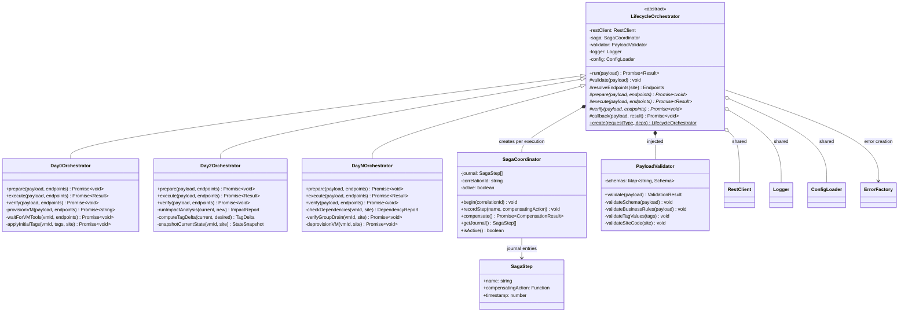
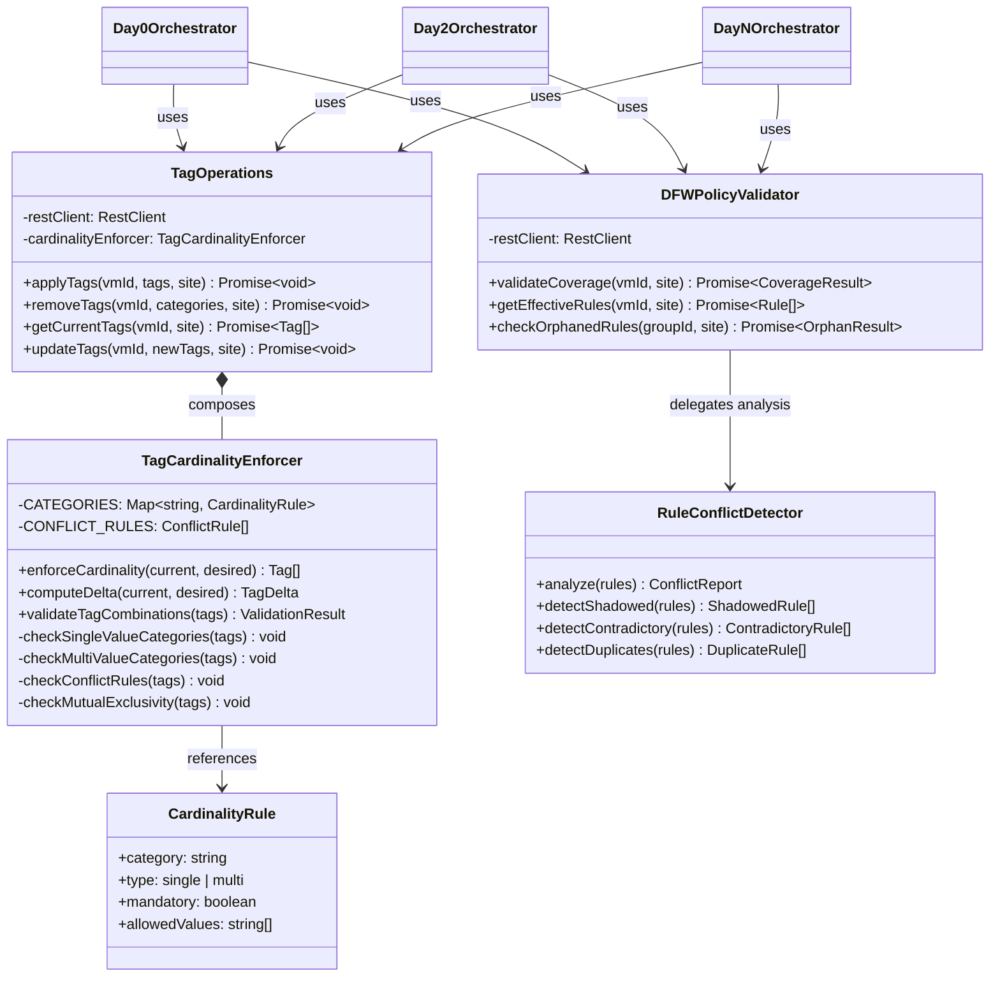
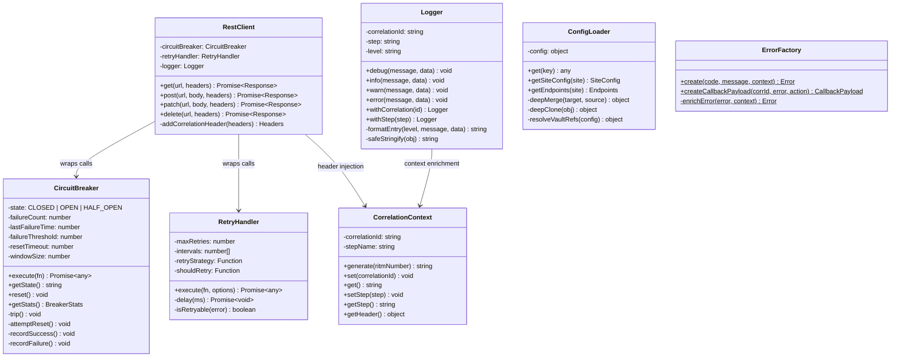

# Class Diagram

This diagram shows the complete class hierarchy and relationships for the NSX DFW Automation Pipeline. It includes the abstract LifecycleOrchestrator with its concrete Day0/Day2/DayN implementations, the tag management subsystem, DFW validation components, resilience infrastructure, and shared utilities.

The diagram is split into three sections for readability.

### Core Orchestration Classes

This section covers the abstract LifecycleOrchestrator with its Day0, Day2, and DayN concrete implementations, the SagaCoordinator for distributed transaction compensation, and core validation and error-handling dependencies.

### Tag Management and DFW Validation

This section covers the tag management subsystem (TagOperations, TagCardinalityEnforcer, CardinalityRule) and the DFW policy validation components (DFWPolicyValidator, RuleConflictDetector). Orchestrator classes are shown minimally to illustrate cross-cutting dependencies.

### Resilience and Infrastructure

This section covers the resilience chain (CircuitBreaker, RetryHandler, RestClient), shared utilities (Logger, ConfigLoader, CorrelationContext), and the ErrorFactory.

## Design Pattern Mapping

| Pattern | Class(es) | Purpose |
|---------|----------|---------|
| Template Method | `LifecycleOrchestrator` (abstract) + Day0/Day2/DayN | Fixed workflow skeleton with pluggable steps |
| Factory Method | `LifecycleOrchestrator.create()` | Instantiates correct orchestrator by request type |
| Strategy | `RetryHandler` (pluggable `retryStrategy`, `shouldRetry`) | Configurable retry behavior |
| Saga | `SagaCoordinator` + `SagaStep` | Distributed transaction compensation |
| Circuit Breaker | `CircuitBreaker` | Endpoint failure detection and fast-fail |
| Adapter | `RestClient` | Uniform HTTP interface over circuit breaker + retry |
| Repository | `TagOperations` (read-compare-write) | Idempotent tag state management |
| Singleton (module) | `CircuitBreaker._endpointStates`, `CorrelationContext` | Per-endpoint state, per-request context |

## Module Dependency Graph

| Module | Depends On | Depended On By |
|--------|-----------|---------------|
| `LifecycleOrchestrator` | SagaCoordinator, PayloadValidator, RestClient, Logger, ConfigLoader, ErrorFactory | Entry point (none) |
| `Day0/Day2/DayNOrchestrator` | TagOperations, DFWPolicyValidator | LifecycleOrchestrator (via factory) |
| `TagOperations` | RestClient, TagCardinalityEnforcer | Day0, Day2, DayN Orchestrators |
| `TagCardinalityEnforcer` | None (pure logic) | TagOperations |
| `DFWPolicyValidator` | RestClient, RuleConflictDetector | Day0, Day2, DayN Orchestrators |
| `RuleConflictDetector` | None (pure logic) | DFWPolicyValidator |
| `RestClient` | CircuitBreaker, RetryHandler, Logger, CorrelationContext | TagOperations, DFWPolicyValidator |
| `CircuitBreaker` | None (self-contained) | RestClient |
| `RetryHandler` | None (self-contained) | RestClient |
| `ErrorFactory` | None (pure logic) | All orchestrators, SagaCoordinator |
| `Logger` | CorrelationContext | All components |
| `ConfigLoader` | None (reads config) | LifecycleOrchestrator |
| `CorrelationContext` | None (module state) | Logger, RestClient |
