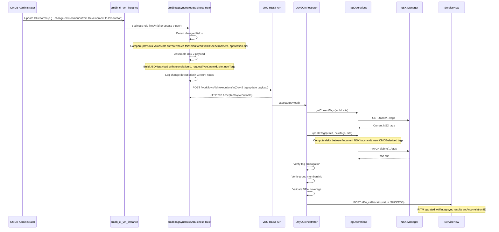

# CMDB-Driven Tag Sync Sequence Diagram

## Overview

This diagram shows how a change to a CMDB CI field triggers automatic Day-2 tag synchronization through the `cmdbTagSyncRule` business rule and the vRO DFW-Day2-TagUpdate workflow.

## Monitored CMDB Fields

| Field | NSX Tag | Sync Behavior |
|-------|---------|---------------|
| `environment` | Environment | Direct value mapping |
| `u_application_ci` | AppCI | Maps CMDB app CI sys_id to application code |
| `u_system_role` | SystemRole | Direct value mapping |
| `u_security_zone` | SecurityZone | Direct value mapping |
| `u_region` | Region | Direct value mapping |

## Business Rule Configuration

| Setting | Value |
|---------|-------|
| Table | `cmdb_ci_vm_instance` |
| When | After update |
| Filter | Monitored fields changed AND `operational_status=1` |
| Order | 200 |
