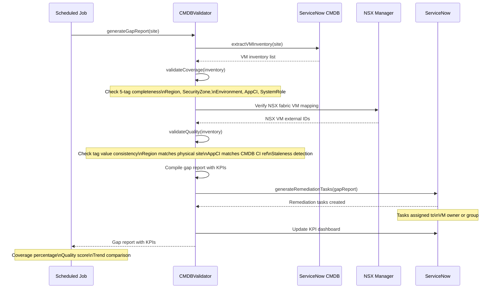

# CMDB Validation Sequence Diagram

## Overview

This diagram shows the end-to-end flow of the CMDBValidator scheduled validation process, from VM inventory extraction through gap report generation and remediation task creation.

## Participants

| Participant | Description |
|-------------|-------------|
| Scheduled Job | vRO scheduled workflow triggering daily CMDB validation |
| CMDBValidator | Core validation engine that orchestrates extraction, validation, and reporting |
| ServiceNow CMDB | Source of truth for VM inventory and application CI relationships |
| NSX Manager | Provides NSX fabric VM inventory for cross-reference validation |
| ServiceNow | Target for remediation task creation and KPI dashboard updates |
