# End-to-End Data Flow

This diagram traces the complete data flow through the NSX DFW Automation Pipeline, from the enterprise tag dictionary through ServiceNow catalog submission, vRO orchestration, VMware tag application, NSX propagation, dynamic security group evaluation, DFW policy enforcement, and the feedback loop through callbacks and CMDB synchronization.

```mermaid
flowchart LR
    subgraph SOURCE["Data Sources"]
        DICT[Tag Dictionary<br/><i>u_tag_dictionary</i><br/>Categories, Values,<br/>Cardinality, Mandatory]
        POLICY_REPO[Policy Repository<br/><i>policies/dfw-rules/*.yaml</i><br/>DFW Rules, Groups,<br/>Service Definitions]
    end

    subgraph REQUEST["Request Layer"]
        FORM[Catalog Form<br/><i>VM Build Request</i>]
        CLIENT[Client Scripts<br/><i>onLoad: defaults</i><br/><i>onChange: validate</i><br/><i>onSubmit: check</i>]
        RITM[RITM Record<br/><i>Request Item</i>]
        APPROVER[Approval Engine<br/><i>Manager + Security</i>]
    end

    subgraph ORCHESTRATION["Orchestration Layer"]
        PAYLOAD[vRO Payload<br/><i>JSON: vmId, site,</i><br/><i>tags, requestType</i>]
        VALIDATOR[Payload Validator<br/><i>Schema + Business</i>]
        ORCHESTRATOR[Lifecycle<br/>Orchestrator<br/><i>Day0/Day2/DayN</i>]
        TAGGER[Tag Operations<br/><i>Read-Compare-Write</i>]
        CARDINALITY[Cardinality<br/>Enforcer<br/><i>Single/Multi/Conflicts</i>]
    end

    subgraph VMWARE["VMware Infrastructure"]
        VC_TAGS[vCenter Tags<br/><i>VAPI Tag Association</i>]
        NSX_TAGS[NSX Tags<br/><i>Auto-propagated from vC</i>]
        GROUPS[Dynamic Security<br/>Groups<br/><i>Tag-based membership</i><br/><i>criteria evaluation</i>]
        DFW[DFW Policies<br/><i>Infrastructure + Env +</i><br/><i>Application + Emergency</i>]
        ESXI[ESXi Data Plane<br/><i>DFW Kernel Module</i><br/><i>Realized Rules</i>]
    end

    subgraph FEEDBACK["Feedback Loop"]
        CALLBACK[Callback Payload<br/><i>correlationId, status,</i><br/><i>tags, groups, rules</i>]
        RITM_UPDATE[RITM Updated<br/><i>Closed Complete or</i><br/><i>Failed with details</i>]
        CMDB[CMDB CI Record<br/><i>Tags, Groups,</i><br/><i>DFW Status synced</i>]
    end

    subgraph ERROR_PATH["Error Path"]
        DLQ[Dead Letter Queue<br/><i>Failed payload +</i><br/><i>error + compensation</i>]
        SPLUNK[Splunk Logs<br/><i>Structured JSON +</i><br/><i>correlationId</i>]
    end

    %% Source to Request
    DICT -->|"Reference values<br/>(dropdowns, not free-text)"| FORM
    FORM --> CLIENT
    CLIENT -->|"Validated user input"| RITM
    RITM -->|"Approval required"| APPROVER
    APPROVER -->|"Approved: REST POST<br/>with correlation ID"| PAYLOAD

    %% Request to Orchestration
    PAYLOAD --> VALIDATOR
    VALIDATOR -->|"Valid payload"| ORCHESTRATOR
    ORCHESTRATOR --> TAGGER
    TAGGER --> CARDINALITY
    CARDINALITY -->|"Validated tag set<br/>(delta computed)"| TAGGER

    %% Orchestration to VMware
    TAGGER -->|"VAPI: attach/detach<br/>tag associations"| VC_TAGS
    VC_TAGS -->|"Auto-propagation<br/>(vCenter → NSX sync)"| NSX_TAGS
    NSX_TAGS -->|"Criteria evaluation<br/>(tag match → group add)"| GROUPS
    GROUPS -->|"Rule binding<br/>(source/dest group match)"| DFW
    DFW -->|"Rule realization<br/>(pushed to hosts)"| ESXI
    POLICY_REPO -->|"Schema-validated YAML<br/>(CI pipeline)"| DFW

    %% Feedback
    ORCHESTRATOR -->|"POST /callback"| CALLBACK
    CALLBACK --> RITM_UPDATE
    RITM_UPDATE -->|"Attribute sync"| CMDB

    %% Error path
    ORCHESTRATOR -.->|"After retry exhaustion<br/>+ saga compensation"| DLQ
    ORCHESTRATOR -.->|"All operations<br/>logged with corrId"| SPLUNK
    DLQ -.->|"Manual reprocess<br/>or purge"| ORCHESTRATOR
```

## Data Transformation Summary

| Stage | Input | Transformation | Output |
|-------|-------|---------------|--------|
| Tag Dictionary | Controlled vocabulary definitions | Loaded as catalog variable reference | Dropdown values for user selection |
| Catalog Form | User selections + client script defaults | Client-side validation (onLoad/onChange/onSubmit) | RITM record with tag key-value pairs |
| Approval | RITM record | Manager and security team approval workflow | Approved request → REST POST trigger |
| Payload Validation | JSON payload from ServiceNow | Schema validation (ajv) + business rules | Validated payload or rejection error |
| Cardinality Enforcement | Current tags + desired tags | Single-value dedup, conflict rules, delta computation | Clean tag delta (add/remove sets) |
| Tag Application | Tag delta | VAPI read-compare-write (idempotent) | Tags attached/detached on vCenter VM |
| Tag Propagation | vCenter tags | Automatic vCenter-to-NSX synchronization | NSX fabric VM tags updated |
| Group Evaluation | NSX tags on VM | Dynamic group membership criteria matching | VM added/removed from security groups |
| DFW Enforcement | Security group membership | Rule source/destination group binding | Active DFW rules on ESXi kernel |
| Callback | Pipeline execution result | Structured JSON with status, tags, groups, errors | RITM updated, CMDB CI synced |

## Data Residency

| Data Element | Storage Location | Retention | Encryption |
|-------------|-----------------|-----------|-----------|
| Tag Dictionary | ServiceNow custom table | Permanent | ServiceNow at-rest encryption |
| Request Payloads | ServiceNow RITM + vRO execution log | Per retention policy | TLS in-transit, at-rest encryption |
| Tags | vCenter (primary), NSX (propagated) | Until removed | VMware VSAN encryption |
| DFW Rules (desired) | Git repository (YAML) | Permanent (version controlled) | Repository encryption |
| DFW Rules (realized) | NSX Manager + ESXi hosts | Until policy change | NSX datastore encryption |
| DLQ Entries | vRO configuration elements | Until purged (default 30 days) | vRO datastore encryption |
| Audit Logs | Splunk | 1 year | Splunk at-rest encryption |
