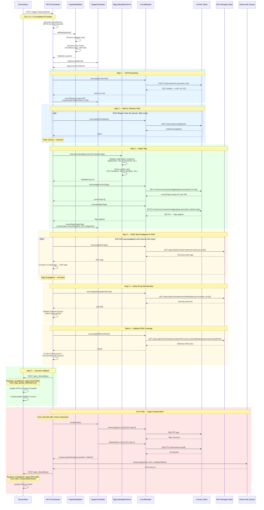

# Day 0 Provisioning Sequence

This diagram shows the complete Day 0 (new VM provisioning) workflow, from the initial ServiceNow request through VM provisioning, tag application, NSX propagation verification, group membership validation, DFW coverage confirmation, and the final callback to ServiceNow. Error paths including saga compensation and DLQ placement are included.

## Step Timing

| Step | Expected Duration | Timeout | Retry Policy |
|------|-------------------|---------|-------------|
| VM Provisioning | 30-120s | 300s | 3 retries, exponential backoff |
| VMware Tools Ready | 30-180s | 300s | Poll every 5s |
| Tag Application | 1-5s | 30s | 3 retries, exponential backoff |
| Tag Propagation | 5-30s | 60s | Poll every 10s |
| Group Verification | 1-5s | 30s | 3 retries |
| DFW Coverage Check | 1-5s | 30s | 3 retries |
| Callback | 1-3s | 15s | 3 retries |
