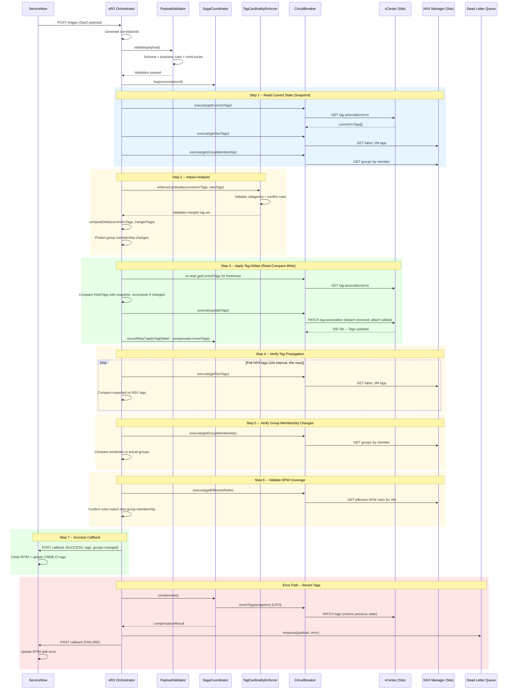

# Day 2 Tag Update Sequence

This diagram shows the complete Day 2 (tag modification) workflow for an existing VM. It includes the impact analysis phase that predicts security group changes before applying tag deltas, the read-compare-write pattern for idempotent tag updates, and the post-update verification cycle.

## Key Differences from Day 0

| Aspect | Day 0 | Day 2 |
|--------|-------|-------|
| VM State | New (being provisioned) | Existing (already running) |
| Tag State | Empty (no prior tags) | Populated (has current tags) |
| Operation | Full tag application | Delta-based tag update |
| Impact Analysis | Not needed | Required (predicts group changes) |
| Read-Compare-Write | Single write | Re-read before write for freshness |
| Compensation | Remove all tags + delete VM | Revert to pre-change tag snapshot |
| CMDB Impact | Create CI record | Update CI record |
