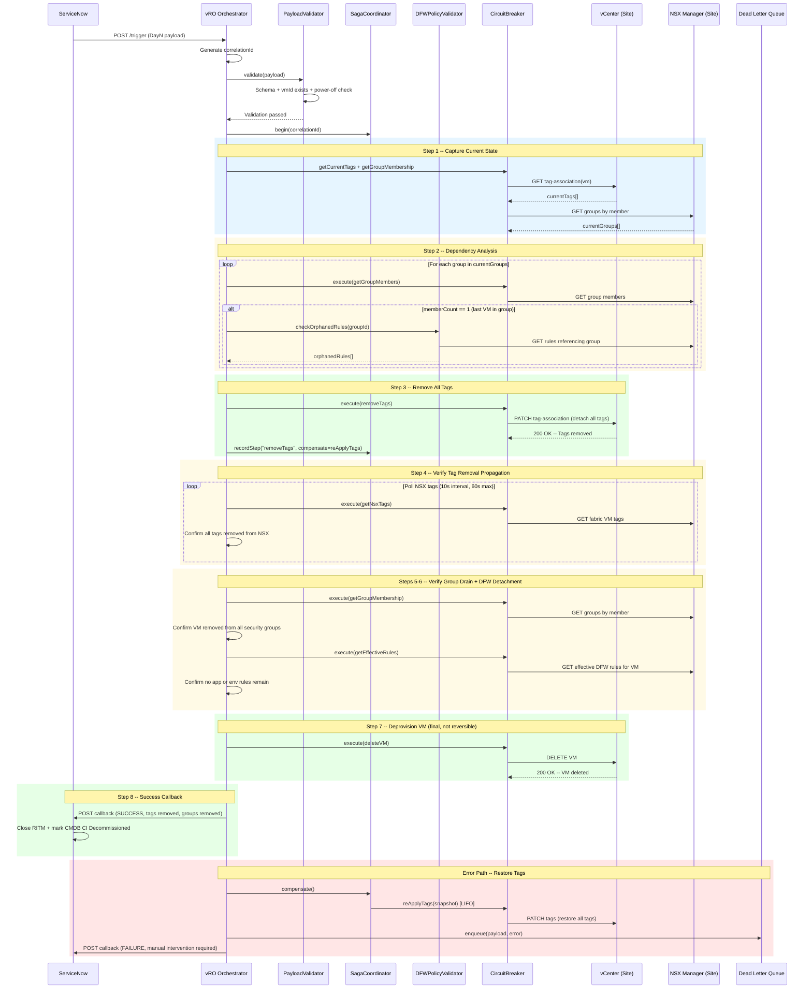

# Day N Decommission Sequence

This diagram shows the complete Day N (VM decommission) workflow. It includes dependency checking to prevent orphaned DFW rules, tag removal with propagation verification, group membership drain confirmation, and safe VM deprovisioning with full saga compensation support.

## Dependency Check Logic

The dependency analysis in Step 2 prevents data integrity issues by detecting situations where removing a VM would leave DFW rules referencing empty security groups:

| Condition | Action | Error Code |
|-----------|--------|-----------|
| Group has multiple members | Safe to proceed | N/A |
| Group has 1 member (this VM), no rules reference group | Safe to proceed, log info | N/A |
| Group has 1 member (this VM), rules reference group | Proceed with warning | DFW-7007 (logged) |
| VM not found in inventory | Fail validation | DFW-1003 |

## Key Differences from Day 0 / Day 2

| Aspect | Day 0 | Day 2 | Day N |
|--------|-------|-------|-------|
| Direction | Add tags | Modify tags | Remove all tags |
| Dependency Check | None | Impact analysis | Orphan rule detection |
| VM Outcome | Created | Unchanged | Deleted |
| Reversibility | Full (delete VM + remove tags) | Full (revert to snapshot) | Partial (restore tags only, VM deletion is final) |
| CMDB Impact | Create CI | Update CI | Mark Decommissioned |
