# Deployment Topology

This diagram shows the physical and logical deployment topology of the NSX DFW Automation Pipeline across the ServiceNow cloud instance, the two data center sites (NDCNG and TULNG), the NSX-T Federation layer, and the monitoring infrastructure. It includes network connectivity, protocols, and failover relationships.

```mermaid
flowchart TB
    subgraph SNOW_CLOUD["ServiceNow Cloud Instance"]
        direction TB
        SNOW_APP["ServiceNow Zurich P6\nProduction Instance"]
        SNOW_CATALOG["Catalog Items\nVM Build / Modify / Decom"]
        SNOW_REST["Scripted REST API\n/api/x_dfw/callback"]
        SNOW_DICT["Tag Dictionary\nu_tag_dictionary table"]
        SNOW_CMDB["CMDB\nCI Records"]
        SNOW_APP --- SNOW_CATALOG
        SNOW_APP --- SNOW_REST
        SNOW_APP --- SNOW_DICT
        SNOW_APP --- SNOW_CMDB
    end

    subgraph NDCNG_SITE["NDCNG Data Center"]
        direction TB
        subgraph VRO_N_CLUSTER["vRO Cluster (Active/Active)"]
            vRO_N1["vRO Node 1\n192.168.10.11"]
            vRO_N2["vRO Node 2\n192.168.10.12"]
            vRO_N_LB["Load Balancer VIP\nvro-ndcng.corp.local"]
            vRO_N_LB --> vRO_N1
            vRO_N_LB --> vRO_N2
        end

        subgraph VCENTER_N["vCenter Server"]
            VC_N["vCenter Server\nvcenter-ndcng.corp.local\nVAPI + REST API"]
        end

        subgraph NSX_N_CLUSTER["NSX Manager Cluster"]
            NSX_N1["NSX Manager 1\nnsx-ndcng-01"]
            NSX_N2["NSX Manager 2\nnsx-ndcng-02"]
            NSX_N3["NSX Manager 3\nnsx-ndcng-03"]
            NSX_N_VIP["Cluster VIP\nnsx-ndcng.corp.local"]
            NSX_N_VIP --> NSX_N1
            NSX_N_VIP --> NSX_N2
            NSX_N_VIP --> NSX_N3
        end

        subgraph COMPUTE_N["Compute Clusters"]
            ESXi_N1["ESXi Host Pool\nDFW Kernel Modules\nTransport Nodes"]
        end

        vRO_N1 -->|VAPI / TLS 1.2| VC_N
        vRO_N2 -->|VAPI / TLS 1.2| VC_N
        vRO_N1 -->|REST / TLS 1.2| NSX_N_VIP
        vRO_N2 -->|REST / TLS 1.2| NSX_N_VIP
        NSX_N_VIP -->|DFW Rule Push| ESXi_N1
        VC_N -->|Tag Propagation| NSX_N_VIP
    end

    subgraph TULNG_SITE["TULNG Data Center"]
        direction TB
        subgraph VRO_T_CLUSTER["vRO Cluster (Active/Active)"]
            vRO_T1["vRO Node 1\n192.168.20.11"]
            vRO_T2["vRO Node 2\n192.168.20.12"]
            vRO_T_LB["Load Balancer VIP\nvro-tulng.corp.local"]
            vRO_T_LB --> vRO_T1
            vRO_T_LB --> vRO_T2
        end

        subgraph VCENTER_T["vCenter Server"]
            VC_T["vCenter Server\nvcenter-tulng.corp.local\nVAPI + REST API"]
        end

        subgraph NSX_T_CLUSTER["NSX Manager Cluster"]
            NSX_T1["NSX Manager 1\nnsx-tulng-01"]
            NSX_T2["NSX Manager 2\nnsx-tulng-02"]
            NSX_T3["NSX Manager 3\nnsx-tulng-03"]
            NSX_T_VIP["Cluster VIP\nnsx-tulng.corp.local"]
            NSX_T_VIP --> NSX_T1
            NSX_T_VIP --> NSX_T2
            NSX_T_VIP --> NSX_T3
        end

        subgraph COMPUTE_T["Compute Clusters"]
            ESXi_T1["ESXi Host Pool\nDFW Kernel Modules\nTransport Nodes"]
        end

        vRO_T1 -->|VAPI / TLS 1.2| VC_T
        vRO_T2 -->|VAPI / TLS 1.2| VC_T
        vRO_T1 -->|REST / TLS 1.2| NSX_T_VIP
        vRO_T2 -->|REST / TLS 1.2| NSX_T_VIP
        NSX_T_VIP -->|DFW Rule Push| ESXi_T1
        VC_T -->|Tag Propagation| NSX_T_VIP
    end

    subgraph FEDERATION["NSX-T Federation"]
        NSX_GM_A["Global Manager\nACTIVE\nnsx-gm-active.corp.local"]
        NSX_GM_S["Global Manager\nSTANDBY\nnsx-gm-standby.corp.local"]
        NSX_GM_A <-->|Replication| NSX_GM_S
    end

    subgraph MONITORING["Monitoring Infrastructure"]
        SPLUNK["Splunk Indexer\nindex=dfw_pipeline"]
        PAGERDUTY["PagerDuty\nAlerting / On-Call"]
        DASHBOARD["Splunk Dashboard\nCircuit Breaker / Throughput\nError Rate / Latency / DLQ"]
        SPLUNK --> DASHBOARD
        SPLUNK --> PAGERDUTY
    end

    %% ServiceNow to vRO (both sites)
    SNOW_APP -->|"REST POST /trigger TLS 1.2+ / mTLS"| vRO_N_LB
    SNOW_APP -->|"REST POST /trigger TLS 1.2+ / mTLS"| vRO_T_LB

    %% vRO callbacks to ServiceNow
    vRO_N_LB -.->|"POST /callback TLS 1.2+"| SNOW_REST
    vRO_T_LB -.->|"POST /callback TLS 1.2+"| SNOW_REST

    %% NSX Federation sync
    NSX_N_VIP <-->|"Federation Sync Inter-site Link"| NSX_GM_A
    NSX_T_VIP <-->|"Federation Sync Inter-site Link"| NSX_GM_A

    %% vRO to Global Manager
    vRO_N_LB -->|"REST / TLS 1.2 Global Policy API"| NSX_GM_A
    vRO_T_LB -->|"REST / TLS 1.2 Global Policy API"| NSX_GM_A

    %% Logging
    vRO_N_LB -.->|Syslog / HEC| SPLUNK
    vRO_T_LB -.->|Syslog / HEC| SPLUNK
```

## Infrastructure Inventory

| Component | NDCNG | TULNG | Shared |
|-----------|-------|-------|--------|
| vRO Nodes | 2 (Active/Active) | 2 (Active/Active) | - |
| vCenter Server | 1 | 1 | - |
| NSX Manager Nodes | 3 (Cluster) | 3 (Cluster) | - |
| NSX Global Manager | - | - | 2 (Active/Standby) |
| ESXi Hosts | N (Compute Pool) | N (Compute Pool) | - |
| Load Balancer | 1 (vRO VIP) | 1 (vRO VIP) | - |

## Network Connectivity Matrix

| Source | Destination | Protocol | Port | Authentication |
|--------|------------|----------|------|---------------|
| ServiceNow | vRO VIP (NDCNG) | HTTPS/TLS 1.2+ | 443 | Service account + token |
| ServiceNow | vRO VIP (TULNG) | HTTPS/TLS 1.2+ | 443 | Service account + token |
| vRO (NDCNG) | vCenter (NDCNG) | HTTPS/TLS 1.2 | 443 | Service account (vault) |
| vRO (NDCNG) | NSX Manager (NDCNG) | HTTPS/TLS 1.2 | 443 | Service account (vault) |
| vRO (NDCNG) | NSX Global Manager | HTTPS/TLS 1.2 | 443 | Service account (vault) |
| vRO (TULNG) | vCenter (TULNG) | HTTPS/TLS 1.2 | 443 | Service account (vault) |
| vRO (TULNG) | NSX Manager (TULNG) | HTTPS/TLS 1.2 | 443 | Service account (vault) |
| vRO (TULNG) | NSX Global Manager | HTTPS/TLS 1.2 | 443 | Service account (vault) |
| vRO (both) | ServiceNow | HTTPS/TLS 1.2+ | 443 | Service account + token |
| vRO (both) | Splunk HEC | HTTPS/TLS 1.2 | 8088 | HEC token |
| NSX Local | NSX Global Manager | HTTPS/TLS 1.2 | 443 | Federation certificate |
| NSX Manager | ESXi Hosts | HTTPS/TLS 1.2 | 1234 | Transport node certificate |

## High Availability and Disaster Recovery

| Component | HA Strategy | RTO | RPO | Failover Mechanism |
|-----------|-------------|-----|-----|-------------------|
| vRO Cluster | Active/Active (2 nodes per site) | < 5 min | 0 (stateless) | Load balancer health check |
| vCenter | VCHA (Active/Passive/Witness) | < 10 min | ~ 0 | Automatic VCHA failover |
| NSX Manager | 3-node cluster | < 5 min | 0 (replicated) | Cluster VIP failover |
| NSX Global Manager | Active/Standby | < 15 min | < 30s | Manual or automated promotion |
| ServiceNow | Cloud SLA (99.8%) | Per SLA | Per SLA | ServiceNow managed |
| Splunk | Indexer cluster | < 5 min | 0 (replicated) | Cluster master failover |

## Failure Domain Isolation

- **Single vRO node failure:** Load balancer redirects to surviving node. No impact to operations.
- **Single NSX Manager node failure:** Cluster VIP routes to surviving nodes. No impact.
- **Full NDCNG site failure:** TULNG operations continue. NDCNG requests fail with DFW-6002 (site unavailable). Global policies remain enforced on TULNG via local data plane.
- **Full TULNG site failure:** NDCNG operations continue. Symmetric to NDCNG failure.
- **NSX Global Manager failure:** Local site operations continue. Global policy changes queued until GM recovery. Standby GM promoted if prolonged.
- **ServiceNow outage:** No new requests initiated. In-flight callbacks queued by vRO retry. DLQ entries created for callback failures.
