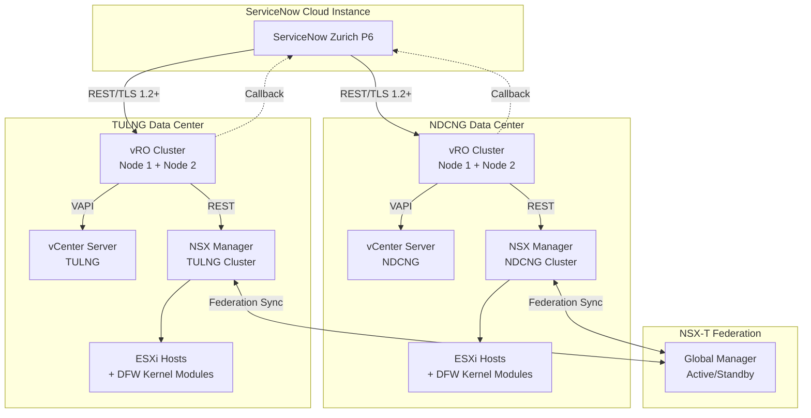

# Deployment Topology

```mermaid
flowchart TB
    subgraph SNOW_CLOUD["ServiceNow Cloud Instance"]
        SNOW[ServiceNow Zurich P6]
    end

    subgraph NDCNG_SITE["NDCNG Data Center"]
        vRO_N[vRO Cluster<br/>Node 1 + Node 2]
        VC_N[vCenter Server<br/>NDCNG]
        NSX_N[NSX Manager<br/>NDCNG Cluster]
        ESXi_N[ESXi Hosts<br/>+ DFW Kernel Modules]
    end

    subgraph TULNG_SITE["TULNG Data Center"]
        vRO_T[vRO Cluster<br/>Node 1 + Node 2]
        VC_T[vCenter Server<br/>TULNG]
        NSX_T[NSX Manager<br/>TULNG Cluster]
        ESXi_T[ESXi Hosts<br/>+ DFW Kernel Modules]
    end

    subgraph FEDERATION["NSX-T Federation"]
        NSX_GM[Global Manager<br/>Active/Standby]
    end

    SNOW -->|REST/TLS 1.2+| vRO_N
    SNOW -->|REST/TLS 1.2+| vRO_T
    vRO_N -->|VAPI| VC_N
    vRO_N -->|REST| NSX_N
    vRO_T -->|VAPI| VC_T
    vRO_T -->|REST| NSX_T
    NSX_N <-->|Federation Sync| NSX_GM
    NSX_T <-->|Federation Sync| NSX_GM
    NSX_N --> ESXi_N
    NSX_T --> ESXi_T
    vRO_N -.->|Callback| SNOW
    vRO_T -.->|Callback| SNOW
```
