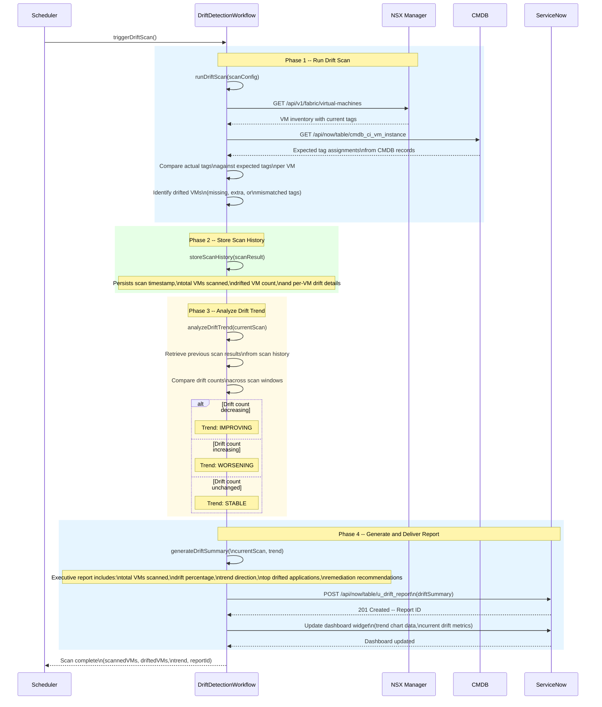

# Drift Trend Analysis Sequence

## Overview

This diagram shows the drift trend analysis workflow, where scheduled scans detect tag and policy drift across VMs, store historical results, analyze trends over time, and generate executive summary reports delivered to the ServiceNow dashboard.

## Trend Classification

| Trend | Condition | Implication |
|-------|-----------|-------------|
| IMPROVING | Drift count decreased compared to previous scans | Remediation efforts are effective |
| WORSENING | Drift count increased compared to previous scans | New drift sources or failed remediation |
| STABLE | Drift count unchanged across scan windows | No significant change in compliance posture |

## Scan Cadence

| Schedule | Frequency | Retention |
|----------|-----------|-----------|
| Standard scan | Every 6 hours | 30 days of scan history |
| Trend analysis window | Compares last 5 scans | Rolling comparison |
| Executive report | Generated per scan | Delivered to ServiceNow dashboard |
