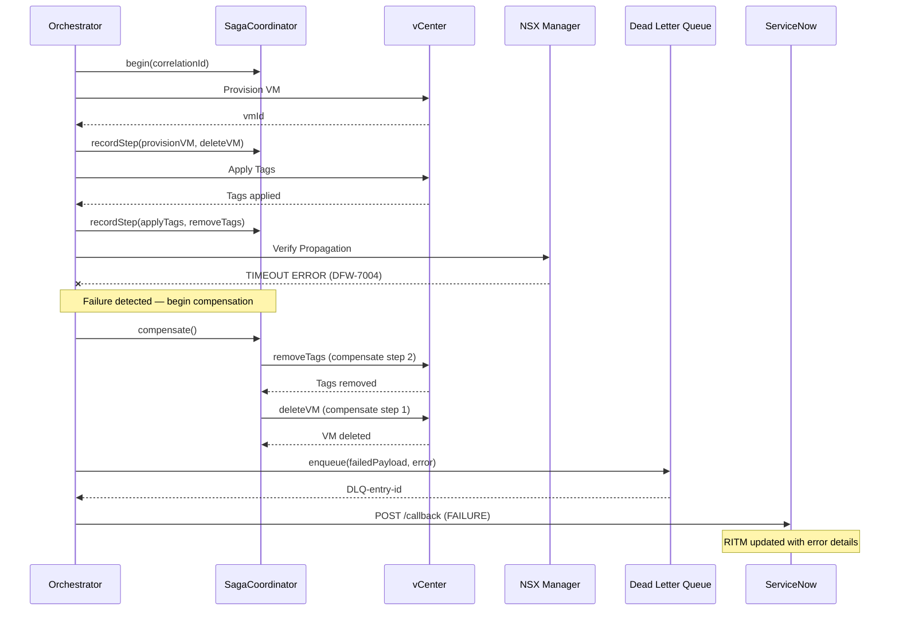

# Error Handling with Saga Compensation

```mermaid
sequenceDiagram
    participant O as Orchestrator
    participant S as SagaCoordinator
    participant VC as vCenter
    participant NSX as NSX Manager
    participant DLQ as Dead Letter Queue
    participant SNOW as ServiceNow

    O->>S: begin(correlationId)
    O->>VC: Provision VM
    VC-->>O: vmId
    O->>S: recordStep(provisionVM, deleteVM)

    O->>VC: Apply Tags
    VC-->>O: Tags applied
    O->>S: recordStep(applyTags, removeTags)

    O->>NSX: Verify Propagation
    NSX--xO: TIMEOUT ERROR (DFW-7004)

    Note over O,S: Failure detected — begin compensation

    O->>S: compensate()
    S->>VC: removeTags (compensate step 2)
    VC-->>S: Tags removed
    S->>VC: deleteVM (compensate step 1)
    VC-->>S: VM deleted

    O->>DLQ: enqueue(failedPayload, error)
    DLQ-->>O: DLQ-entry-id

    O->>SNOW: POST /callback (FAILURE)
    Note over SNOW: RITM updated with error details
```
