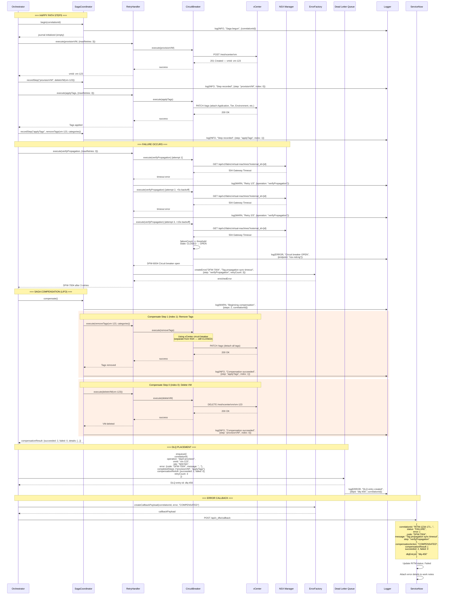
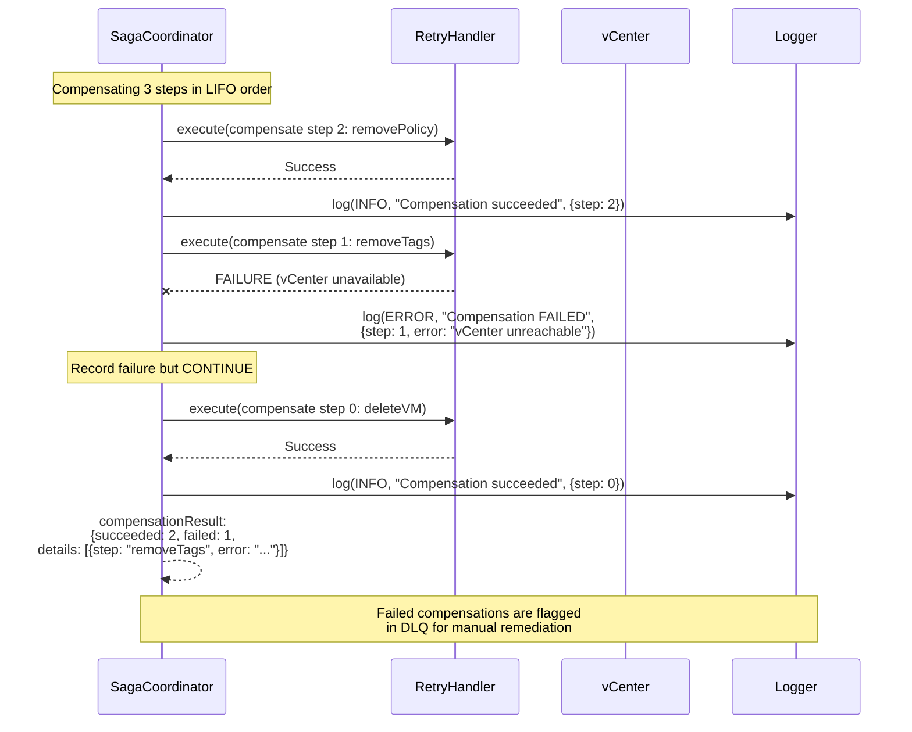

# Error Handling with Saga Compensation

This diagram illustrates the complete error handling flow in the DFW Automation Pipeline, showing how the Saga pattern coordinates multi-step compensation when a failure occurs. It covers the happy path steps, the failure detection, LIFO compensation execution, partial compensation failure handling, DLQ placement, and the error callback to ServiceNow.

## Partial Compensation Failure

When a compensating action itself fails, the saga continues with remaining compensations rather than aborting:

## Error Code Reference

| Code | Category | Retryable | Compensation | Description |
|------|----------|-----------|-------------|-------------|
| DFW-1001 | Validation | No | None needed | Invalid payload schema |
| DFW-1002 | Validation | No | None needed | Missing mandatory tags |
| DFW-1003 | Validation | No | None needed | VM not found in inventory |
| DFW-2001 | NSX API | Yes | Saga compensate | NSX Manager API unreachable |
| DFW-2002 | NSX Auth | No | Saga compensate | NSX authentication failure |
| DFW-3001 | Tag | Yes | Saga compensate | Tag application failed |
| DFW-3003 | Tag | No | Saga compensate | Tag cardinality violation |
| DFW-4001 | Group | Yes | Saga compensate | Group membership verification failed |
| DFW-6001 | Saga | No | Manual | Saga not active |
| DFW-6002 | Saga | No | Manual | No steps to compensate |
| DFW-6003 | Saga | No | Manual | Saga already active |
| DFW-6004 | Circuit | No | Saga compensate | Circuit breaker is OPEN |
| DFW-7001 | Timeout | Yes | Saga compensate | Operation timeout |
| DFW-7004 | Timeout | Yes | Saga compensate | Tag propagation sync timeout |
| DFW-7006 | DFW | Yes | Saga compensate | DFW coverage validation failed |
| DFW-7007 | DFW | No | Warning only | Orphaned rule detected |
| DFW-9001 | System | No | Saga compensate | Unexpected internal error |
