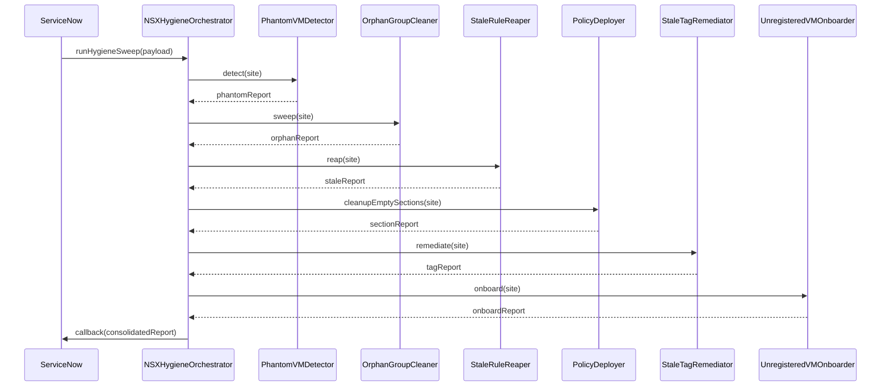

# Hygiene Sweep — Full Orchestration Sequence

End-to-end sequence for `NSXHygieneOrchestrator.runHygieneSweep()`, showing the
coordinated invocation of every hygiene sub-module and the consolidated callback
to ServiceNow.

