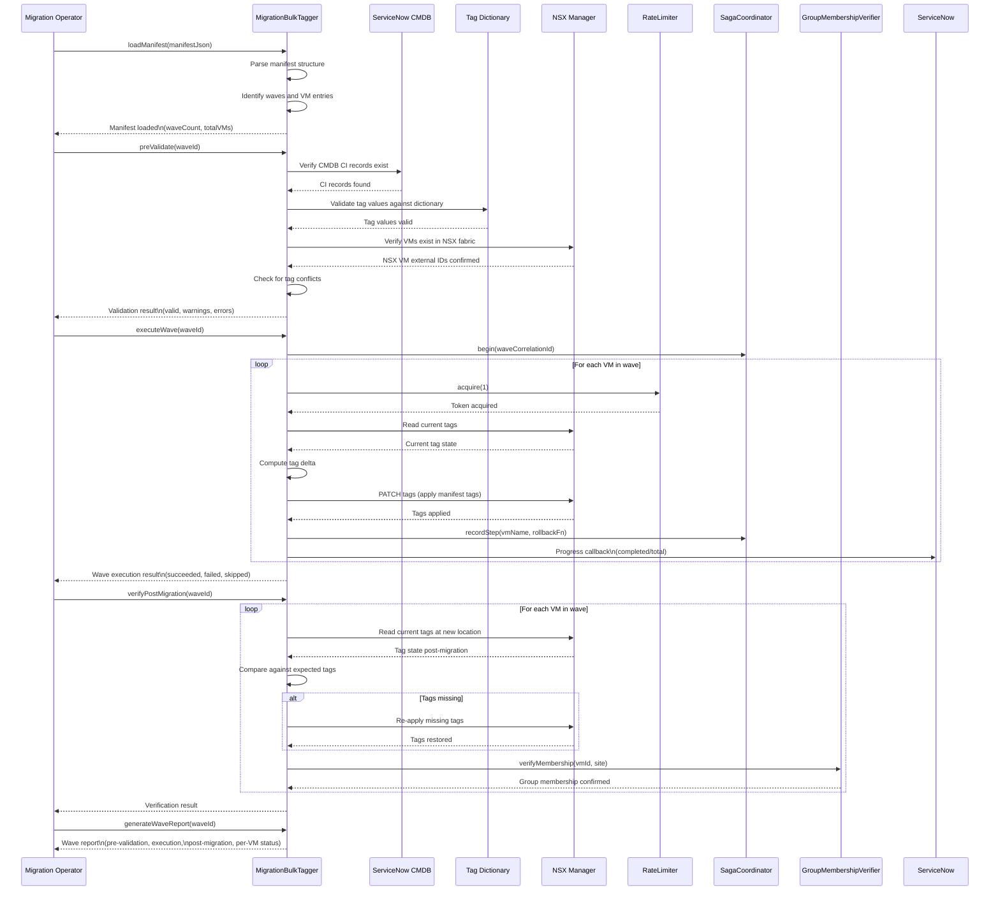

# Migration Bulk Tag Sequence Diagram

## Overview

This diagram shows the end-to-end flow of the MigrationBulkTagger processing a Greenzone VM migration wave, from manifest loading through post-migration verification.

## Manifest Structure

The migration manifest defines waves of VMs with their target tag assignments:

| Field | Description |
|-------|-------------|
| `manifestId` | Unique identifier for the migration event |
| `waves[].waveId` | Identifier for each migration wave |
| `waves[].scheduledDate` | Planned execution date for the wave |
| `waves[].vms[].vmName` | VM name as registered in vCenter |
| `waves[].vms[].cmdbCi` | Corresponding CMDB CI identifier |
| `waves[].vms[].tags` | Target tag assignments (Region, SecurityZone, Environment, AppCI, SystemRole) |
