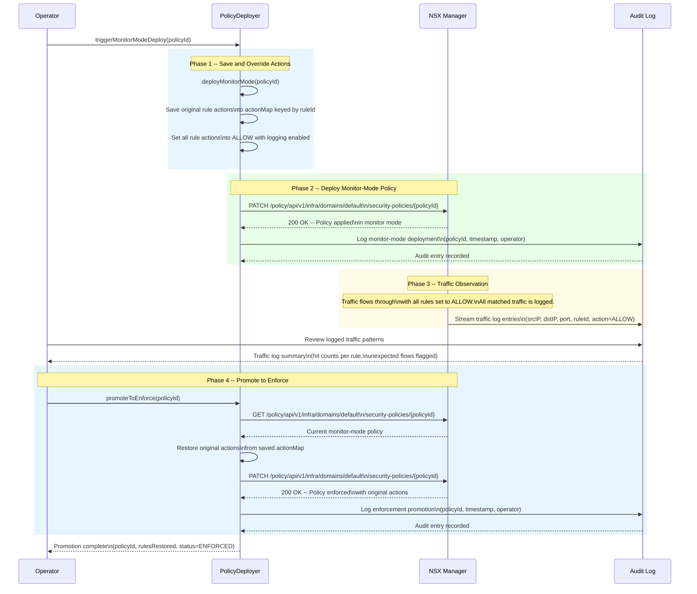

# Monitor-Mode Deployment Sequence

## Overview

This diagram shows the monitor-mode deployment workflow, where firewall rules are initially deployed with permissive ALLOW+LOG actions to observe real traffic patterns before promoting to full enforcement. The operator triggers monitor-mode, reviews logged traffic, and then promotes the policy to enforce original actions.

## Workflow Summary

| Phase | Description | Key Action |
|-------|-------------|------------|
| Save and Override | Original rule actions preserved in memory map | `deployMonitorMode` stores action per ruleId |
| Deploy Monitor-Mode | Policy pushed to NSX with ALLOW+LOG on all rules | PATCH security policy |
| Traffic Observation | Real traffic flows through; all matches logged | Operator reviews traffic logs |
| Promote to Enforce | Original actions restored and policy redeployed | `promoteToEnforce` restores from actionMap |
