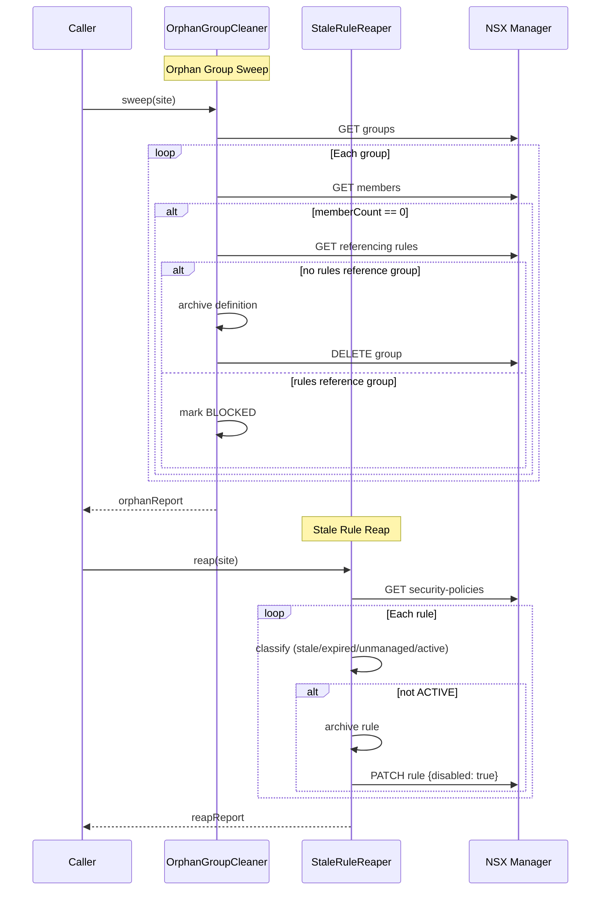

# Orphan Group Cleanup and Stale Rule Reap Sequence

Combined sequence diagram for `OrphanGroupCleaner.sweep()` and
`StaleRuleReaper.reap()`. These two modules run in tandem during the
hygiene sweep to remove empty groups and disable non-active rules.

