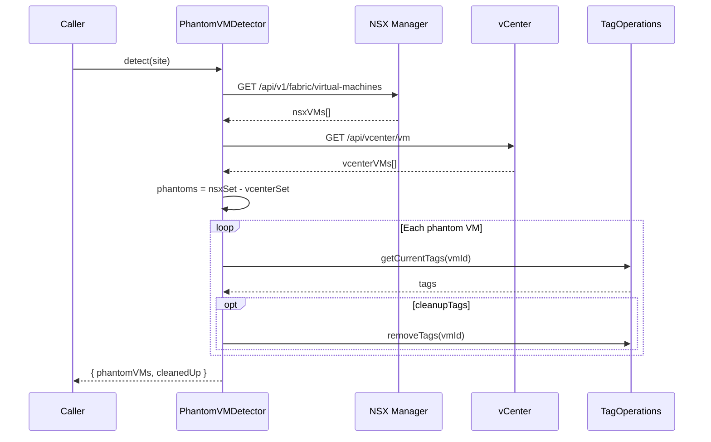

# Phantom VM Detection Sequence

Sequence diagram for `PhantomVMDetector.detect()`. Compares the NSX fabric
VM inventory against vCenter to identify phantom VMs (present in NSX but
absent from vCenter) and optionally cleans up their stale tags.

