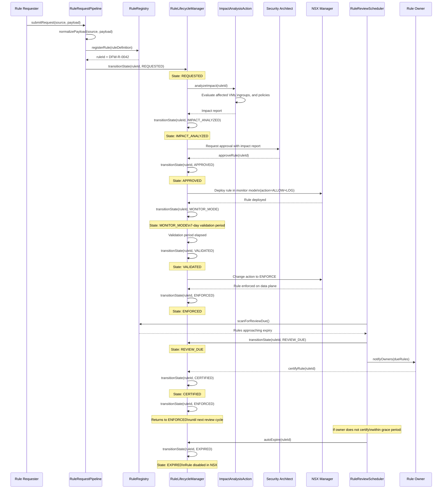

# Rule Lifecycle Sequence Diagram

## Overview

This diagram shows the full DFW rule lifecycle state machine from initial request through enforcement, periodic review, and eventual expiry or rollback.

## State Machine Summary

| State | Description | Valid Transitions |
|-------|-------------|-------------------|
| REQUESTED | Initial submission | IMPACT_ANALYZED |
| IMPACT_ANALYZED | Impact report generated | APPROVED, ROLLED_BACK |
| APPROVED | Approved by Security Architect | MONITOR_MODE |
| MONITOR_MODE | Deployed with logging only | VALIDATED, ROLLED_BACK |
| VALIDATED | Monitoring period passed | ENFORCED |
| ENFORCED | Active on data plane | CERTIFIED, REVIEW_DUE, ROLLED_BACK |
| CERTIFIED | Re-certified by owner | ENFORCED |
| REVIEW_DUE | Approaching expiry | CERTIFIED, EXPIRED |
| EXPIRED | Not re-certified, disabled | REQUESTED |
| ROLLED_BACK | Removed due to incident | REQUESTED |
