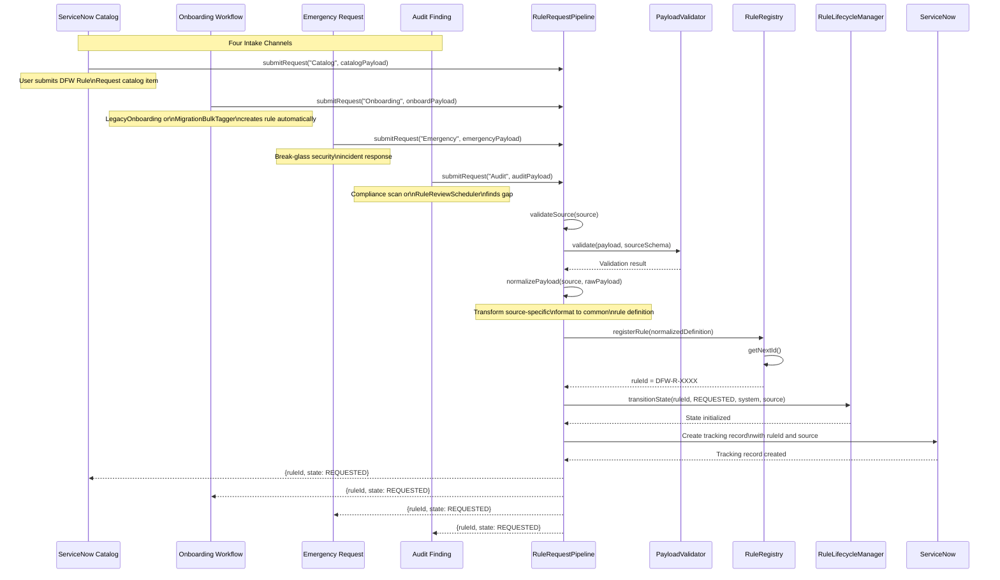

# Rule Request Pipeline Sequence Diagram

## Overview

This diagram shows how DFW rule requests from four different intake channels are normalized and processed through the unified RuleRequestPipeline into the RuleLifecycleManager.

## Intake Channel Details

| Channel | Source | Trigger | Priority | Approval Required |
|---------|--------|---------|----------|-------------------|
| Catalog | ServiceNow Catalog | User submits DFW Rule Request item | Normal | Yes -- Security Architect |
| Onboarding | LegacyOnboardingOrchestrator or MigrationBulkTagger | Automated rule creation during VM onboarding | Normal | Yes -- Security Architect |
| Emergency | Security incident response | Break-glass emergency rule request | High | Post-hoc review only |
| Audit | RuleReviewScheduler or compliance scan | Audit finding requires rule creation or modification | Normal | Yes -- Security Architect |
