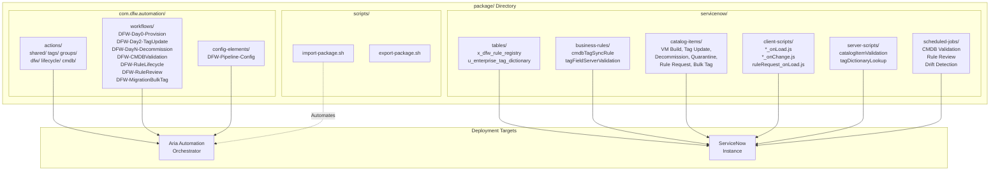
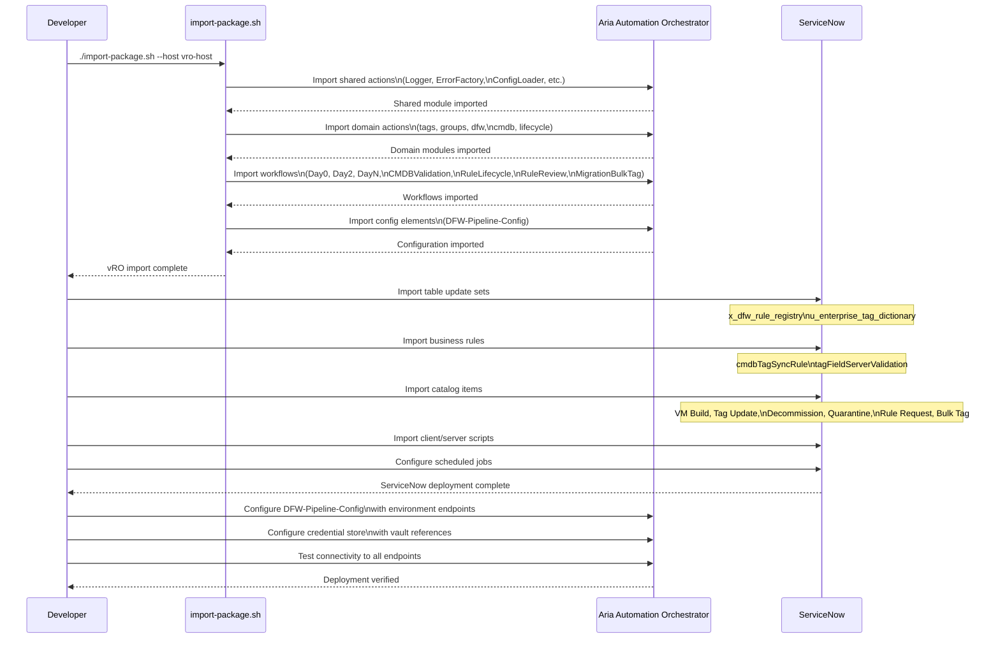

# VRA Package Structure and Deployment Flow

## Overview

This diagram shows the VRA package directory structure and the deployment flow for importing the DFW automation pipeline into VMware Aria Automation Orchestrator and ServiceNow.

## Deployment Sequence

## Package Contents Summary

| Component | Count | Location |
|-----------|-------|----------|
| vRO Actions | 36+ | `com.dfw.automation/actions/` |
| vRO Workflows | 7 | `com.dfw.automation/workflows/` |
| Configuration Elements | 1 | `com.dfw.automation/config-elements/` |
| ServiceNow Tables | 2 | `servicenow/tables/` |
| Business Rules | 2 | `servicenow/business-rules/` |
| Catalog Items | 6 | `servicenow/catalog-items/` |
| Client Scripts | 6 | `servicenow/client-scripts/` |
| Server Scripts | 2 | `servicenow/server-scripts/` |
| Scheduled Jobs | 5 | `servicenow/scheduled-jobs/` |
| Import Scripts | 2 | `scripts/` |
